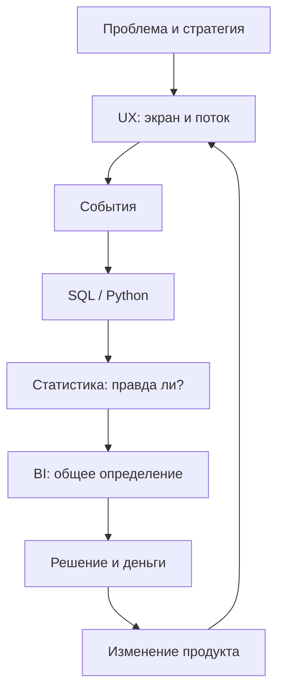

# М0.1. Аналитик и продакт как участники решения

| Поле | Значение |
|---|---|
| **ID** | М0.1 |
| **Неделя / проход** | Неделя 1 · Проход 1 |
| **Опоры** | все пять — знакомство с контуром |
| **Аудитория** | аналитик + продакт (общий минимум) |
| **Ориентир** | 60–75 мин теория+пример · 90–120 мин практика |
| **Визуалы** | [контур](./visuals/m0-1-contour.svg) · [разрывы](./visuals/m0-1-broken-links.svg) |

---

## Цели

После урока вы:

- **Общий минимум:** можете нарисовать контур «проблема → … → изменение» и указать, на каком звене ломается решение.
- **Аналитик:** отличаете продуктовую аналитику от отчётности и от «просто посчитать в SQL»; видите, зачем ваша цифра нужна решению.
- **Продакт:** формулируете, какое решение вы принимаете, и какое звено контура у вас сейчас пустое.

---

## Контекст Ритма

**Ритм** — приложение привычек с подпиской Pro. Пользователь ставит 1–3 ежедневных ритуала, отмечает чек-ины, копит серию дней, в какой-то момент видит paywall.

На этом уроке мы ещё не лезем в базу. Мы договариваемся: *какая работа вообще считается продуктовой аналитикой на Ритме* — и чем она отличается от красивого отчёта, который никто не меняет.

---

## Теория коротко

### 1. Три «аналитики», которые часто путают

| Вид | Вопрос | Типичный выход | Риск |
|---|---|---|---|
| **Отчётность** | «Что произошло?» | таблица/дашборд «как было» | цифра есть, решения нет |
| **Дата-сайенс / модели** | «Как предсказать / классифицировать?» | модель, score | модель не связана с рычагом продукта |
| **Продуктовая аналитика** | «Что менять в продукте и почему это окупится?» | вывод → решение → изменение | без контура скатывается в отчётность |

Курс учит третьему. SQL, статистика и BI — инструменты внутри контура, не самоцель.

### 2. Контур решения

Метрика не «берётся из базы». Она проходит путь:

Статическая версия той же схемы: [`visuals/m0-1-contour.svg`](./visuals/m0-1-contour.svg).

**Как читать:** если звено выпало, вы либо не измерите продукт, либо получите красивый дашборд, который ничего не меняет.

### 3. Что ломается при разрыве

| Выпало звено | Симптом на Ритме |
|---|---|
| Проблема / стратегия | Считаем «активных», не зная, какую привычку вообще хотим удержать |
| UX / поверхность | Paywall есть, но непонятно, после какого шага его показывать |
| События | В логах только `button_click` — streak не восстановить |
| Расчёт | JOIN раздул пользователей, «конверсия в Pro» 140% |
| Статистика | «Ретеншн D7 вырос» на 40 людях без интервала |
| BI | У маркетинга и продукта три разных «активных» |
| Решение / деньги | Гипотеза внедрена, P&L не пересчитан |
| Изменение | Отчёт готов, в приложении ничего не поменялось |

Разбор трёх типовых разрывов: [`visuals/m0-1-broken-links.svg`](./visuals/m0-1-broken-links.svg).

### 4. Роли в контуре

На одном продукте работают оба:

- **Продакт** владеет вопросом «какую проблему решаем» и финальным «растим / правим / убиваем».
- **Аналитик** владеет честностью пути «как достали и почему можно верить».
- Оба обязаны понимать чужое звено достаточно, чтобы спорить.

---

## Разобранный пример: три аналитики Ритма, которые ничего не изменили

**Сцена.** Команда Ритма смотрит неделю метрик. Три артефакта.

### А. «Отчёт ради отчёта»

Слайд: MAU 48 200 → 51 100 (+6%). Вывод в чате: «растём».  
**Разрыв:** нет связи с проблемой (бросают привычку на 3–5 день) и нет решения. MAU может расти за счёт новых установок при падающем D7.

### Б. «Красивая модель без рычага»

Модель предсказывает churn с AUC 0.81. В бэклоге нет изменения, которое использует score.  
**Разрыв:** нет пути «результат → изменение продукта». Предсказание без действия — дата-сайенс рядом с продуктом, не продуктовая аналитика.

### В. «Дашборд без определения»

В DataLens «конверсия в Pro» = 4,2%. В таблице маркетинга = 7,8%. Спорят два часа.  
**Разрыв:** выпало звено BI (единое определение) и, возможно, гранулярность событий (по сессиям vs по пользователям).

**Рабочий контур на ту же неделю выглядел бы так:**

1. Проблема: 62% создавших привычку не делают чек-ин на D3.
2. Гипотеза: онбординг обещает «21 день», а первый успех не дан в D1 — слишком далеко.
3. Изменение: цель «3 дня подряд» + событие `streak_3_reached` до paywall.
4. Метрика решения: доля пользователей с `habit_created` → `streak_3_reached` за 7 дней; вторично — trial→Pro.
5. Проверка: не объявлять победу на n < 500 без интервала.
6. Деньги: если D3→streak_3 +8 п.п. при той же цене Pro — сколько дополнительной маржи в месяц.

---

## Практика

### Ядро (оба)

1. Нарисуйте контур Ритма на одном листе (можно скопировать схему урока) и **подпишите одним предложением каждое звено** на языке Ритма (не абстрактно).
2. Выберите один реальный или правдоподобный «мёртвый» отчёт из своей практики / придумайте для Ритма — и укажите **какое звено выпало**.
3. Сформулируйте одно решение, которое команда Ритма могла бы принять на этой неделе (формат: *если верно X, то делаем Y, иначе Z*).

### Расширение «руки»

Разложите воображаемый недельный отчёт Ритма (5–7 строк метрик: installs, habit_created, D1, D7, paywall_view, subscribe) и отметьте:

- какая метрика отвечает на решение из ядра;
- какие две метрики можно выкинуть без потери решения;
- где нужна гранулярность «пользователь», а не «сессия» (пока без SQL — словами).

### Расширение «решение»

Напишите постановку аналитику на полстраницы:

- решение, которое вы хотите принять;
- какую цифру считаете достаточной;
- что будет, если цифра врёт (цена ошибки);
- какие 2 контрольных вопроса вы зададите на приёмке.

---

## Критерии приёмки

- [ ] Контур полный: все звенья названы на языке Ритма.
- [ ] Указан хотя бы один разрыв с симптомом.
- [ ] Есть решение в формате if/then/else, а не «посмотреть метрики».
- [ ] Сделано ядро + одно расширение.
- [ ] В сдаче явно: где вы могли бы попросить AI помочь — и что проверите сами (см. линию AI).

---

## Линия AI

| Шаг | AI можно | Вы отвечаете |
|---|---|---|
| Набросать формулировки звеньев контура | да | чтобы звенья были про Ритм, не generic |
| Придумать «мёртвые» отчёты | да | выбрать один и доказать разрыв |
| Написать постановку аналитику | черновик | цена ошибки и критерий приёмки |

**Проверка:** если выкинуть бренд «Ритм» из текста и он всё ещё звучит убедительно для любого SaaS — перепишите. Контур курса всегда про конкретный продукт.

---

## Дальше читать

- Карта опор и контур: [`../course-structure.md`](../course-structure.md) §2.
- Инвентарь публичных опор по продукту/метрикам: [`../sources-inventory.md`](../sources-inventory.md) (раздел про плейлист VK Team, лекция 1 — блиц по метрикам; лекция 9 — активность/retention — как фон, не как текст урока).
- Офлайн: стратегия end-to-end product analytics — [`../uploads/medium-geoghegan-end-to-end-product-analytics-strategy.md`](../uploads/medium-geoghegan-end-to-end-product-analytics-strategy.md).
- Что ещё нужно для стенда данных: [`../materials-needed.md`](../materials-needed.md).

Следующий модуль: [`m0-2-ai-in-contour.md`](./m0-2-ai-in-contour.md).
