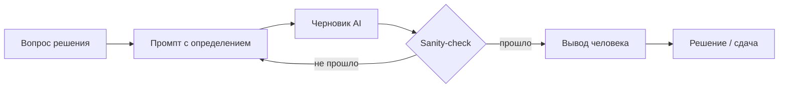

# М0.2. Место AI в контуре

| Поле | Значение |
|---|---|
| **ID** | М0.2 |
| **Неделя / проход** | Неделя 1 · Проход 1 |
| **Опоры** | сквозная AI-линия · стык со всеми пятью |
| **Аудитория** | аналитик + продакт |
| **Ориентир** | 45–60 мин · практика 60–90 мин |
| **Визуалы** | [роли AI](./visuals/m0-2-ai-roles.svg) · [привычка проверки](./visuals/m0-2-verify-loop.svg) |
| **Зависимость** | после М0.1 |

---

## Цели

После урока вы:

- **Общий минимум:** знаете договорённость курса — AI ускоряет работу, вы отвечаете за метрику, гранулярность и решение.
- **Аналитик:** умеете собрать рабочий промпт «контекст → схема → определение → проверки» и не принимать код без sanity-check.
- **Продакт:** не принимаете решение по неверифицированному выводу AI; умеете потребовать контрольные вопросы.

---

## Контекст Ритма

На Ритме AI будет писать черновики SQL, варианты метрик, тексты онбординга и даже набросок изменения paywall. Опасность одна: **правдоподобная ложь** — запрос «отработал», текст «звучит умно», решение уже в проде.

Этот урок закрепляет привычку *до* того, как появятся таблицы.

---

## Теория коротко

### 1. Что AI реально ускоряет

| В контуре | Ускоряет | Не заменяет |
|---|---|---|
| Проблема → метрика | перебор кандидатов метрик | выбор и ответственность |
| Метрика → UX | черновик структуры экрана/событий | решение, что измеряем |
| UX → данные | черновик tracking plan, имена полей | гранулярность и момент срабатывания |
| Данные → код | SQL/Python | постановка и приёмка |
| Код → результат | объяснение, поиск багов | контрольные запросы |
| Результат → интерпретация | альтернативные объяснения | причинная логика |
| Интерпретация → решение | упаковка текста защиты | само решение |

Схема ролей: [`visuals/m0-2-ai-roles.svg`](./visuals/m0-2-ai-roles.svg).

### 2. Договорённость курса (запомнить)

> **AI — соавтор кода и черновика. Не соавтор вывода.**  
> Нет проверки — нет цифры в решении.

### 3. Анатомия рабочего промпта (шаблон курса)

Даже до SQL полезно зафиксировать шаблон — он понадобится с М3.1:

1. **Контекст решения** — какое решение изменится от ответа.
2. **Объект** — Ритм; сценарий (например, trial → Pro).
3. **Определение метрики словами** — числитель, знаменатель, окно, дедуп.
4. **Ограничения** — период, исключения (сотрудники, тест-аккаунты).
5. **Формат ответа** — код/список + логика + **контрольные проверки**.

Плохо: «посчитай конверсию в подписку».  
Нормально: «Доля пользователей Ритма с `habit_created` в периоде, у которых за 7 дней есть `subscribe_started`. Считать по `user_id`, не по сессиям. Исключить `is_internal=true`. Дай определение, псевдокод и 3 контрольных проверки».

### 4. Типовые правдоподобные лжи AI (на Ритме)

| Ложь | Как выглядит | Как ловить |
|---|---|---|
| Подмена определения | «конверсия 12%» без окна | спросить числитель/знаменатель/окно |
| Неверная гранулярность | считает по сессиям paywall | «строка = ?» |
| Выдуманные поля | `user.plan_type` которого нет | сверить со схемой (когда появится) |
| Причинность из корреляции | «кто купил Pro, у тех выше streak — значит streak продаёт» | потребовать дизайн проверки |
| Generic-стратегия | «улучшить онбординг и персонализацию» | привязать к узкому месту Ритма |

Привычка проверки: [`visuals/m0-2-verify-loop.svg`](./visuals/m0-2-verify-loop.svg).

---

## Разобранный пример: один вопрос — два промпта

**Решение продакта Ритма:** показывать paywall после 3 дней серии или после 7?

**Плохой промпт**

> Напиши, когда лучше показывать paywall в приложении привычек.

Типичный ответ AI: абзац про «ценность до оплаты», без цифр и без определения успеха.

**Хороший промпт**

> Контекст: Ритм, freemium → Pro 299 ₽/мес. Решение: paywall на D3 streak vs D7.  
> Метрика успеха: среди пользователей с `habit_created`, доля с `subscribe_started` за 14 дней; ограда — D30 retention чек-инов не ниже контроля.  
> Сейчас стенда данных нет — дай: (1) какие события нужны, (2) дизайн сравнения, (3) три способа, которыми вывод может соврать, (4) что проверить, когда появятся данные.  
> Не предлагай generic best practices без привязки к метрике.

**Что делает человек после ответа**

1. Вычёркивает советы без метрики.
2. Фиксирует события: `streak_3_reached`, `streak_7_reached`, `paywall_shown`, `subscribe_started`.
3. Записывает цену ошибки: ранний paywall может поднять trial→Pro и убить retention.
4. Кладёт в бэклог проверку — не внедряет «потому что AI сказал».

---

## Практика

### Ядро (оба)

1. Выпишите **пять** мест контура Ритма, где вы лично готовы звать AI на этой неделе — и **пять**, где не готовы (можно меньше, но честно).
2. Возьмите один вопрос решения (можно paywall D3 vs D7) и напишите **плохой** и **хороший** промпт по шаблону курса.
3. Сформулируйте **минимум проверки** из 3 пунктов, без которого ответ AI не попадёт в сдачу.

### Расширение «руки»

Сымитируйте «правдоподобный» ответ AI на ваш хороший промпт (сами или с моделью) и найдите в нём ≥2 дыры: подмена определения, скрытая причинность, отсутствие окна, отсутствие цены ошибки и т.п. Оформите как ревью: цитата → почему опасно → что переспросить.

### Расширение «решение»

Напишите «договор с аналитиком/AI» на полстраницы для Ритма:

- какие артефакты AI может готовить сам;
- что вы подписываете лично перед релизом изменения;
- красные флаги приёмки (3 штуки).

---

## Критерии приёмки

- [ ] Есть явная граница: ускоряет / не заменяет.
- [ ] Есть пара промптов (плохой/хороший) с определением метрики в хорошем.
- [ ] Есть ≥3 пункта sanity-check.
- [ ] Ядро + одно расширение.
- [ ] В расширении поймана хотя бы одна правдоподобная ложь — не «AI иногда ошибается», а конкретный дефект.

---

## Линия AI

Этот модуль и есть линия. Короткое правило на весь курс:

1. В промпт — определение метрики и решение.
2. В ответ — контрольные проверки.
3. В сдачу — только то, что пережило проверки.

---

## Дальше читать

- Пять AI-линий курса: [`../course-structure.md`](../course-structure.md) §6.
- Пробел «проверка вывода AI» как производственная дыра: [`../sources-inventory.md`](../sources-inventory.md) (раздел «Коротко»).
- SQL/Python и промптинг появятся в блоке 3; заготовка источников: [`../sql-python-sources.md`](../sql-python-sources.md).

Следующий модуль недели 1: [`m1-1-problem-market.md`](./m1-1-problem-market.md).
