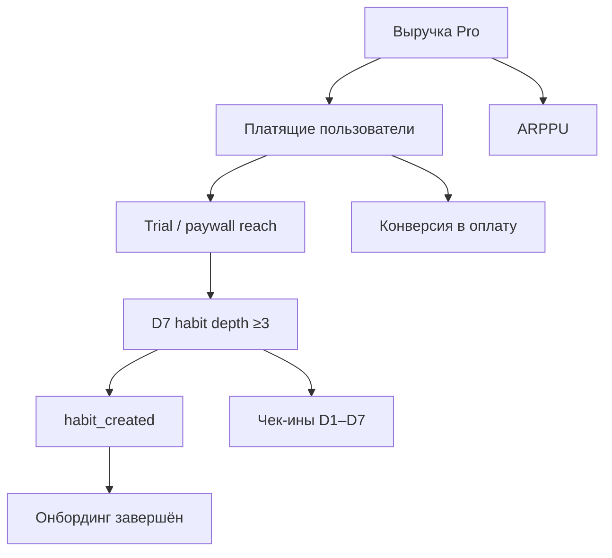

# М1.1. Рынок и проблема: с чего начинается цифровой продукт

| Поле | Значение |
|---|---|
| **ID** | М1.1 |
| **Неделя / проход** | Неделя 1 · Проход 1 |
| **Опора** | продукт, стратегия, экономика |
| **Аудитория** | аналитик + продакт |
| **Ориентир** | 75–90 мин · практика 2–3 ч |
| **Визуалы** | [выбор проблемы](./visuals/m1-1-problem-filter.svg) · [дерево метрик старт](./visuals/m1-1-metric-tree.svg) |
| **Зависимость** | после М0.1–М0.2 |

---

## Цели

После урока вы:

- **Общий минимум:** умеете обосновать проблему Ритма через частоту, боль, платёжеспособность и альтернативы — и связать её с первой метрикой решения.
- **Аналитик:** превращаете расплывчатую «боль» в проверяемые числа и видите, где рынок-оценка — санити-чек, а где самообман.
- **Продакт:** сознательно выбираете, *кому не продаём*, и защищаете фокус одной проблемой, а не списком фич.

---

## Контекст Ритма

Ритм обещает: «удерживай 1–3 ежедневных ритуала, не бросая через неделю».  
Это ещё не стратегия и не метрики — это гипотеза о работе, на которую «нанимают» продукт. На уроке мы:

1. проверяем, стоит ли эта проблема наших ресурсов;
2. выбираем целевой сегмент;
3. открываем **спираль метрик**: от проблемы → к одной метрике решения → к дереву, которое развернём в М1.3.

---

## Теория коротко

### 1. Проблема — это не «тема рынка»

Плохо: «рынок wellness $X млрд».  
Нужно: *кто, в какой ситуации, какую работу хочет сделать, чем платит сейчас, почему старое решение не устраивает*.

Фильтр выбора проблемы:

| Критерий | Вопрос | Пример на Ритме |
|---|---|---|
| **Частота** | Как часто возникает ситуация? | Каждый день (чек-ин) / срыв раз в неделю |
| **Боль** | Что болит, если не решить? | Стыд, потеря идентичности «я спортсмен», деньги за брошенный абонемент |
| **Платёжеспособность** | Платят ли уже чем-то? | Подписки на другие habit-приложения, коучи, Notion-шаблоны |
| **Доступность** | Можем ли дотянуться? | ASC/Google, TikTok/Reels, HR wellness B2B позже |
| **Альтернативы** | Включая «ничего» и Excel | Бумажный трекер, календарь, Streaks, Fabulous, чат с другом |

Схема фильтра: [`visuals/m1-1-problem-filter.svg`](./visuals/m1-1-problem-filter.svg).

### 2. Сегмент и сознательный отказ

«Всем, кто хочет привычки» — не сегмент. Рабочий черновик для Ритма:

- **Целевой:** 25–40, уже пробовал трекер/челлендж и бросил на 1–2 неделе; нужен не «каталог привычек», а удержание короткой серии.
- **Не продаём сейчас:** детям школьникам; корпоративным wellness-пакетам на 10 000 сотрудников; людям без смартфона как основного канала.

Отказ экономит метрики: иначе в одну воронку смешаются разные работы.

### 3. TAM / SAM / SOM как санити-чек

Считаем порядок величины, не слайд инвестору.

Учебный набросок для Ритма (цифры **учебные**, для метода):

| Уровень | Определение | Порядок |
|---|---|---|
| TAM | взрослые с смартфоном в RU, интересующиеся self-improvement | миллионы |
| SAM | из них хотя бы раз ставили привычку/челлендж за год | сотни тысяч–миллионы |
| SOM | можем реалистично привлечь за 12 мес. при нашем канале и CAC | десятки тысяч |

Правило: если SOM при честном CAC не окупает команду — проблема «красивая», но не наша. Источники оценок всегда записываем; чужому отчёту не верим без метода.

### 4. От проблемы к метрике (открытие спирали)

Проблема Ритма в рабочей формулировке:

> Люди, которые уже хотят держать 1–3 ритуала, **теряют серию в первые 7 дней** и после этого редко возвращаются к продукту — и тем более к оплате.

Метрика решения первого порядка (не North Star навсегда — рабочая на проход 1):

**«Доля новых пользователей с `habit_created`, у которых есть ≥3 дня с чек-ином в первые 7 дней»**  
Коротко: **D7 habit depth ≥3**.

Почему не MAU и не «конверсия в Pro» сразу:

- MAU не отличает туристов от держащих ритм;
- Pro — следствие; если серия не живёт, paywall оптимизирует пустышку.

Черновое дерево (развернём в М1.3):

SVG-версия с подписями «рычаг / следствие»: [`visuals/m1-1-metric-tree.svg`](./visuals/m1-1-metric-tree.svg).

---

## Разобранный пример: две формулировки проблемы Ритма

### Формулировка X (слабая)

«Людям сложно формировать привычки».  
Следствие: команда пилит библиотеку из 200 привычек, медитации, воду, шаги. Метрика — число созданных привычек. Серия падает, Pro не растёт.

### Формулировка Y (рабочая)

«Среди тех, кто уже создал первую привычку, большинство не добирает 3 чек-ина за 7 дней — продукт не даёт раннего успеха, обещая далёкие 21/66 дней».  
Следствие: режем онбординг под «3 дня», меняем цель по умолчанию, переносим paywall после раннего успеха. Метрика — D7 habit depth ≥3; Pro — ниже по дереву.

**Связка с контуром М0.1:** формулировка Y сразу указывает UX-рычаг, событие, расчёт и решение. Формулировка X указывает только контент.

---

## Практика

Данные ниже — **учебный срез** Ритма за 4 недели привлечения (синтетика для метода). Когда появится стенд — замените на факты.

| Шаг | Пользователи |
|---|---|
| Установки | 10 000 |
| Онбординг завершён | 7 200 |
| `habit_created` | 5 400 |
| ≥1 чек-ин в D1 | 3 100 |
| ≥3 дня с чек-ином за 7 дней | 1 450 |
| Увидели paywall | 2 000 |
| `subscribe_started` | 380 |

### Ядро (оба)

1. Запишите проблему Ритма в 2–3 предложениях по шаблону: *кто / ситуация / работа / почему старое плохо*.
2. Прогоните через фильтр частота–боль–платёж–доступ–альтернативы (таблица).
3. Назовите целевой сегмент и **одного**, кому сознательно не продаёте.
4. Выберите **одну** метрику решения на проход 1 и обоснуйте, почему не MAU и не «всё дерево сразу».
5. Нарисуйте дерево из 6–10 узлов от выручки Pro вниз до действия пользователя (можно развить SVG урока).

### Расширение «руки»

По таблице выше посчитайте:

- конверсию `habit_created` → depth≥3;
- конверсию install → subscribe;
- покажите, **какая** из двух лучше отвечает формулировке Y и почему вторая опасна как North Star на этом этапе.

Добавьте: какие 3 поля/события нужны, чтобы считать depth≥3 честно (пока словами).

### Расширение «решение»

Подготовьте одностраничный бриф:

- проблема и отказ от сегментов;
- SOM-санити (порядок + допущения, без фантазии «мы возьмём 10% рынка»);
- метрика решения + решение if/then;
- цена ошибки, если выбрали не ту проблему (что потратим зря за квартал).

---

## Критерии приёмки

- [ ] Проблема конкретна: есть «кто» и «провал серии», а не «wellness».
- [ ] Фильтр из 5 критериев заполнен.
- [ ] Есть явный non-target.
- [ ] Одна метрика решения согласована с проблемой; дерево не противоречит ей.
- [ ] Ядро + одно расширение; в «руках» есть расчёт по учебной таблице.
- [ ] AI мог помочь с деревом/формулировками — в сдаче видно вашу правку определения метрики.

---

## Линия AI

| Можно | Нельзя без вас |
|---|---|
| Набросать альтернативные формулировки проблемы | Выбрать финальную |
| Предложить кандидатов в метрики | Подписать определение (числитель/окно) |
| Нарисовать дерево | Проверить, что верх дерева = деньги/удержание ценности, а не vanity |

**Проверка:** вычеркните из ответа AI все предложения без числа или без альтернативы «ничего не делать». Если текст опустел — промпт был про «рынок вообще».

---

## Дальше читать

- Место модуля в спирали и неделя 1: [`../course-structure.md`](../course-structure.md) §4–5 (М1.1).
- Публичные опоры по метрикам/рынку: [`../sources-inventory.md`](../sources-inventory.md) — блиц метрик VK Team (лекция 1); плейлисты Product Heroes «Испытание 0» как фон по моделям экономик (не копировать тексты — смотреть логику моделей).
- UX-измеримость (следующий кусок недели 1): [`../ux-sources.md`](../ux-sources.md).
- Medium/LinkedIn курация под продукт: [`../medium-linkedin-sources.md`](../medium-linkedin-sources.md).

Дальше по календарю недели 1: М4.1 (экран), М3.1 (откуда данные), старт SQL — тексты появятся следующими итерациями.
