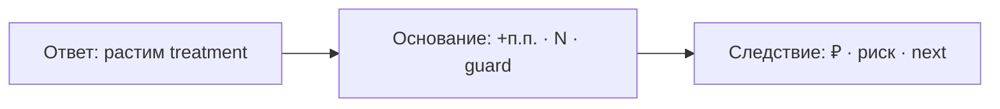
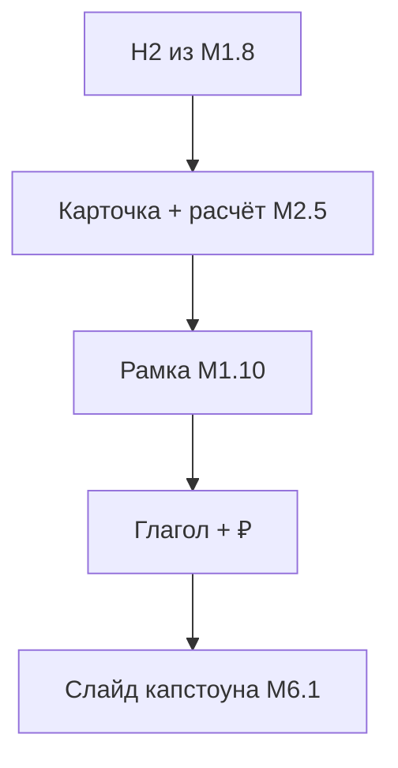

# М1.10. Как довести вывод до решения

| Поле | Значение |
|---|---|
| **ID** | М1.10 |
| **Неделя / проход** | Неделя 7–8 · Проход 3 |
| **Опора** | стратегия / деньги / защита |
| **Аудитория** | аналитик + продакт |
| **Ориентир** | 60–80 мин · практика 2–3 ч (+ репетиция 5 мин) |
| **Визуалы** | [ответ → основание → следствие](./visuals/m1-10-answer-basis.svg) · [п.п. → деньги](./visuals/m1-10-pp-to-money.svg) |
| **Зависимость** | после М1.3, М2.4/М2.5; стык с капстоуном **М6.1** |
| **Вехи** | **P4** — перевод цифры эксперимента в решение на защите |

---

## Цели

После урока вы:

- **Общий минимум:** упаковываете вывод в рамку **ответ → основание → следствие** и переводите **+N п.п.** в порядок денег и глагол решения (растим / разворачиваем / убиваем / ждём данных).
- **Аналитик:** не оставляете «значимо» без N, окна и связи со словарём; отделяете шум от решения.
- **Продакт:** защищаете решение 5 минут без слайд-кладбища; называете цену ошибки I/II.

---

## Контекст Ритма

К неделе 7 у вас есть (или почти есть) расчёт `paywall_timing_2026q3` из **М2.5** и юнит-лист **М1.3**. P4 на защите спрашивает не «какой p-value», а **что делаем с продуктом**. Этот урок — репетиция денежного абзаца капстоуна **М6.1**.

Учебные якоря (как в М1.3 / М2.5): база habit→subscribe, глубина, early paywall, Pro 299 ₽/мес · 1 990 ₽/год; волна habit порядка тысяч на полном стенде.

---

## Теория коротко

### 1. Рамка: ответ → основание → следствие

| Часть | Содержание | Антипаттерн |
|---|---|---|
| **Ответ** | один глагол решения + объект | «метрики выглядят лучше» |
| **Основание** | primary, N, окно, ДИ/оговорка шума, guardrails | p-value без определения метрики |
| **Следствие** | ₽ порядка, что делаем завтра, что мониторим | «успех» без действий |

Картина: [`visuals/m1-10-answer-basis.svg`](./visuals/m1-10-answer-basis.svg).

### 2. Неопределённость без обесценивания

| Ситуация | Честная формулировка | Плохая |
|---|---|---|
| ДИ пересекает 0 | «эффект от −1 до +4 п.п.; при MDE 3 не раскатываем» | «ничего не доказали, зря работали» |
| Primary ↑, depth ↓ | «деньги primary не покупают раскатку» | «в целом положительно» |
| Малый N семпла | «на семпле шум; решение — по full» | «на глаз treatment лучше» |

Неопределённость — часть основания, не повод убрать следствие: *что решили при этом диапазоне*.

### 3. От п.п. к деньгам

Цепочка (порядок величины):

\[
\Delta \text{Pro} \approx \frac{\Delta_{\text{п.п.}}}{100} \times N_{\text{habit в волне}}
\]

Дальше × смешанный платёж / ARPPU / маржа **с листа М1.3** — не «из головы».

Визуал: [`visuals/m1-10-pp-to-money.svg`](./visuals/m1-10-pp-to-money.svg).

| Шаг | Учебный пример |
|---|---|
| Δ primary | +5 п.п. habit→subscribe_14d |
| База | 5 400 habit / волна |
| Δ Pro | ≈ +270 подписок |
| ₽ | × ARPPU/маржа из юнит-листа |
| Глагол | **растим**, если guardrails ок |

Оговорки обязательны: эффект стенда ≠ прод 1-в-1; guardrail бьёт — деньги primary не решают; «почти значимо» **не** умножаем на ₽.

### 4. Глаголы решения (словарь P4)

| Глагол | Когда |
|---|---|
| **Растим** | primary в нужную сторону, guardrails в норме, ₽ окупают риск |
| **Разворачиваем** | primary вниз или guardrail критично просел |
| **Убиваем** | гипотеза механизма опровергнута; не тащим «ещё вариант кнопки» |
| **Ждём / новый дизайн** | шум при честном N; или нужен другой primary |

«Частичная победа» (упал early paywall, primary в шуме) — **не** раскатка; это сигнал уточнить гипотезу.

### 5. Пять минут защиты (мини-формат)

1. Ответ (15 с).  
2. Контекст узкого места Ритма (45 с).  
3. Основание: дизайн + цифра (2 мин).  
4. Деньги + риск (1 мин).  
5. Следующий шаг / что не делаем (1 мин).  

Полная 10-минутная рубрика — в **М6.1**.

---

## Разобранный пример: один абзац решения

**Ответ:** растим `paywall` после `streak_3` на основную волну.

**Основание:** на full-синтетике `paywall_timing_2026q3` primary habit→subscribe_14d выше у treatment на X п.п. при N≈…; early_paywall_share ниже; d7_depth_ge3 не хуже порога; определения — М5.1; без daily peeking.

**Следствие:** порядок +Y Pro / волну × ARPPU с листа М1.3; мониторим depth 2 волны; цена ошибки I — раскатить вредный timing; не трогаем каталог привычек «в том же релизе».

(Конкретные X/Y студент подставляет из **своего** расчёта М2.5, не из ключа преподавателя.)

---

## Практика

Вход: карточка и цифры из М2.5 (или учебный черновик с пометкой «прогноз»). Юнит — М1.3. Ключ instructor **не** открывать до сдачи.

### Ядро (оба)

1. Заполните карточку **ответ / основание / следствие** на одну сторону A4 (или ½ слайда).  
2. Посчитайте цепочку п.п. → Δ Pro → ₽ порядка; укажите источник ARPPU/маржи.  
3. Назовите **один** риск (ошибка I или II) и что мониторите после решения.  
4. Репетиция **5 минут** вслух (пара или запись): без чтения длинного текста.

### Расширение «руки»

- Чувствительность: покажите ₽ при Δ = +2 / +5 / +8 п.п. на той же базе.  
- Сценарий «primary ↑, depth −3 п.п.»: перепишите следствие (какой глагол?).  
- Одна проверка: определение primary дословно совпадает со словарём М5.1.

### Расширение «решение»

- Контр-бриф: уберите деньги — останется ли убедительным? (если да — бриф слабый.)  
- Политика чата: три запрещённые фразы («ещё денёк», «на iOS зелёное», «AI говорит winner»).  
- Заготовка Q&A: ответ на «а почему не раскатить только early-сегмент?».

---

## Критерии приёмки

- [ ] Есть глагол решения, не пересказ графика.
- [ ] Основание: метрика, N/окно, guardrail или явная оговорка.
- [ ] Есть порядок ₽ и источник юнит-гипотез.
- [ ] Неопределённость названа без обесценивания работы.
- [ ] Ядро + одно расширение; репетиция 5 мин состоялась.

---

## Линия AI

| Можно | Нельзя без вас |
|---|---|
| Сжать черновик до трёх предложений | Выбрать глагол раскатки |
| Помочь с порядком арифметики | Подставить «красивые» ₽ без листа М1.3 |
| Найти дыры в брифе | Объявить winner эксперимента из памяти модели |

**Проверка:** спросите AI только упаковать *ваши* числа. Если в ответе появились цифры, которых не было во входе — выбросить.

---

## Дальше читать

- P4 и защита: [`../course-structure.md`](../course-structure.md) §3.2–3.3, §4.1.  
- Инвентарь: [`../sources-inventory.md`](../sources-inventory.md) — жанр strategic_move / разборы защит (своими словами).  
- Входы: [`m2-5-ab-design-read.md`](./m2-5-ab-design-read.md), [`m2-4-confidence-intervals.md`](./m2-4-confidence-intervals.md), [`m1-3-unit-economics.md`](./m1-3-unit-economics.md).  
- Выход: [`m6-1-capstone-defense.md`](./m6-1-capstone-defense.md).

Визуалы: [`visuals/m1-10-answer-basis.svg`](./visuals/m1-10-answer-basis.svg), [`visuals/m1-10-pp-to-money.svg`](./visuals/m1-10-pp-to-money.svg).
