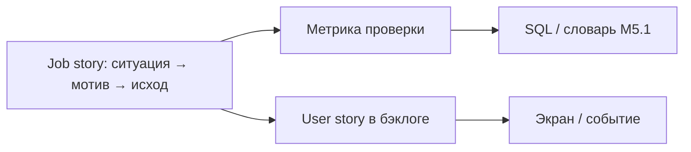
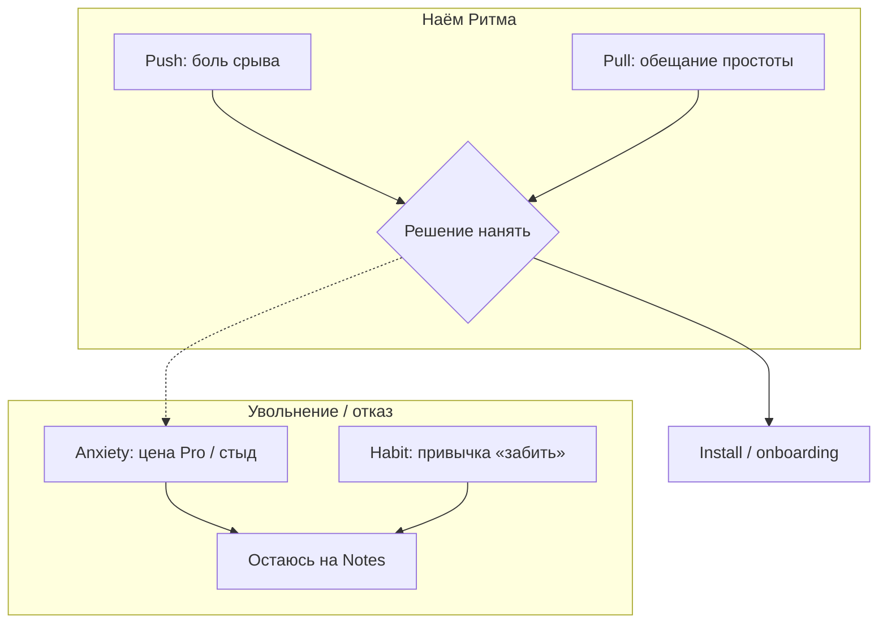
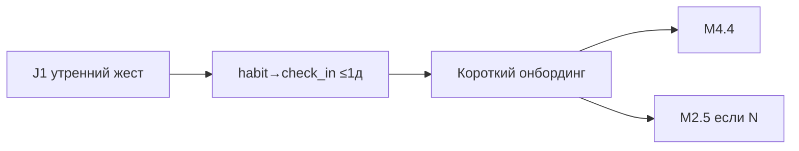

# М1.2. JTBD: зачем клиент «нанимает» продукт

| Поле | Значение |
|---|---|
| **ID** | М1.2 |
| **Неделя / проход** | Неделя 3 · Проход 2 |
| **Опора** | продукт / стратегия · Jobs to Be Done |
| **Аудитория** | аналитик + продакт |
| **Ориентир** | 60–80 мин · практика 2–3 ч |
| **Визуалы** | Mermaid: job story vs user story · силы перехода |
| **Зависимость** | после М1.1; стык с **М1.7**, **М4.4**, метриками М1.3 / М5.1 |
| **Вехи** | уплотняет P2→P3: работа → метрика проверки |

---

## Цели

После урока вы:

- **Общий минимум:** формулируете **≥3 job story** для Ритма в формате *Когда… хочу… чтобы…* и для каждой — **проверяемую метрику** (не «довольство»).
- **Аналитик:** связываете job с событием/окном из tracking plan; отделяете «наём» продукта от клика по фиче.
- **Продакт:** видите силы перехода (push / pull / anxiety / habit) и не путаете job story с бэклогом user story.

---

## Контекст Ритма

М1.1 уже зафиксировал проблему: удерживать 1–3 ежедневных ритуала, не бросая через неделю. **М1.2** отвечает: *какую работу человек нанимает Ритм делать* — и чем это отличается от «хочу streak-бейдж».

Без JTBD воронка М2.3 и CJM М1.7 легко съезжают в фичи: «добавим напоминания», «перекрасим paywall». С JTBD гипотеза звучит: «люди увольняют заметки/календарь, потому что в контексте утра нужна *минимальная* отметка прогресса — проверим depth_d7 и time-to-first-check-in».

Сценарий тот же: онбординг → привычка → чек-ин → streak → paywall → Pro (299 ₽/мес · 1 990 ₽/год).

---

## Теория коротко

### 1. Продукт нанимают на работу

Люди покупают не «приложение привычек», а **прогресс в ситуации**: утром не забыть зарядку; вечером закрыть «день не зря»; не сорвать серию после отпуска. Работа существует **до** Ритма — альтернативы: заметка, календарь, Excel, «ничего», чужой трекер.

| Вопрос | Плохой ответ | Лучше для Ритма |
|---|---|---|
| Кто пользователь? | «женщины 25–34» | «человек, который уже пробовал трекер и бросил» |
| Что строим? | «экран streak» | «минимальный ритуал отметки в контексте утра» |
| Чем мерим успех job? | NPS после онбординга | time-to-first-check-in · depth_d7 · return_d3 |

Правило курса: **job без метрики — слоган; метрика без job — отчётность.**

### 2. Job story против user story

| | **Job story** | **User story** |
|---|---|---|
| Формат | Когда [ситуация], хочу [мотивация], чтобы [исход] | Как [роль], хочу [фичу], чтобы [выгода] |
| Центр | контекст и прогресс | персона и бэклог |
| Решение внутри? | почти никогда | часто уже заложено |
| Где живёт | discovery, позиционирование, метрики | спринт, критерии приёмки |

Пример Ритма:

- **Job:** *Когда утро будний и осталось 3 минуты до выхода, хочу отметить ритуал одним жестом, чтобы не тащить вину весь день.*  
- **User story (уже решение):** *Как пользователь, хочу виджет на home screen, чтобы открывать чек-ин без онбординга.*

Сначала job и метрика; фича — следствие.

### 3. Силы перехода (почему нанимают / увольняют)

Четыре силы (пересказ логики Moesta / Demand-Side):

| Сила | Смысл | Учебный сигнал на Ритме |
|---|---|---|
| **Push** | давление текущей ситуации | «сорвал третью попытку за год» |
| **Pull** | притяжение нового решения | «один жест — и день закрыт» |
| **Anxiety** | страх переключения | «снова подписка, которую заброшу» |
| **Habit** | инерция старого | заметка в Notes / «забью» |

На paywall anxiety часто сильнее pull — отсюда H2 timing (М2.5): не продавать Pro до ощущения прогресса.

### 4. Как JTBD становится метрикой

Цепочка:

1. Job story (ситуация + исход).  
2. **Поведенческий критерий успеха** глазами пользователя («отметил до выхода из дома»).  
3. Событие(я) в tracking plan (М4.3).  
4. Определение в словаре М5.1 + окно.  
5. Гипотеза продукта: изменение поверхности → сдвиг метрики.

| Job (кратко) | Метрика проверки | Не метрика |
|---|---|---|
| Утренний ритуал за 1 жест | share users с check_in ≤15 мин после первого открытия дня | «лайкнули онбординг» |
| Не бросить к дню 7 | depth_d7 / return_d3 | MAU без когорты |
| Понять ценность до оплаты | early_paywall_share ↓ · habit→subscribe при late PW | «конверсия paywall» без триггера |

### 5. Три работы Ритма (учебный канон)

Не один job на весь продукт — минимум три конкурирующих:

| # | Job story | Конкурент | Метрика |
|---|---|---|---|
| J1 | Когда день рвётся на куски, хочу одну маленькую победу, чтобы не чувствовать день пустым | заметка / «забью» | time-to-first-check-in · check_ins/user_d1 |
| J2 | Когда уже срывал трекеры, хочу удержать серию без перфекционизма, чтобы не бросить после одного пропуска | Habitica / Excel | streak_3_reached · return после пропуска |
| J3 | Когда привычка уже держится, хочу снять лимиты freemium, чтобы не спотыкаться о paywall | «останусь на free» | habit→subscribe_14d · early vs late PW |

Практика урока строится на этих трёх (можно уточнять формулировки, не раздувать до 12).

---

## Разобранный пример: от job к гипотезе P3

**Ситуация:** в диагностике М1.8 узкое место habit→first check_in.

**Job J1** (утро, 3 минуты).  
**Силы:** push = вина пустого дня; anxiety на онбординге = «опять 7 вопросов».  
**Метрика:** доля `habit_created` → `check_in` ≤1д; медиана времени до первого check_in.  
**Гипотеза:** укоротить онбординг до 1 привычки → ↑ depth без роста early paywall.  
**Проверка:** коридор М4.4 на онбординге + потом A/B, если хватает N (М2.4/М2.5); если N мал — план М2.6.

---

## Практика

Объект: Ритм (стенд / сценарий). Словарь — М5.1; события — М4.3.

### Ядро (оба)

1. Напишите **3 job story** (можно оттолкнуться от J1–J3 выше) — строго *Когда / хочу / чтобы*.  
2. Для каждой: альтернатива «увольнения», одна сила push и одна anxiety.  
3. Для каждой: **метрика** (формула словами + окно) и событие-якорь.  
4. Одну job свяжите с узким местом из М1.3 / М1.8 (или предположите, если ещё нет диагностики).

### Расширение «руки»

- Таблица «job → событие → SQL-псевдокод sanity» (3 строки).  
- Сравните early vs late paywall как разные ответы на anxiety J3 (без спойлера A/B-ключа).  
- Список метрик, которые **притворяются** проверкой job, но ими не являются (vanity).

### Расширение «решение»

- Однослайдовый выбор: *какую одну job оптимизируем на нед. 3–5 и от какой отказываемся*.  
- Перепишите одну user story бэклога в job story — покажите, какое решение было спрятано.  
- Как JTBD меняет текст paywall (выгода vs налог — мост к М1.6).

---

## Критерии приёмки

- [ ] ≥3 job story в правильном формате; не список фич.
- [ ] У каждой — метрика с окном и альтернатива конкурента.
- [ ] Есть силы перехода хотя бы для одной job.
- [ ] Явная связь с событием / словарём или пометка «дыра → М4.4».
- [ ] Ядро + одно расширение.

---

## Линия AI

| Можно | Нельзя без вас |
|---|---|
| Черновик формулировок job из описания Ритма | Выбрать, какая job сейчас в приоритете |
| Набросать силы перехода | Объявить «истинную работу всех пользователей» |
| Предложить метрики-кандидаты | Подменить job конверсией paywall |

**Проверка:** вычеркните из job все слова про UI («кнопка», «экран», «бейдж»). Если формулировка развалилась — это была user story.

---

## Дальше читать

- Курс: [`m1-1-problem-market.md`](./m1-1-problem-market.md) · [`m1-7-cjm-journey.md`](./m1-7-cjm-journey.md) · [`m4-4-corridor-tests.md`](./m4-4-corridor-tests.md).  
- Открыто: [GoPractice — JTBD: теория и фреймворки](https://gopractice.ru/product/jtbd-the-theory-and-the-frameworks/) · [гайд JTBD-интервью](https://gopractice.ru/product/jtbd-interview/) · [Kustov JTBD — ScrumTrek](https://scrumtrek.ru/blog/product-management/2492/gajd-po-tehnike-jobs-to-be-done-jtbd/) · [personas vs JTBD](https://gopractice.ru/product/personas-vs-jtbd/).  
- Библиотека: [`../materials-library.md`](../materials-library.md) §3.7.
