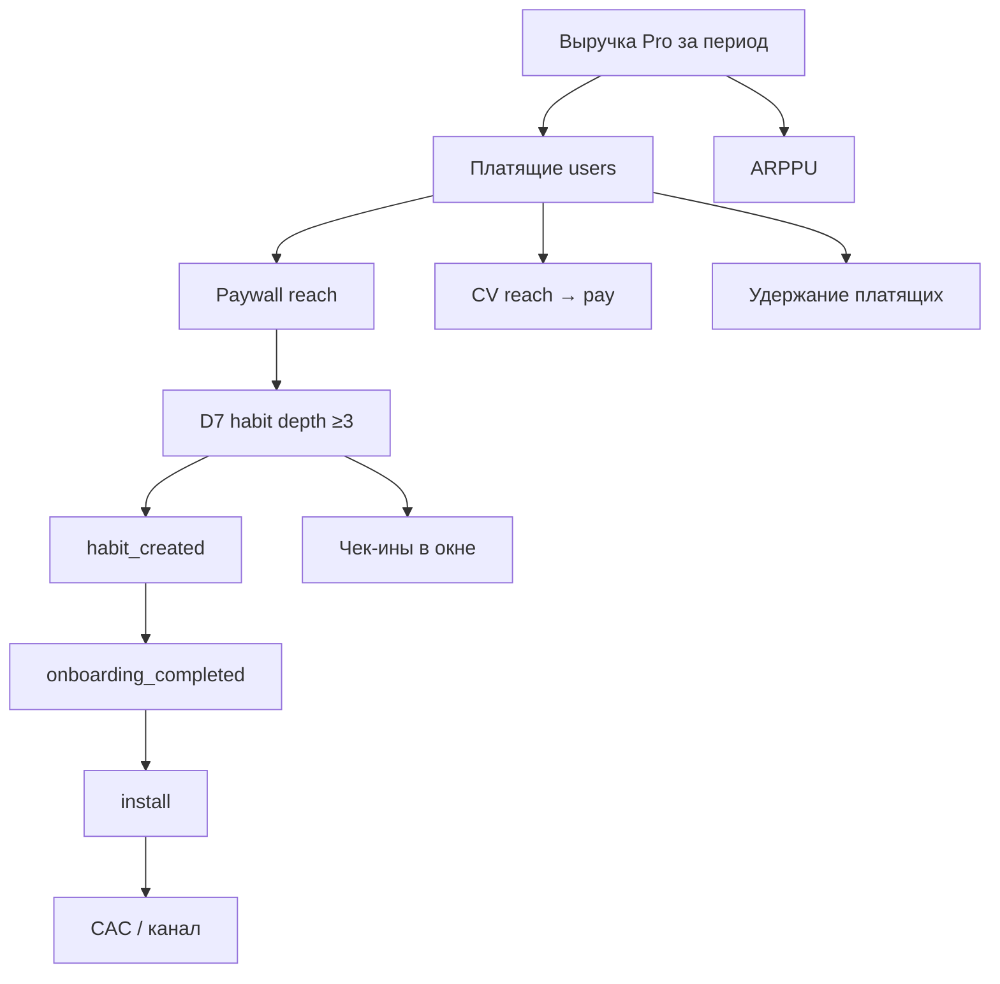

# М1.3. Юнит-экономика: продукт как машина по производству денег

| Поле | Значение |
|---|---|
| **ID** | М1.3 |
| **Неделя / проход** | Неделя 2 · Проход 1 (база) → дожим в P2 |
| **Опора** | продукт, стратегия, экономика |
| **Аудитория** | аналитик + продакт |
| **Ориентир** | 90–110 мин · практика 3–4 ч |
| **Визуалы** | [древо метрик Ритма](./visuals/m1-3-metric-tree-full.svg) · [узкое горлышко](./visuals/m1-3-bottleneck.svg) |
| **Зависимость** | после М1.1; стык с М2.3 (конверсии) и М5.1 (словарь) |
| **Вехи** | **P1** (древо) + **P2** (юнит на одном листе) |

---

## Цели

После урока вы:

- **Общий минимум:** собираете экономику Ритма на одном листе (CAC → LTV → маржа) и указываете **узкое место**, а не «всё плохо».
- **Аналитик:** считаете ARPU/ARPPU, payback и чувствительность к depth≥3 / конверсии в Pro; не путаете vanity с рычагом.
- **Продакт:** защищаете приоритет («чинить онбординг, а не крутить цену») деньгами и отказом от чужих моделей (маркетплейс ≠ подписка).

---

## Контекст Ритма

В М1.1 вы выбрали проблему (теряют серию в первые 7 дней) и метрику решения **D7 habit depth ≥3**. Здесь разворачиваем **полное древо** до денег и отвечаем: *сколько стоит один удерживающий пользователь и где машина рвётся*.

Монетизация Ритма (стенд):

| План | Цена |
|---|---|
| Pro месяц | **299 ₽** |
| Pro год | **1 990 ₽** (~166 ₽/мес при полной оплате вперёд) |

Сценарий: онбординг → привычка → чек-ин → streak → paywall → Pro. Вехи: древо закрывает кусок **P1**; лист экономики + узкое место — ядро **P2**.

---

## Теория коротко

### 1. Древо метрик: сверху деньги, снизу действие

Правило: каждый узел либо **следствие** (деньги, платящие), либо **рычаг** (действие пользователя / канал). Не вешайте MAU на вершину.

Полная схема с подписями рычаг/следствие: [`visuals/m1-3-metric-tree-full.svg`](./visuals/m1-3-metric-tree-full.svg).

### 2. Словарь денег (подписка)

| Метрика | Определение курса (черновик → М5.1) | На Ритме |
|---|---|---|
| **ARPU** | выручка / все активные users периода | размывает freemium |
| **ARPPU** | выручка / платящие | 299 vs mix месяц/год |
| **AMPU / AMPPU** | то же с **маржой** после COGS (хостинг, платежи, саппорт) | без COGS — только валовая «на салфетке» |
| **CAC** | стоимость привлечения **одного** install (или одного `habit_created` — но подпишите) | учебный CAC ниже |
| **LTV** | ожидаемая маржа с пользователя за жизнь | для подписки ≈ (маржа/мес) × срок жизни; не «ARPU×12» без оттока |
| **LTV/CAC** | ориентир, **не закон** «должно быть 3» | смотрите payback и риск |

**Payback:** за сколько месяцев когорта возвращает CAC маржой. Для freemium критичен путь до первой оплаты *и* отток после.

### 3. Модели экономик — не копируйте чужой лист

| Модель | Единица | Типичный рычаг | Ловушка для Ритма |
|---|---|---|---|
| Подписка (мы) | user / месяц жизни | ретеншн, CV в Pro, churn | считать LTV как e-com «чек» |
| E-com | заказ | AOV, повторные покупки | игнорировать freemium-хвост |
| Маркетплейс | GMV × take rate | ликвидность сторон | нет двух сторон в Ритме |
| Реклама | показы / ARPDAU | внимание, не подписка | оптимизация DAU ценой глубины |
| B2B SaaS | seat / контракт | expansion | другой цикл продажи |

На курсе считаем **подписку B2C**. Остальное — чтобы не стащить формулу из чужого шаблона.

### 4. Узкое горлышко (логика Голдратта)

Машина = цепочка. Улучшение **не-узкого** звена не поднимает пропускную способность.

На Ритме типовая цепочка:

install → onboarding → habit → depth≥3 → paywall (после ценности) → subscribe → retention платящих

Если 73% отваливаются до depth≥3, а CV paywall→pay уже «нормальная» для ниши — крутить креатив paywall = оптимизация пустышки. Схема: [`visuals/m1-3-bottleneck.svg`](./visuals/m1-3-bottleneck.svg).

### 5. Юнит считается по когорте, не «в среднем по больнице»

Правило курса (и здравого смысла привлечения): **сравниваем деньги одной волны привлечения с затратами на эту же волну**. Смешать всех платящих за месяц с рекламой «в целом» — получить красивое, но бессмысленное LTV/CAC.

Мини-алгоритм на одну когорту install (или `habit_created` — но единицу зафиксируйте):

1. Сколько потратили на привлечение **этой** когорты → **CAC / CPUser**.
2. Сколько валовой маржи уже принесла когорта → факт.
3. Какую маржу ещё *ожидаете* (удержание × платежи) → прогноз отдельно от факта.
4. **AMPU** (маржа на одного привлечённого) vs **AMPPU** (на платящего): AMPU отвечает «окупается ли канал», AMPPU — «жив ли платящий сегмент».
5. Сходятся ли **AMPU ≥ CPUser** (или LTV ≥ CAC) — и **за какой срок** (payback).

На Ритме freemium усиливает разрыв AMPU/AMPPU: большинство install не платят; «средний ARPU» маскирует узкое место depth→Pro.

### 6. Где счёт врёт (чеклист перед решением)

| Ловушка | Как выглядит «правда» | Что делать на Ритме |
|---|---|---|
| **Неполный CAC** | только реклама в кабинете | учебный CAC = media + доля команды/инструментов по **одному** правилу на все каналы |
| **Окупаемость от оборота** | «первый платёж 806 ₽ > CAC 45 ₽» | сравнивать с **маржой** после COGS/платежей, не с выручкой |
| **LTV без горизонта** | «LTV = ARPU × 12» | горизонт явный (3 / 6 / 12 мес.); **факт** удержания отдельно от **экстраполяции** |
| **Среднее по каналам** | «LTV/CAC = 2,8» | разрез platform / канал / месяц install; среднее — последним |
| **Красивый LTV/CAC, длинный payback** | соотношение > 3, касса горит | для маленькой команды **payback важнее** бенчмарка «должно быть 3» |
| **Napkin LTV** | ARPA × 1/churn | ок для салфетки; для решения по каналу — **когортные** кривые retention × MRR (операторский метод) |

Чувствительность обязательна: пересчитайте вывод при **пессимистичном** удержании. Если решение держится только на оптимистичном хвосте — это гипотеза, не факт.

### 7. Связь с P1 / P2

| Артефакт | Вехи | Что сдать из этого урока |
|---|---|---|
| Древо 8–15 узлов | P1 | от выручки до события; метка рычаг/следствие |
| Лист экономики | P2 | CAC, конверсии цепочки, ARPPU/mix, LTV-набросок, payback, **одно** узкое место |
| Чувствительность | P2+ | «что если depth +5 п.п.» **и** пессимистичный retention в деньгах когорты |

---

## Разобранный пример: один лист Ритма (учебный срез)

Цифры **метода** (согласованы с воронкой М1.1 / М2.3). Когда гоняете стенд — замените фактами, определения оставьте.

**Воронка (users, волна 10 000 install):**

| Шаг | Users | CV от предыдущего |
|---|---|---|---|
| install | 10 000 | — |
| onboarding_completed | 7 200 | 72% |
| habit_created | 5 400 | 75% |
| depth≥3 (7д) | 1 450 | 27% |
| paywall_view | 2 000 | (не строго «после depth») |
| subscribe_started (новые) | 380 | 19% от paywall / 7% от habit |

**Деньги (учебные допущения):**

| Параметр | Значение |
|---|---|
| CAC (paid, на install) | 45 ₽ |
| Доля month / year среди новых Pro | 70% / 30% |
| Смешанный «первый платёж» | 0,7×299 + 0,3×1990 ≈ **806 ₽** |
| Допущение маржи после платежей | 85% от платежа (учебно) |
| Средний срок жизни Pro (грубо) | 4 месяца эквивалента месячной оплаты *или* учёт года отдельно — **подпишите модель** |
| Учебный LTV (маржа) | ~1 100 ₽ на платящего (набросок; не истина) |

**На когорту 10k install:**

- стоимость привлечения: 10 000 × 45 = **450 000 ₽**;
- новых Pro: 380; валовая «на салфетке» с первого платежа: 380 × 806 × 0,85 ≈ **260 000 ₽** — **ещё не окупили CAC** без повторных месяцев / года;
- если поднять depth≥3 с 27% до 32% при той же CV depth→pay, платящих станет больше → чувствительность важнее спора «на 10 ₽ дороже креатив».

**Узкое место в этом срезе:** переход **habit → depth≥3 (27%)**, не цена Pro и не «мало paywall». Paywall reach (2 000) больше depth (1 450): часть давления идёт *до* ценности — стык с guardrail из М2.3 и экспериментом М2.5.

---

## Практика

Опирайтесь на таблицу выше. Стенд: [`../stand/`](../stand/) — `subscriptions.price_rub`, события из М4.3.

### Ядро (оба) — артефакты P1+P2

1. Нарисуйте **древо метрик** Ритма (8–15 узлов): корень = выручка Pro; листья = события/канал. Пометьте рычаг vs следствие.
2. Заполните **один лист** экономики волны:
   - CAC и на что он считается (install / habit);
   - 5–6 конверсий цепочки;
   - mix month/year и ARPPU первого платежа;
   - LTV-набросок с **явными** допущениями (срок, маржа, churn);
   - payback «в лоб» (окупается ли когорта первым платежом / за N месяцев).
3. Назовите **одно** узкое горлышко и одно действие, которое вы *не* будете делать, пока оно не сдвинуто.
4. Запишите if/then: «если depth≥3 < X две волны подряд → …».
5. В листе явно разделите: **факт маржи когорты на сегодня** / **экстраполированный LTV** / **payback в месяцах**.

### Расширение «руки»

- Пересчитайте лист при CAC = 70 ₽ и при 30 ₽: что ломается первым?
- Чувствительность: +5 п.п. к habit→depth при неизменной depth→subscribe — сколько доп. Pro и ₽ на волну?
- Пессимистичный сценарий: срок жизни Pro −30% к базовому допущению — сходится ли экономика канала?
- Покажите **AMPU** и **AMPPU** на одной когорте (маржа / все install vs маржа / платящие).
- Напишите 3 контрольных проверки к будущему SQL (исключить `is_internal`, дедуп renew, не джойнить две строки `subscriptions` как двух платящих без правил).

### Расширение «решение»

Одностраничный бриф для синкапа:

- узкое место и почему не цена / не «ещё привычек в каталоге»;
- бюджет гипотезы на квартал vs ожидаемый эффект в ₽ (порядок);
- что скажете инвестору/фаундеру, если LTV/CAC «красивый», а payback > 6 мес. при текущем churn;
- отказ: какие метрики *не* тащите в North Star на этом этапе;
- где в вашем листе риск «среднее скрыло убыточный сегмент» (platform / канал).

---

## Критерии приёмки

- [ ] Древо согласовано с проблемой М1.1 (depth на пути к деньгам, не MAU наверху).
- [ ] Лист содержит CAC, цепочку CV, деньги Pro, LTV-допущения, вывод по окупаемости; факт / экстраполяция / payback разделены.
- [ ] Узкое место одно; есть явный «не трогаем, пока…».
- [ ] Ядро + одно расширение; в «руках» — чувствительность, пессимистичный retention или AMPU/AMPPU.
- [ ] AI мог набросать «LTV/CAC = 3» — в сдаче ваши допущения и отказ от чужой модели.

---

## Линия AI

| Можно | Нельзя без вас |
|---|---|
| Развернуть дерево, предложить формулы | Выбрать единицу CAC и окно LTV |
| Посчитать арифметику чувствительности | Объявить узкое место без сравнения звеньев |
| Сравнить модели подписка vs e-com | Подставить чужой бенчмарк «LTV/CAC = 3» как закон |

**Проверка:** вычеркните из ответа AI все LTV без срока жизни и маржи. Если остались только «средние по рынку» — промпт был про бенчмарк, не про Ритм.

---

## Дальше читать

База урока — выше; наружу уходить не нужно. Библиотека курса — для разбора примеров и формулировок рядом с практикой Ритма.

- Место в спирали и вехи P1–P2: [`../course-structure.md`](../course-structure.md) §3.2, §4 (М1.3).
- **Библиотека курса (юнит):** [`../uploads/bonus-gopractice-unit-economics.md`](../uploads/bonus-gopractice-unit-economics.md) · [`../uploads/bonus-vcru-ltv-cac-unit-economics.md`](../uploads/bonus-vcru-ltv-cac-unit-economics.md) · [`../uploads/medium-ki-unit-economics-one-day.md`](../uploads/medium-ki-unit-economics-one-day.md) · [`../uploads/linkedin-min-finance-operators-guide-ltvcac.md`](../uploads/linkedin-min-finance-operators-guide-ltvcac.md).
- Карта библиотеки: [`../materials-library.md`](../materials-library.md).
- Конверсии и когорты, которыми кормите лист: [`m2-3-conversion-cohorts.md`](./m2-3-conversion-cohorts.md).
- Словарь определений (следующий носитель P1→демо-2): [`m5-1-metrics-layer.md`](./m5-1-metrics-layer.md).
- Стенд и цены: [`../stand/README.md`](../stand/README.md).

Рядом: [`m1-1-problem-market.md`](./m1-1-problem-market.md). Финансы глубже (P&L, LTV финансиста) — М1.4 (конвейер).
