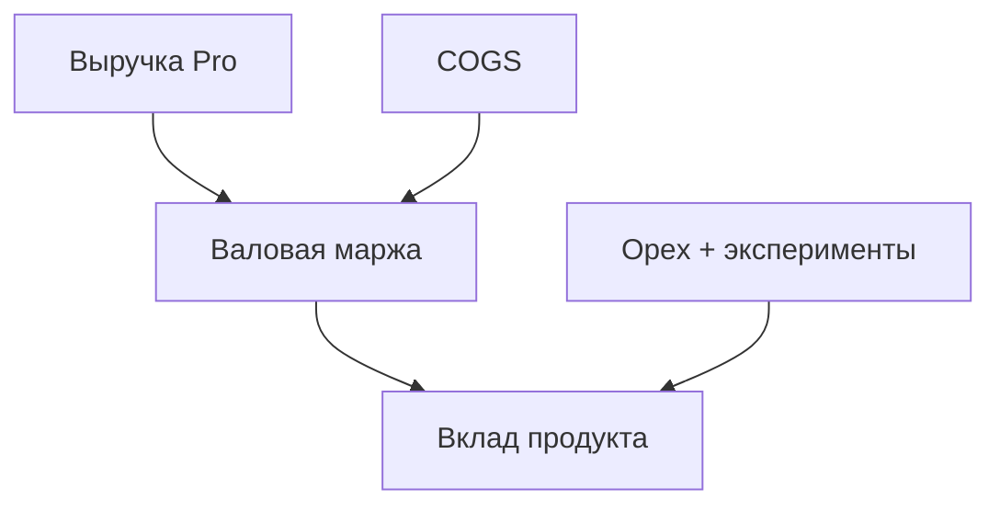
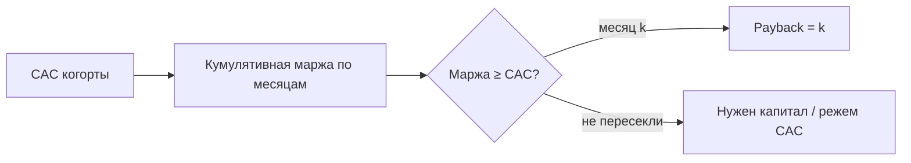

# М1.4. Финансы продукта для продакта и аналитика

| Поле | Значение |
|---|---|
| **ID** | М1.4 |
| **Неделя / проход** | Неделя 6 · Проход 3 |
| **Опора** | продукт / экономика · P&L и окупаемость |
| **Аудитория** | аналитик + продакт |
| **Ориентир** | 70–90 мин · практика 3–4 ч |
| **Визуалы** | Mermaid: P&L слоя · payback когорты |
| **Зависимость** | после **М1.3**; стык с **М1.10**, **М2.5**, капстоуном |
| **Вехи** | **P4** — деньги гипотезы и окупаемость рядом с A/B |

---

## Цели

После урока вы:

- **Общий минимум:** собираете **упрощённый P&L продукта** Ритма и считаете **CAC payback когорты** (не «магическое LTV/CAC = 3»).
- **Аналитик:** разделяете LTV продакта (поведение × ARPU) и LTV финансиста (маржа, горизонт, churn); не смешиваете выручку с вкладом.
- **Продакт:** оцениваете **стоимость одной гипотезы** (трафик × время × риск) до раскатки A/B.

---

## Контекст Ритма

М1.3 дал юнит на одном листе: древо, ARPU/ARPPU, узкое место. **М1.4** поднимает взгляд: сколько денег реально остаётся продукту и когда когорта отбивает привлечение. На защите P4 фраза «+5 п.п. → +N ₽» без payback и COGS звучит слабо — здесь вы учитесь не врать себе про cash.

Учебные якоря: Pro 299 ₽/мес · 1 990 ₽/год; freemium; синтетические когорты `users` / `subscriptions` / события стенда. CAC в учебном стенде **задаётся сценарием** (или берётся из листа М1.3) — не ищем «реальный маркетинг Ритма».

---

## Теория коротко

### 1. P&L продукта: слои, не одна ячейка Excel

| Строка | Смысл для Ритма | Частая ошибка |
|---|---|---|
| **Выручка** | платежи Pro (месяц/год), иногда trial→paid | считать «потенциал» как факт |
| **COGS** | платежный %, поддержка платящих, infra на активного | забыть переменные издержки |
| **Валовая маржа** | выручка − COGS | путать с «прибылью компании» |
| **Opex продукта** | команда, фичи, эксперименты | всё списать на CAC |
| **Вклад продукта** | маржа − opex (упрощённо) | оптимизировать vanity MAU |

Правило: **сначала маржа с платящего, потом масштабирование привлечения.**

### 2. CAC payback важнее лозунга «LTV/CAC = 3»

Классика SaaS часто твердит 3:1. На практике:

- LTV на молодых когортах — это **экстраполяция**, не факт (см. М2.3 ретеншн).  
- **Payback** = сколько месяцев валовой маржи нужно, чтобы вернуть fully-loaded CAC.  
- Две компании с одинаковым LTV/CAC и payback 6 vs 24 мес — разные бизнесы по кэшу.

Учебная формула (порядок величины):

\[
\text{Payback (мес)} \approx \frac{\text{CAC}}{\text{ARPU}_{\text{мес}} \times \text{Gross Margin \%}}
\]

Честнее — **когортная кривая**: кумулятивная маржа когорты месяца M vs CAC этой когорты; месяц пересечения = наблюдаемый payback.

| Ситуация | Честный вывод |
|---|---|
| Payback 4 мес при GM 70% | можно крутить привлечение осторожно |
| LTV/CAC «4» на 2-й месяц жизни когорты | самообман; смотрите payback и хвост retention |
| Годовая подписка 1 990 ₽ | ускоряет cash vs 299×12 — модель отдельно |

### 3. LTV продакта vs LTV финансиста

| | **Продакт / аналитик продукта** | **Финансист** |
|---|---|---|
| Вход | поведение, конверсия, retention | маржа, налог, аллокация opex |
| Горизонт | часто 3–12 мес «видимой» жизни | полный горизонт + WACC |
| Риск | путать ARPU с прибылью | усреднить каналы в один CAC |

Курс требует оба слоя в разговоре: **поведенческий LTV** питает гипотезы; **маржинальный** — решение «растим бюджет / нет».

### 4. Сколько стоит гипотеза

До A/B (М2.5) оцените стоимость проверки:

| Компонент | Пример на Ритме |
|---|---|
| Трафик / N | недели до MDE +3 п.п. (М2.4) |
| Инженерное время | 3 дня на вариант paywall |
| Риск downside | падение depth / рост refund |
| Opportunity cost | что не делаем вместо этого |

Если стоимость гипотезы > ожидаемый вклад при optimistic Δ — сначала коридор (М4.4) или квази-план (М2.6), не «тестируем потому что модно».

### 5. Окупаемость учебного продукта (рамка сдачи)

На одном листе рядом с М1.3:

1. Выручка / маржа на платящего (мес и год).  
2. CAC сценария (дан преподавателем или принят в группе).  
3. Payback когорты (формула + 1 график/таблица).  
4. Стоимость H2 (`paywall_timing_*`) в «неделях стенда» и в ₽ порядка.  
5. Решение: при текущем payback имеет ли смысл раскатывать winner P4.

---

## Разобранный пример: payback vs «красивый» LTV

**Дано (учебное):** CAC = 180 ₽; ARPU платящих ≈ 250 ₽/мес смешанный; GM = 75%; доля платящих из когорты install к мес. 3 = 4%.

- Маржа на платящего в месяц ≈ 187 ₽.  
- На **одного install** ожидаемая маржа/мес ≈ 0,04 × 187 ≈ 7,5 ₽ → payback install-уровня выглядит бесконечным, если мерить от install, а не от платящего.  
- **Вывод:** считайте payback от **привлечённого платящего** и отдельно воронку install→paid; не смешивайте знаменатели.

Связь с P4: +5 п.п. habit→subscribe увеличивает поток платящих → сокращает эффективный CAC на Pro (больше «успехов» на тот же маркетинг) — пересчитайте на листе М1.10.

---

## Практика

Данные: лист М1.3 + витрины стенда (`subscriptions`, когорты). CAC — из брифа группы.

### Ядро (оба)

1. Упрощённый **P&L на 1 страницу**: выручка, COGS (3 строки максимум), маржа, opex продукта (оценка), вклад.  
2. **Payback** двух способов: формула ARPU×GM и набросок когортной кумулятивной маржи (хотя бы 6 месяцев гипотезы).  
3. Явно напишите, почему **не** опираетесь только на LTV/CAC = 3.  
4. Стоимость одной гипотезы (H2 timing или ваша из P3) — таблица из 4 компонентов.

### Расширение «руки»

- SQL/псевдокод: выручка Pro по месяцу когорты `subscribe_at`.  
- Сравнение payback месяц vs год (1 990 ₽) при одинаковом churn-сценарии.  
- Sanity: доля годовых в `subscriptions` и влияние на cash первого месяца.

### Расширение «решение»

- Memo на ½ страницы: «при нашем payback раскатываем ли winner A/B».  
- Где вы врёте инвестору, если покажете только LTV/CAC на месяце 2.  
- Отказ: какую гипотезу **не** тестируем из-за стоимости > вклада.

---

## Критерии приёмки

- [ ] P&L с разделением выручка / маржа / вклад; не один KPI.
- [ ] Payback посчитан; LTV/CAC = 3 не используется как закон.
- [ ] Стоимость гипотезы оценена до защиты P4.
- [ ] Знаменатели (install vs paid) не смешаны.
- [ ] Ядро + одно расширение.

---

## Линия AI

| Можно | Нельзя без вас |
|---|---|
| Черновик структуры P&L | Подставить «бенчмарк индустрии» как факт Ритма |
| Формулы payback | Спрятать допущения churn в красивый LTV |
| Сценарии what-if | Решение раскатки без связи с М2.5 / guardrails |

**Проверка:** удалите все числа без источника (лист М1.3, бриф CAC, запрос). Если слайд опустел — это была декорация.

---

## Дальше читать

- Курс: [`m1-3-unit-economics.md`](./m1-3-unit-economics.md) · [`m1-10-insight-to-decision.md`](./m1-10-insight-to-decision.md).  
- Открыто: [GoPractice — юнит-экономика](https://gopractice.ru/product/unit-economics/) · [vc.ru — где LTV/CAC врёт](https://vc.ru/marketing/3052938-unit-ekonomika-privlecheniya-ltv-cac) · обзорно: [CAC payback](https://www.zenskar.com/blog/cac-payback-period) · [LTV/CAC vs payback](https://saasflywheel.io/blog/ltv-cac-ratio-for-saas).  
- Uploads: [`../uploads/bonus-gopractice-unit-economics.md`](../uploads/bonus-gopractice-unit-economics.md) · [`../uploads/linkedin-min-finance-operators-guide-ltvcac.md`](../uploads/linkedin-min-finance-operators-guide-ltvcac.md).
