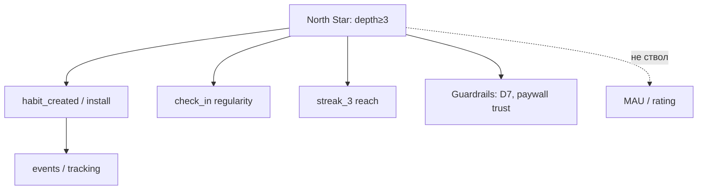

# М1.5. Стратегия: куда продукт идёт

| Поле | Значение |
|---|---|
| **ID** | М1.5 |
| **Неделя / проход** | Неделя 7 · Проход 3 |
| **Опора** | продукт, стратегия, экономика |
| **Аудитория** | аналитик + продакт |
| **Ориентир** | 70–90 мин · практика 2–3 ч |
| **Зависимость** | после М1.3, М5.1; стык с М1.8 / М1.10 / P4 |
| **Вехи** | рамка **P4** — «куда растём» до защиты A/B |

---

## Цели

После урока вы:

- **Общий минимум:** одностраничная стратегическая рамка Ритма (куда растём / от чего отказываемся) + кандидат NSM с 3–5 input-метриками.
- **Аналитик:** отличаете иерархию «связи в данных» от пирамиды-классификации и от культа одной цифры; не путаете vanity с рычагом.
- **Продакт:** защищаете отказ от фич/каналов, которые не бьют в дерево входов NSM на текущем этапе.

---

## Контекст Ритма

Freemium → Pro. На учебном этапе узкое место — ценность привычки (depth / retention), не «ещё вертикалей» и не агрессивный paid. Стратегия курса по умолчанию: **сначала ведро не течёт**, потом масштабируем привлечение.

М5.1 даёт словарь и NSM-гипотезу на этап. М1.5 отвечает: какой **отказ** делаем стратегически и как North Star не превращается в карго-культ.

---

## Теория коротко

### 1. Стратегия = выбор отказа

Четыре направления роста (учебный чеклист):

| Направление | Вопрос | Ритм сейчас |
|---|---|---|
| Больше пользователей | acquisition | позже, если depth держится |
| Чаще ценность | engagement / depth | **приоритет** |
| Больше платят | монетизация / ARPU | после ценности |
| Дольше остаются | retention / LTV | **приоритет рядом с depth** |

Отказ — часть артефакта: «не берём B2B-пивот», «не масштабируем paid, пока depth≥3 < X».

### 2. Иерархия vs пирамида vs NSM

| Рамка | Что это у нас | Ловушка |
|---|---|---|
| **Иерархия** | связи «деньги ← рычаги ← события» (древо М1.3) | дерево без решений |
| **Пирамида / слои** | health → ценность → рост → деньги | гиперфокус на одном кольце |
| **North Star** | одна гипотеза ценности на этап | «всё подчинили одной цифре» |

Правило: NSM **можно сменить**, когда сменилась стадия или узкое место (М0.1 § стадии, М5.1).

### 3. Дерево North Star

Ствол → 3–5 **input** → supporting. Пример ствола Ритма: доля users с depth≥3 за 7 дней после `habit_created` (карточка в М5.1). Здесь вы **обосновываете**, почему этот ствол на горизонте квартала, и какие метрики сознательно **не** в стволе (MAU, store rating как vanity на этом этапе).

### 4. Health → retention keystone → growth → business

Без базовой «здоровья» и удержания воронки роста бессмысленны. Retention — замок; бизнес-метрики сверху только если ведро не течёт. Детали матриц ретеншна — М2.3; деньги когорты — М1.3.

---

## Разобранный пример: отказ от «ещё одной привычки в каталоге»

Идея бэклога: каталог из 200 готовых привычек «как у конкурента» → рост install.

Стратегия этапа: ценность серии. Каталог без depth — acquisition vanity.

**Рамка:** цель квартала — поднять depth≥3 с A% до B% на когорте habit_created; отказ — paid scale и каталог-фича; NSM — depth≥3; inputs — onboarding completion, D1 check-in, streak_3; guardrail — жалобы на paywall / refund rate.

Связь с P4: эксперимент `paywall_timing_*` имеет смысл только если стратегия не «монетизировать до ценности».

---

## Практика

### Ядро (оба)

1. Одна страница: цель квартала Ритма, **явные отказы** (≥2), NSM-кандидат, 3 input, 2 guardrail.
2. Связь с листом М1.3: как сдвиг одного input бьёт в ₽ когорты (порядок величины, не идеальный прогноз).
3. Одна метрика, которую *не* берёте в NSM — и почему (анти-vanity).
4. Согласование имён со словарём М5.1 (не новое имя без карточки определения).

### Расширение «руки»

Таблица: вопрос стратегии → метрика → событие Ритма → где в Postgres/Metabase. Минимум 5 строк.

### Расширение «решение»

Бриф руководству: «почему не масштабируем paid, пока depth < X». Формат: ставка → доказательство из диагностики М1.8 → цена отказа → критерий пересмотра ставки.

---

## Критерии приёмки

- [ ] Есть явный отказ и NSM с inputs + guardrails.
- [ ] NSM согласован со словарём М5.1.
- [ ] Нет трёх «north star» сразу.
- [ ] Связь с юнит-экономикой или диагностикой названа.
- [ ] Ядро + одно расширение.

---

## Линия AI

AI предложит «классический SaaS NSM» (WAU, activation). Вы обязаны привязать к событиям и узкому месту Ритма. Проверка: выкиньте бренд — если текст про любой subscription app без depth/check_in — перепишите.

---

## Дальше читать (библиотека курса)

- [`../uploads/medium-seregina-metrics-hierarchy-vs-pyramid.md`](../uploads/medium-seregina-metrics-hierarchy-vs-pyramid.md)
- [`../uploads/medium-seregina-metrics-frameworks.md`](../uploads/medium-seregina-metrics-frameworks.md)
- [`../uploads/linkedin-zaleuska-north-star-product-metrics.md`](../uploads/linkedin-zaleuska-north-star-product-metrics.md)
- [`../uploads/linkedin-swartz-hierarchy-product-metrics.md`](../uploads/linkedin-swartz-hierarchy-product-metrics.md)
- Словарь: [`m5-1-metrics-layer.md`](./m5-1-metrics-layer.md) · Юнит: [`m1-3-unit-economics.md`](./m1-3-unit-economics.md) · Решение: [`m1-10-insight-to-decision.md`](./m1-10-insight-to-decision.md)
- Карта: [`../course-structure.md`](../course-structure.md) · [`../materials-library.md`](../materials-library.md)
