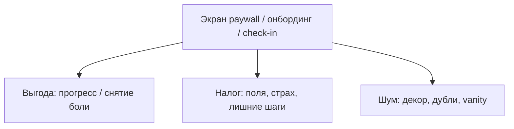
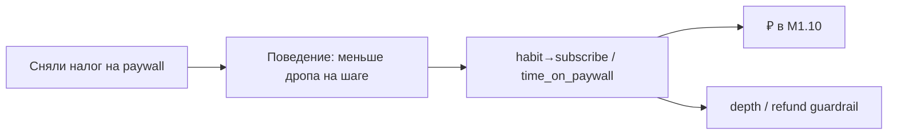

# М1.6. Ценность глазами пользователя: выгода и налог

| Поле | Значение |
|---|---|
| **ID** | М1.6 |
| **Неделя / проход** | Неделя 6 · Проход 3 |
| **Опора** | продукт / UX · экономика внимания |
| **Аудитория** | аналитик + продакт |
| **Ориентир** | 50–70 мин · практика 2–3 ч |
| **Визуалы** | Mermaid: выгода vs налог на экране · цепочка трения → метрика |
| **Зависимость** | после М4.1 / М1.7; стык с **М4.2**, **М1.10** |
| **Вехи** | P4 — изменение поверхности ↔ деньги без самообмана «красивым UI» |

---

## Цели

После урока вы:

- **Общий минимум:** размечаете **один ключевой экран Ритма** на зоны **выгоды** и **налога**; снимаете ≥2 элемента налога с предсказанием метрики.
- **Аналитик:** связываете налог (время, усилие, риск, непонимание) с событием отвала или временем шага.
- **Продакт:** правите текст/иерархию как рычаг конверсии, не как «дизайн ради дизайна».

---

## Контекст Ритма

К неделе 6 команда уже знает узкие места (М1.8) и готовит/читает A/B (М2.5). **М1.6** даёт язык ценности на поверхности: пользователь платит не только ₽, но и **вниманием**. Paywall, онбординг и чек-ин — места, где налог особенно дорог.

Стык с М4.2: налог на **экране** vs налог в **потоке**. Здесь фокус — один экран и текст; поток — соседний урок.

---

## Теория коротко

### 1. Экономика внимания: четыре валюты налога

| Валюта | Вопрос пользователя | Пример на Ритме |
|---|---|---|
| **Время** | сколько это займёт? | онбординг из 8 экранов |
| **Усилие** | сколько решений принять? | выбрать 5 привычек сразу |
| **Риск** | что будет, если ошибусь? | «спишется 1 990 ₽» без trial-ясности |
| **Непонимание** | что я получу? | Pro-буллеты про «AI-коуч» без связи с job |

Выгода — ответ на job (М1.2): «отмечу ритуал за секунду», «серия не сломается из-за одного пропуска».

### 2. Разметка экрана: выгода / налог / шум

| Зона | Держим | Режем |
|---|---|---|
| Выгода | одна ясная работа экрана | три оффера сразу |
| Налог | минимально необходимое (цена, юр. текст) | повторный опрос email |
| Шум | — | иллюстрации без смысла, «ещё 12 фич Pro» |

Правило Бюро/редактуры (пересказ для курса): **текст — часть продукта**. Смутная кнопка = налог непонимания = просадка конверсии, даже если «дизайн красивый».

### 3. Текст и конверсия

| Было (налог) | Стало (выгода) | Что ждать в данных |
|---|---|---|
| «Оформить Pro» | «Снять лимит: 3 привычки и напоминания» | ↑ CTR primary при том же трафике |
| «Тарифы» без цены выше fold | цена + период сразу | ↓ время до решения; не всегда ↑ CR |
| Страх «автопродление» мелким шрифтом | явный биллинг + отмена | ↓ refund / support; guardrail |

Не обещайте рост CR от любого сокращения текста: иногда налог **нужен** (юридика, цена). Цель — убрать налог, который **не** создаёт доверия.

### 4. Связь с метриками и P4

Любое снятие налога = гипотеза с primary и guardrail. Красивый экран без измерения — анти-скоуп курса.

### 5. Два обязательных экрана для практики

1. **Paywall** (early и late — сравнить налог anxiety).  
2. **Первый check-in** (налог усилия vs выгода «день закрыт»).

Онбординг — бонус, если успеваете.

---

## Разобранный пример: paywall Ритма

**Выгода:** снять freemium-лимит, сохранить streak-напоминания, закрыть job J3.  
**Налог:** 6 буллетов фич; цена только после скролла; CTA «Продолжить» без цены.  
**Шум:** анимация трофея, отзыв без имени.

**Снимаем два налога:** (1) цена и период у CTA; (2) один буллет = одна job, остальные в «подробнее».  
**Предсказание:** ↑ click CTA; primary habit→subscribe может вырасти; guardrail — не должно упасть `check_in` на следующий день (если меняли только PW).

---

## Практика

Объект: скрин/прототип/описание экрана Ритма (из стенда или М4.1).

### Ядро (оба)

1. Выберите **один** экран (paywall или check-in).  
2. Таблица зон: элемент → выгода / налог / шум → валюта налога.  
3. Снимите **≥2** элемента налога; опишите новый экран списком (не нужен Figma-шедевр).  
4. Предскажите сдвиг **одной** метрики + один guardrail.  
5. Свяжите с job из М1.2 (или сформулируйте кратко).

### Расширение «руки»

- События: какие нужны, чтобы измерить «время до CTA» / rage-drop (хотя бы псевдо).  
- Сравните early vs late paywall по налогам anxiety (таблица).  
- SQL-идея: доля `paywall_view` → `subscribe` по `trigger`.

### Расширение «решение»

- Что **не** трогаем на экране (юридика / цена) и почему это не «страх инноваций».  
- Как текст CTA попадает в карточку A/B (М2.5) одной строкой.  
- Отказ от редизайна всего онбординга — аргумент стоимостью гипотезы (М1.4).

---

## Критерии приёмки

- [ ] Экран размечен: выгода / налог / шум.
- [ ] ≥2 налога сняты с предсказанием метрики и guardrail.
- [ ] Нет «стало красивее» без поведения.
- [ ] Связь с job или узким местом продукта.
- [ ] Ядро + одно расширение.

---

## Линия AI

| Можно | Нельзя без вас |
|---|---|
| Варианты CTA и буллетов | Выбрать, какой налог критичен |
| Чеклист «длинный текст» | Подменить измерение эстетикой |
| Черновик предсказания метрик | Игнорировать guardrail |

**Проверка:** закройте скрин и по памяти назовите выгоду экрана одной фразой. Если не можете — налог непонимания ещё там.

---

## Дальше читать

- Курс: [`m4-1-screen-as-hypothesis.md`](./m4-1-screen-as-hypothesis.md) · [`m4-2-flow-friction.md`](./m4-2-flow-friction.md) · [`m1-2-jtbd.md`](./m1-2-jtbd.md).  
- Открыто: [Бирман — Пользовательский интерфейс (Бюро)](https://bureau.ru/books/ui/) · [Habr — user flow](https://habr.com/ru/articles/1081360/) · [Habr — гипотеза или баг фронта](https://habr.com/ru/companies/proto/articles/1077812/).  
- UX-инвентарь: [`../ux-sources.md`](../ux-sources.md).
