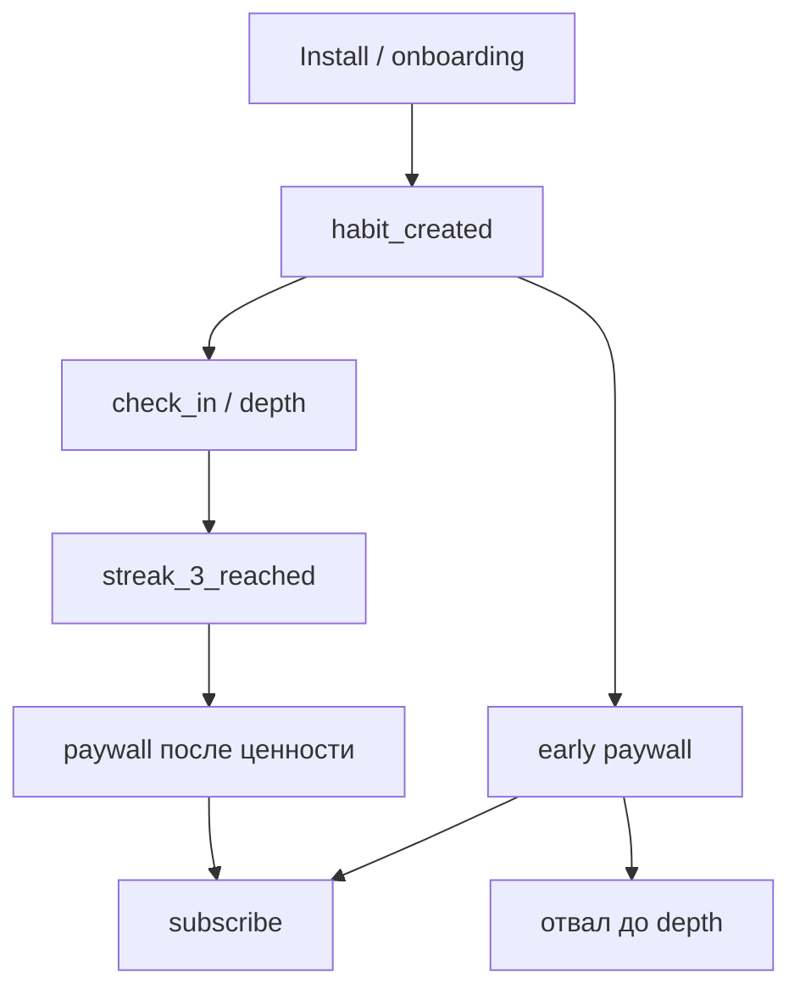
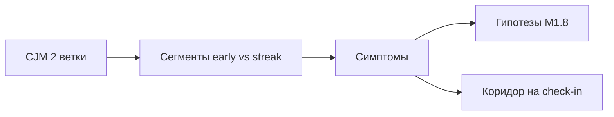

# М1.7. CJM и путь пользователя

| Поле | Значение |
|---|---|
| **ID** | М1.7 |
| **Неделя / проход** | Неделя 3–5 · Проход 2 (вход в **P3**) |
| **Опора** | продукт / UX · journey mapping |
| **Аудитория** | аналитик + продакт |
| **Ориентир** | 70–90 мин · практика 3–4 ч |
| **Визуалы** | [этапы CJM](./visuals/m1-7-cjm-stages.svg) · [усреднённый путь врёт](./visuals/m1-7-average-path-lie.svg) |
| **Зависимость** | после М1.1 / М4.3 желательно; стык с **М1.8**, **М4.4**; словарь М5.1 |
| **Вехи** | **P3** — путь → сегменты → сырьё для гипотез |

---

## Цели

После урока вы:

- **Общий минимум:** рисуете CJM **ключевого сценария Ритма** (онбординг → Pro) с шагами, трением и пометкой «логируется / дыра»; выделяете **≥2 реальных ветки**, а не один «средний» путь.
- **Аналитик:** связываете каждый шаг с событием tracking plan / метрикой словаря; видите, где воронка слепа без качественного наблюдения.
- **Продакт:** отделяете путь ценности от пути монетизации; не оптимизируете paywall, пока не понятен путь до depth.

---

## Контекст Ритма

К P3 команда уже знает проблему (М1.1), юнит и узкое место (М1.3), конверсии (М2.3). **М1.7** даёт карту *опыта*: где человек решает «остаться / бросить / платить». Эта карта кормит диагностику **М1.8** и коридор **М4.4** (когда в событиях дыра).

Сценарий тот же: install → онбординг → первая привычка → чек-ин → streak → paywall → Pro (299 ₽/мес или 1 990 ₽/год).

---

## Теория коротко

### 1. CJM — карта шагов и решений, не постер

На каждом шаге фиксируем четыре поля:

| Поле | Вопрос на Ритме |
|---|---|
| **Работа** | что человек пытается сделать |
| **Трение** | где спотыкается / сомневается |
| **Решение** | остаться / отложить / уйти / купить |
| **Сигнал** | событие или «дыра» (нужен коридор) |

Карта этапов: [`visuals/m1-7-cjm-stages.svg`](./visuals/m1-7-cjm-stages.svg).

Правило курса: **каждый шаг CJM либо привязан к событию М4.3, либо явно помечен как неизмеримый** — тогда слот М4.4.

### 2. Где CJM врёт

| Ловушка | Как выглядит | Что делать |
|---|---|---|
| Усреднённый путь | одна линия «все так ходят» | ≥2 ветки по сегменту |
| Happy path only | только дошедшие до Pro | отдельно путь отвала |
| Фичи вместо опыта | «экран настроек» в центре | держать работу пользователя |
| События = эмоции | «был happy на streak» | эмоции — гипотеза, не факт лога |

Усреднение: [`visuals/m1-7-average-path-lie.svg`](./visuals/m1-7-average-path-lie.svg).

### 3. Две обязательные ветки Ритма

| Ветка | Кто | Чем кормит P3 |
|---|---|---|
| **Streak-first** | дошли до streak_3, потом paywall | узкое часто в habit→depth |
| **Early PW** | paywall до ценности | early_paywall_share, H2 timing → М2.5 |

Без веток сегменты М1.8 будут «platform потому что так принято», а не потому что путь разный.

### 4. CJM → сегмент → гипотеза (мост)

1. На карте отметить **узкий шаг** (где решение «уйти» массово).  
2. Спросить: *у кого* этот шаг другой? → сегмент.  
3. Сформулировать симптом для М1.8.  
4. Если механизм на экране неясен → задача коридора М4.4 на **этом** шаге.  
5. Если рычаг UI и хватает трафика → кандидат в A/B (P4).

CJM сам по себе **не** приоритизирует гипотезы — это делает М1.8 (влияние × уверенность × стоимость).

### 5. Что логируется vs что видно только человеку

| Тип сигнала | Пример | Куда |
|---|---|---|
| Событие | `habit_created`, `check_in`, `paywall_view` | SQL / дашборд |
| Производная метрика | habit→first check_in ≤1д | словарь М5.1 |
| Наблюдение | «20 сек искал кнопку чек-ина» | М4.4 → гипотеза |
| Самоотчёт | «хочу Pro» в интервью | осторожно; не primary A/B |

---

## Разобранный пример: CJM до трёх симптомов P3

**Ключевой сценарий:** «создать одну привычку и удержать 3 дня, затем решить про Pro».

| Шаг | Работа | Трение (учебное) | Сигнал |
|---|---|---|---|
| Онбординг | выбрать 1 ритуал | длинный опрос, 3 привычки сразу | `onboarding_completed` / drop |
| Habit | создать | неясный CTA после создания | `habit_created` |
| Check-in | отметить день | кнопка неочевидна | `check_in` · **дыра UX** |
| Streak | дойти до 3 | забыли без пуша | `streak_3_reached` |
| Paywall early | «купить сейчас» | давление до ценности | `paywall_view` trigger=early |
| Paywall late | оценить Pro | цена / недоверие | `paywall_view` после streak |

**Симптомы в М1.8:** (1) habit→depth узкое; (2) early share высок; (3) на check-in — качественная дыра → коридор.

---

## Практика

Объект: поток Ритма (стенд / прототип / аналог habit-приложения). Определения метрик — из М5.1; имена событий — из М4.3 / стенда.

### Ядро (оба) — артефакт к P3

1. Нарисуйте **CJM ключевого сценария** (6–8 шагов) в любом удобном виде (Figma / доска / markdown-таблица).  
2. На каждом шаге: работа, трение, решение пользователя, событие **или** пометка «дыра».  
3. Добавьте **две ветки**: streak-first и early paywall (см. визуал 2).  
4. Отметьте **один узкий шаг** и кандидата в сегмент для М1.8.  
5. Выпишите **1 вопрос коридору** (М4.4) на шаге с дырой в логах.

### Расширение «руки»

- Таблица «шаг CJM → событие → метрика словаря» (минимум 5 строк).  
- SQL/псевдокод: доля users с `paywall_view` до первого `streak_3_reached` (early).  
- Список шагов, где воронка **не** отличит «не понял UI» от «не захотел» — аргумент для М4.4.

### Расширение «решение»

- Однослайдовый бриф: «какой путь оптимизируем на неделю 5 и какой **не** трогаем».  
- Отказ: «не рисуем CJM всех экранов настроек» — почему.  
- Как CJM меняет формулировку H2 (paywall timing), если early-ветка = 40% показов.

---

## Критерии приёмки

- [ ] CJM ключевого сценария с работами и трениями; не список экранов.
- [ ] ≥2 ветки; усреднённый путь не выдаётся за истину.
- [ ] У каждого шага — событие или явная «дыра».
- [ ] Есть мост в М1.8 (симптом/сегмент) и слот М4.4.
- [ ] Ядро + одно расширение.

---

## Линия AI

| Можно | Нельзя без вас |
|---|---|
| Черновик шагов CJM из описания продукта | Выбрать ключевой сценарий и узкий шаг |
| Подсказать имена событий из схемы | Объявить эмоции пользователя «из модели» фактом |
| Сжать карту в таблицу | Подменить ветки одним happy path |

**Проверка:** удалите из CJM всё, что не связано с событием или коридором. Если карта опустела — это был тур по UI, не путь решения.

---

## Дальше читать

- Вехи P3: [`../course-structure.md`](../course-structure.md) §3.2; модуль в карте §6 (М1.7).  
- Инвентарь: [`../sources-inventory.md`](../sources-inventory.md) / [`../ux-sources.md`](../ux-sources.md) — NN/g journey mapping; жанр CJM (пересказ своими словами).  
- Tracking: [`m4-3-tracking-plan.md`](./m4-3-tracking-plan.md).  
- Следом: [`m1-8-product-diagnosis.md`](./m1-8-product-diagnosis.md), [`m4-4-corridor-tests.md`](./m4-4-corridor-tests.md).

Визуалы урока: [`visuals/m1-7-cjm-stages.svg`](./visuals/m1-7-cjm-stages.svg), [`visuals/m1-7-average-path-lie.svg`](./visuals/m1-7-average-path-lie.svg).
