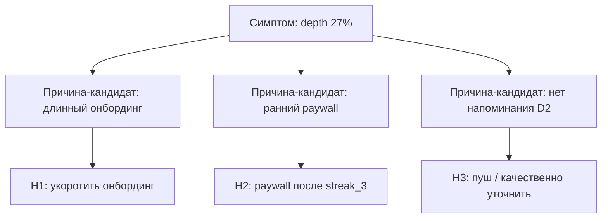

# М1.8. Диагностика продукта и точки роста

| Поле | Значение |
|---|---|
| **ID** | М1.8 |
| **Неделя / проход** | Неделя 5 · Проход 2 |
| **Опора** | продукт, стратегия, экономика |
| **Аудитория** | аналитик + продакт |
| **Ориентир** | 90–110 мин · практика 3–4 ч |
| **Визуалы** | [карта диагностики](./visuals/m1-8-diagnosis-map.svg) · [приоритизация гипотез](./visuals/m1-8-prioritize.svg) |
| **Зависимость** | после М1.3, М2.3; желательно М1.7 (CJM), дашборд М5.2/М5.4, словарь М5.1 |
| **Вехи** | **P3** — диагностика, сегменты, 3 гипотезы |

---

## Цели

После урока вы:

- **Общий минимум:** проводите диагностику Ритма по воронке/когортам/сегментам и отдаёте **три приоритизированные гипотезы** с метрикой проверки.
- **Аналитик:** отделяете симптом от рычага; сравниваете с базой (волна, сегмент, период); не объявляете «точку роста» без знаменателя.
- **Продакт:** приоритизируете влияние × уверенность × стоимость; защищаете отказ от «ещё фич в каталог».

---

## Контекст Ритма

К неделе 5 у вас уже есть: проблема (М1.1), юнит и узкое место (М1.3), конверсии/когорты (М2.3), словарь (М5.1), дашборд (М5.2/М5.4). **P3** требует не новый график, а решение: *куда бить*.

Сценарий тот же: онбординг → привычка → чек-ин → streak → paywall → Pro. Качественная опора (коридорка М4.4) усиливает уверенность — на этом уроке достаточно заложить слот «что проверить качественно».

---

## Теория коротко

### 1. Диагностика ≠ список метрик

Диагностика отвечает: **где теряем ценность/деньги относительно базы**, и **для кого**.

Минимальный контур:

1. Зафиксировать цель периода (из юнит-листа: сдвинуть узкое звено).
2. Снять воронку и 1–2 когорты **в определениях словаря**.
3. Разрезать 2–3 сегментами (platform, ранний paywall yes/no, глубина привычек).
4. Сформулировать симптомы → гипотезы причин → проверки.
5. Приоритизировать и выбрать три.

Карта: [`visuals/m1-8-diagnosis-map.svg`](./visuals/m1-8-diagnosis-map.svg).

### 2. Цифра без сравнения — не цифра

| Сравнение | Пример на Ритме |
|---|---|
| Со своей прошлой волной | depth W5 vs W4 |
| С сегментом | iOS vs Android |
| С этапом цепочки | habit→depth vs depth→pay |
| С явным порогом решения | depth &lt; 25% две волны |

«Depth 27%» само по себе не диагноз. «27% при том, что paywall→pay 19%, а early paywall 40%» — уже указывает рычаг.

### 3. Сегменты, которые имеют смысл на Ритме

| Сегмент | Зачем | Ловушка |
|---|---|---|
| `platform` | разный UX/пуш | Симпсон, если смешать в один % |
| Early paywall vs после streak_3 | давление vs ценность | путать с вариантом A/B без окна |
| 1 привычка vs 2–3 | перегруз онбординга | мало N в хвосте |
| Дошёл до depth≥3 vs нет | монетизация пустышки | оптимизация paywall на «нет» |

Не плодите 15 сегментов «на всякий» — это исследование, не P3.

### 4. Приоритизация: влияние × уверенность × стоимость

Рабочая шкала курса (1–5):

$$
\text{Score} = \frac{\text{Impact} \times \text{Confidence}}{\text{Cost}}
$$

| Ось | Вопрос |
|---|---|
| **Impact** | насколько сдвинет узкое звено / ₽ когорты |
| **Confidence** | есть ли данные + (желательно) качественный сигнал |
| **Cost** | инженерия, риск, время до проверки |

Схема ранжирования: [`visuals/m1-8-prioritize.svg`](./visuals/m1-8-prioritize.svg).

Гипотеза без **метрики проверки** и **окна** в P3 не считается.

### 5. От гипотезы к проверке (мост в P4)

| Тип проверки | Когда | Модуль |
|---|---|---|
| Коридор / интервью | непонятна причина трения | М4.4 |
| A/B на paywall / онбординг | хватает трафика, явный UI-рычаг | М2.5 |
| Наблюдение + юнит | мало трафика / нельзя резать | М2.6 |

P3 заканчивается *планом* проверки; полный дизайн A/B — в М2.5.

---

## Разобранный пример: три гипотезы по одному срезу

**Факты (учебные, согласованы с М1.3 / М2.3):**

- habit → depth≥3 = 27% (узкое);
- среди Android depth на 6 п.п. ниже iOS;
- early paywall share = 40% показов;
- у users с depth≥3 CV в Pro заметно выше, чем у «туристов» paywall.

| # | Гипотеза | Impact | Conf. | Cost | Score | Проверка |
|---|---|---|---|---|---|---|
| H1 | Сокращение онбординга до «одна привычка + цель 3 дня» поднимет depth | 5 | 4 | 2 | 10 | A/B или поэтапный rollout + depth |
| H2 | Перенос paywall после streak_3 снизит early share и поднимет habit→subscribe | 4 | 4 | 2 | 8 | эксперимент `paywall_timing_*` (М2.5) |
| H3 | Пуш на D2 тем, у кого 0 check_in, поднимет ≥1 check_in | 3 | 2 | 3 | 2 | сначала коридор «почему не чекинятся» |
| — | Каталог +50 привычек | 2 | 1 | 5 | 0,4 | **отказ** (не бьёт в узкое) |

В сдачу P3 идут **H1, H2, H3** (или замена H3 на более уверенную), плюс явный отказ от каталога.

---

## Практика

Данные: учебные таблицы М1.3/М2.3 и/или стенд Postgres + дашборд. Определения — только из словаря М5.1.

### Ядро (оба) — артефакт P3

1. Заполните **одностраничную диагностику** Ритма: цель периода, воронка (5–7 шагов), 1 когортный сигнал, 2 сегмента, узкое место (ссылка на М1.3).
2. Сформулируйте **≥5 симптомов** → отберите **3 гипотезы** роста.
3. Для каждой гипотезы: формулировка «если… то…», primary-метрика, guardrail, способ проверки, score влияния×уверенности×стоимости.
4. Добавьте **один явный отказ** (что не делаем и почему).
5. Укажите, где нужна качественная опора (даже если М4.4 ещё впереди — слот «вопрос пользователю»).

### Расширение «руки»

- Посчитайте по учебной воронке вклад каждого звена в «потери до Pro» (users, не только %).
- Разрез platform: покажите, меняется ли узкое место.
- Черновик SQL/псевдокода сегмента early paywall (users с paywall_view до первого streak_3_reached).

### Расширение «решение»

- Бриф на 5 минут защиты P3: диагноз → 3 ставки → отказ → деньги (порядок ₽, если depth +5 п.п.).
- Матрица «что скажем команде, если H2 выиграет, а depth не вырос» (ложный рычаг).
- Цена ошибки: взять H_каталог вместо H1.

---

## Критерии приёмки

- [ ] Диагностика со сравнением (не одна голая цифра).
- [ ] Три гипотезы со score и метрикой проверки; один отказ.
- [ ] Узкое место согласовано с юнит-листом М1.3.
- [ ] Ядро + одно расширение.
- [ ] AI мог выдать 10 «ideas for growth» — в сдаче только то, что бьёт в диагноз Ритма.

---

## Линия AI

| Можно | Нельзя без вас |
|---|---|
| Набросать кандидатов гипотез из симптомов | Выбрать тройку и score |
| Помочь с формулировками if/then | Подменить причину корреляцией |
| Собрать таблицу приоритизации | Объявить победителя без данных/дизайна проверки |

**Проверка:** удалите гипотезы AI, у которых нет primary из словаря М5.1. Если список опустел — это был брейншторм фич, не диагностика.

---

## Дальше читать

- Вехи P3 и календарь недели 5: [`../course-structure.md`](../course-structure.md) §3.2, §4.1.
- Инвентарь: [`../sources-inventory.md`](../sources-inventory.md) — RCA Product Heroes (жанр корневых причин); логика испытаний диагностики (пересказ своими словами).
- Офлайн (приоритизация RICE): [`../uploads/linkedin-tyler-rice-excerpt.md`](../uploads/linkedin-tyler-rice-excerpt.md).
- Входы: [`m1-3-unit-economics.md`](./m1-3-unit-economics.md), [`m2-3-conversion-cohorts.md`](./m2-3-conversion-cohorts.md), [`m5-1-metrics-layer.md`](./m5-1-metrics-layer.md).
- Выход в эксперимент: М2.5; качественная опора: М4.4.

Дашборд как зеркало диагноза: [`m5-2-dashboard-decision.md`](./m5-2-dashboard-decision.md).
