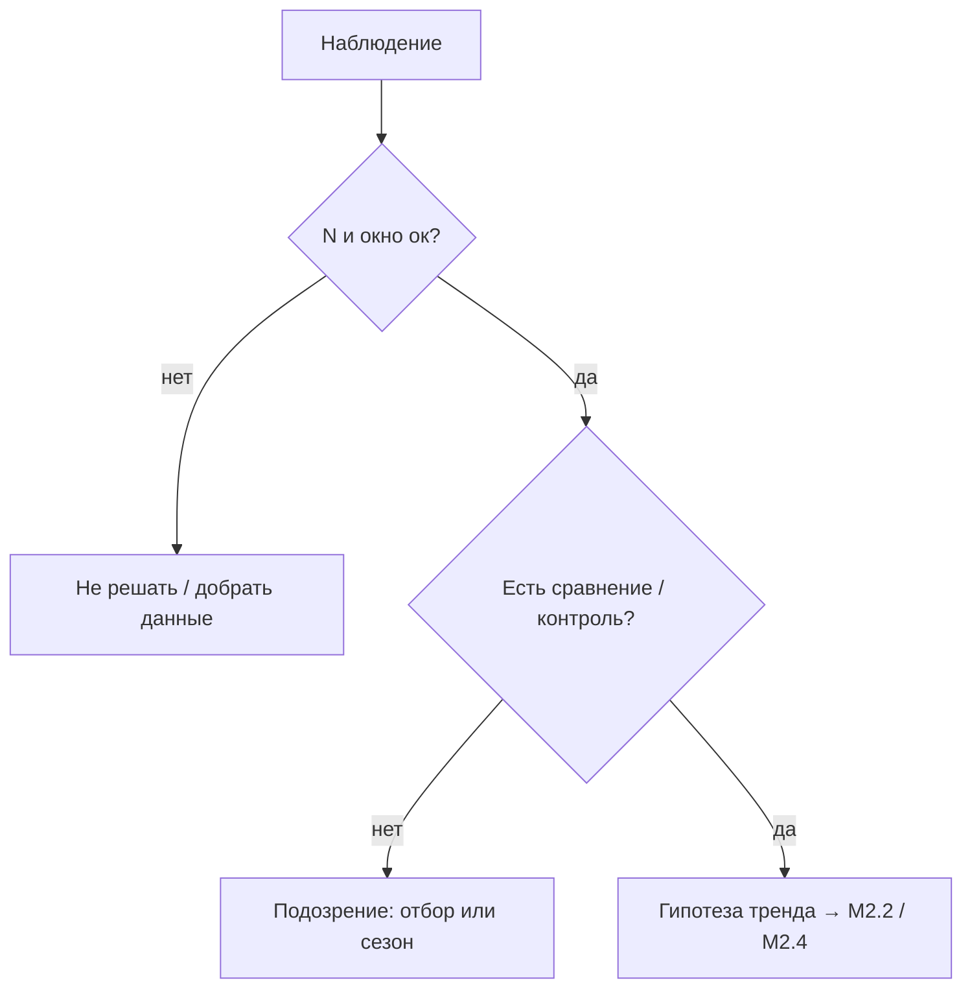

# М2.1. Почему данные врут: вариативность и шум

| Поле | Значение |
|---|---|
| **ID** | М2.1 |
| **Неделя / проход** | Неделя 2 · Проход 1 |
| **Опора** | статистика |
| **Аудитория** | аналитик + продакт |
| **Ориентир** | 50–70 мин · практика 1–2 ч |
| **Зависимость** | после М1.1; перед/рядом М2.2; до М2.3 и М2.4 |
| **Вехи** | фундамент **P1→P2** — без шума «рост» на 40 людях выглядит как закон |

---

## Цели

После урока вы:

- **Общий минимум:** отличаете случайный шум от устойчивого сдвига; не объявляете победу по одному дню графика.
- **Аналитик:** называете источники вранья (отбор, выжившие, сезонность, малый N) на цифрах Ритма.
- **Продакт:** требуете «чему верить» до решения; ловите карго-культ метрик (MAU ради MAU).

---

## Контекст Ритма

В понедельник depth D7 = 24%, во вторник = 29%. В чате: «онбординг заработал». На стенде семпла это легко получить **без** изменения продукта — просто другая неделя install и малый N.

Этот урок — прививка до конверсий (М2.3) и доверительных интервалов (М2.4): сначала *подозрение*, потом формальный аппарат.

---

## Теория коротко

### 1. Случайность ≠ тренд

Каждый день / когорта — реализация случайного процесса. Одно наблюдение почти ничего не говорит. Правило курса на проходе 1:

- смотрите **несколько** точек или когорт;
- спрашивайте N;
- не меняйте продукт по одному «зелёному» дню.

### 2. Типовые источники вранья

| Источник | Симптом на Ритме | Что спросить |
|---|---|---|
| **Малый N** | «Конверсия +50%» на 20 paywall | сколько users в знаменателе? |
| **Отбор / выжившие** | «У Pro depth 80%» | сравнили с теми, кто не дошёл до Pro? |
| **Сезонность / день недели** | вспышка чек-инов в вс | окно ≥7 дней? |
| **Смена разметки** | скачок события после релиза | версия tracking? |
| **Смешение когорт** | «ретеншн упал» | хвост дозрел? (М2.3) |
| **Карго-культ** | оптимизируем store rating | эта метрика бьёт в NSM/depth? |

### 3. Карго-культ метрик

Метрику копируют «как у успешных», не понимая модель. На Ритме карго: гнать install при дырявом D3; растить paywall_view до ценности привычки; объявлять MAU north star.

### 4. Связь с решением

Шум опасен не математически, а **деньгами**: выкатываете фичу → тратите спринт → метрика «откатилась» на следующей неделе сама. Цена ложного сигнала = стоимость гипотезы (позже М1.4).

---

## Разобранный пример: «ретеншн вырос за ночь»

**Факт:** доля users с ≥1 `check_in` на D1 выросла с 41% до 53% день к дню.

**Разбор:**

1. N вчерашней когорты install = 38, сегодняшней = 210 (после поста в соцсетях).
2. Новая волна — другой канал (более мотивированные).
3. Продукт не менялся.

**Вывод:** это не доказательство онбординга. Это смесь **малого N** и **отбора канала**. Честный следующий шаг — сравнить D1 внутри одного канала на 2 недели или ждать М2.4 (интервал).

---

## Практика

### Ядро (оба)

1. Возьмите 3 «вывода» (свои или учебные ниже) и для каждого укажите: шум / возможно сигнал / нельзя сказать — и **почему**.
2. Учебные выводы для разбора:
   - «После пуша MAU +12% за день — пуш работает».
   - «У пользователей со streak≥7 конверсия в Pro 22%, значит streak вызывает оплату».
   - «Во вторник paywall→subscribe 9%, в субботу 4% — в выходные хуже оффер».
3. Для одного вывода напишите, какие **два** контрольных среза сняли бы подозрение.

### Расширение «руки»

На семпле стенда ([`../stand/`](../stand/)): посчитайте `count(distinct user_id)` с `habit_created` по дням `installed_at` (или по `date_trunc('day', ts)` для события). Найдите день с экстремумом и проверьте N. Короткий комментарий: это тренд или шум?

### Расширение «решение»

Постановка: «Не принимать решение о смене paywall по одному дню». Критерии: минимальный N, окно, запрет peeking до даты разбора (задел М2.5).

---

## Критерии приёмки

- [ ] Три вывода классифицированы с причиной (не «мне кажется»).
- [ ] Явно фигурируют N / отбор / сезонность хотя бы в одном разборе.
- [ ] Ядро + одно расширение.
- [ ] Нет объявления «статзначимо» — до М2.4 достаточно языка подозрения.

---

## Линия AI

AI охотно пишет «метрика значимо выросла». Вы обязаны спросить N, окно и сравнение. Проверка: выкиньте прилагательные «значимо/очевидно» — остался ли аргумент?

---

## Дальше

- Описательная статистика: [`m2-2-descriptive-stats.md`](./m2-2-descriptive-stats.md)
- Конверсии и когорты: [`m2-3-conversion-cohorts.md`](./m2-3-conversion-cohorts.md)
- ДИ: [`m2-4-confidence-intervals.md`](./m2-4-confidence-intervals.md)
- Карта: [`../course-structure.md`](../course-structure.md) · [`../materials-library.md`](../materials-library.md)
