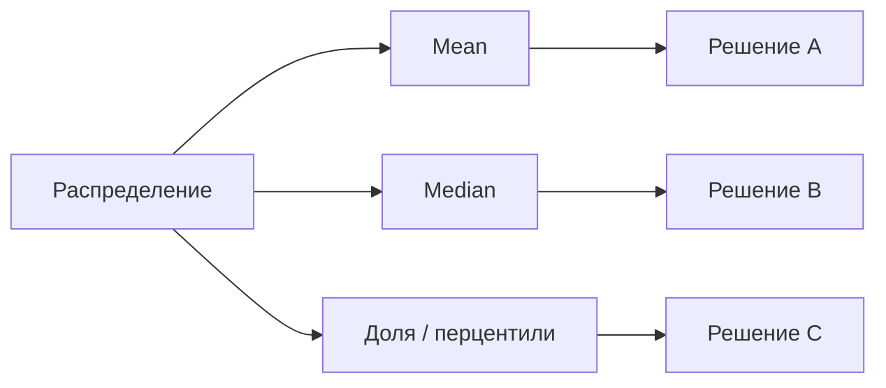

# М2.2. Описательная статистика, которая меняет решения

| Поле | Значение |
|---|---|
| **ID** | М2.2 |
| **Неделя / проход** | Неделя 2 · Проход 1 |
| **Опора** | статистика |
| **Аудитория** | аналитик + продакт |
| **Ориентир** | 60–80 мин · практика 2 ч |
| **Зависимость** | после М2.1; до М2.3 |
| **Вехи** | вход в **P2** — среднее без хвоста врёт про деньги и «типичного» юзера |

---

## Цели

После урока вы:

- **Общий минимум:** выбираете медиану / перцентиль / долю вместо «среднего», когда хвост тяжёлый; знаете эффект Симпсона на пальцах.
- **Аналитик:** на одной выборке Ритма получаете три разных вывода и фиксируете, какой агрегат для какого решения.
- **Продакт:** не принимаете «средний чек / средний depth», пока не увидели распределение.

---

## Контекст Ритма

Depth (число чек-инов за 7 дней) у большинства скромный; у фанатов — десятки. «Средний depth = 4,2» может означать «много нулей + несколько гиков», а не «типичный пользователь держит привычку».

Подписка Pro 299 ₽/мес vs 1 990 ₽/год — средний revenue на платящего тоже врёт, если смешать планы без разреза.

---

## Теория коротко

### 1. Среднее чувствительно к хвосту

| Мера | Вопрос | Когда на Ритме |
|---|---|---|
| **Среднее (mean)** | сумма / n | осторожно при skew |
| **Медиана** | «типичный» центр | depth, время до paywall |
| **Перцентили (p90, p95)** | насколько тяжёлый хвост | power users, латентность |
| **Доля** | % выше порога | depth≥3, D7 active |

Правило: для ценности привычки чаще смотрите **долю выше порога** (уже в М1.1) и медиану, не среднее.

### 2. Одна выборка — три вывода

Учебный срез depth за D7 (n = 200 users с `habit_created`):

| Агрегат | Число | История в чате |
|---|---|---|
| Mean | 5,1 | «в среднем почти каждый день» |
| Median | 2 | «типичный — редкие чек-ины» |
| % с depth≥3 | 28% | «ценность нашла четверть» |

Все три арифметически возможны. Решение «усложнять Pro» vs «чинить онбординг» зависит от выбора агрегата.

### 3. Симпсон: сегменты переворачивают итог

Общая конверсия paywall→subscribe выросла, но **внутри** Android и iOS упала — просто стало больше iOS с исходно высокой базой (или наоборот). Всегда спрашивайте: нет ли смешения сегментов?

### 4. Проценты vs процентные пункты

Уже кратко в М2.3; здесь закрепляем: «+10%» относительно 5% = 5,5%, а «+10 п.п.» = 15%. В защите пишите оба.

---

## Разобранный пример: «средний пользователь почти Pro»

Маркетинг: ARPU = 45 ₽ на install. Продукт радуется.

Разрез:

- 96% users = 0 ₽;
- 4% платящих тянут среднее;
- медианный revenue = 0.

**Решение меняется:** не «всем поднять цену», а «улучшить конверсию в платящих / LTV платящих» и отдельно смотреть AMPPU (М1.3).

---

## Практика

### Ядро (оба)

1. Сформулируйте один вопрос решения Ритма (например: «достаточно ли ценности до paywall?»).
2. На одних и тех же данных (стенд или учебная таблица из 15–20 строк depth) посчитайте mean, median, долю depth≥3.
3. Напишите **три** однострочных вывода — по одному на агрегат — и выберите, какой несёте на демо P1/P2 и почему.
4. Укажите один сегмент (platform / канал / неделя), где общий вывод может перевернуться (Симпсон-гипотеза).

### Расширение «руки»

SQL на стенде: распределение числа `check_in` на user за 7 дней после `habit_created` (черновик окнами из М3.2 или подзапросом). Выведите avg, approximative median (`percentile_cont` в Postgres), долю ≥3. Сверьте порядок величин с семплом.

### Расширение «решение»

Запретите в еженедельном отчёте «средний depth» без медианы и доли≥3. Напишите шаблон строки отчёта для команды.

---

## Критерии приёмки

- [ ] Три агрегата на одной выборке и три вывода.
- [ ] Выбран один агрегат под решение с обоснованием.
- [ ] Есть гипотеза Симпсона / сегмента.
- [ ] Ядро + одно расширение.

---

## Линия AI

AI любит mean по умолчанию. В промпте требуйте median + долю порога. Проверка: сравните глазами min/max и пару перцентилей.

---

## Дальше

- Шум: [`m2-1-noise-variability.md`](./m2-1-noise-variability.md)
- Конверсии: [`m2-3-conversion-cohorts.md`](./m2-3-conversion-cohorts.md)
- Юнит: [`m1-3-unit-economics.md`](./m1-3-unit-economics.md)
- Карта: [`../course-structure.md`](../course-structure.md) · [`../materials-library.md`](../materials-library.md)
