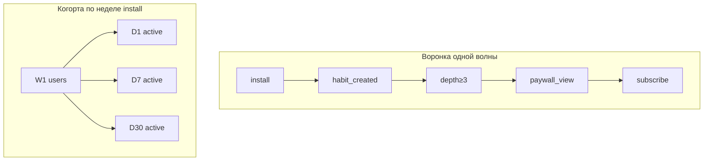

# М2.3. Конверсия и когорты как статистические объекты

| Поле | Значение |
|---|---|
| **ID** | М2.3 |
| **Неделя / проход** | Неделя 3 · Проход 2 |
| **Опора** | статистика |
| **Аудитория** | аналитик + продакт |
| **Ориентир** | 90–110 мин · практика 3–4 ч |
| **Визуалы** | [четыре конверсии](./visuals/m2-3-four-conversions.svg) · [воронка vs когорта](./visuals/m2-3-funnel-vs-cohort.svg) |
| **Зависимость** | после М1.1; желательно М2.1–М2.2 и черновик событий из М4.3 |

---

## Цели

После урока вы:

- **Общий минимум:** отличаете шаг воронки от когорты по календарю и можете выбрать *один* способ считать конверсию под решение Ритма.
- **Аналитик:** считаете четыре способа из одних событий; фиксируете окно, знаменатель (users vs sessions) и дедуп.
- **Продакт:** не принимаете «конверсия выросла» без определения; читаете когортную матрицу ретеншна и видите предел прогноза.

---

## Контекст Ритма

Одно и то же событие `subscribe_started` на Ритме даёт разные числа — в зависимости от знаменателя и окна. Команда, которая спорит «4% или 12%», почти всегда спорит об **определении**, не о Postgres.

Учебный поток (синтетика; CSV может появиться позже) опирается на схему из М4.3: `users`, `events` (`habit_created`, `check_in`, `paywall_view`, `subscribe_started`, …), `subscriptions`.

---

## Теория коротко

### 1. Конверсия — это отношение с договором

$$
\text{конверсия} = \frac{\text{числитель за окно}}{\text{знаменатель}}
$$

Без четырёх уточнений число бесполезно:

| Уточнение | Вопрос | Пример на Ритме |
|---|---|---|
| **Кто в знаменателе** | users или sessions / показы? | users с `habit_created` vs все `paywall_view` |
| **Что в числителе** | какое событие успеха | `subscribe_started` vs `trial_started` |
| **Окно** | за сколько дней после старта | 1 / 7 / 30 дней от `habit_created` |
| **Дедуп** | один user один раз? | первый subscribe, не каждый renew |

### 2. Одно событие — четыре числа

Возьмём успех = `subscribe_started`. Учебный срез (цифры метода):

| Способ | Знаменатель | Окно | Число (учебное) |
|---|---|---|---|
| A. От установки | users с `installed_at` в периоде | 30 дней | 380 / 10 000 = **3,8%** |
| B. От привычки | users с `habit_created` | 14 дней | 380 / 5 400 = **7,0%** |
| C. От показа paywall | users с ≥1 `paywall_view` | 7 дней | 380 / 2 000 = **19,0%** |
| D. По сессиям paywall | строки `paywall_view` | тот же | 380 / 6 100 ≈ **6,2%** |

A отвечает «сколько денег с привлечения».  
B — «монетизируем ли ценность привычки».  
C — «работает ли сам paywall».  
D — обычно **врёт** для продукта: один упёртый user набивает показы.

Схема: [`visuals/m2-3-four-conversions.svg`](./visuals/m2-3-four-conversions.svg).

Правило курса: на слайде/в Metabase рядом с % всегда подпись определения. Иначе это не метрика, а настроение.

### 3. Абсолютная vs относительная; п.п. vs %

- «Конверсия выросла на **2 п.п.**» (с 7% до 9%) ≠ «выросла на **2%**».
- Относительный рост +29% от 7% звучит громче, чем +2 п.п. — в защите указывайте оба и базу.

### 4. Воронка ≠ когорта

| | Воронка | Когорта |
|---|---|---|
| Вопрос | где отвал в шагах сценария | как ведут себя люди, *стартовавшие вместе* |
| Ось | шаги (habit → check-in → …) | время жизни относительно старта (D1, D7, D30) |
| Опасность | смешивает новичков разных недель | хвост ещё не дозрел — «ретеншн упал» ложно |

Рядом: [`visuals/m2-3-funnel-vs-cohort.svg`](./visuals/m2-3-funnel-vs-cohort.svg).

### 5. Ретеншн на Ритме

Рабочие определения курса (зафиксируйте в словаре позже в М5.1):

- **N-day retention (активность):** доля когорты с ≥1 `app_open` или лучше ≥1 `check_in` на день N.
- **Habit retention:** доля с ≥1 `check_in` на дне N — ближе к ценности Ритма.
- **Rolling retention:** «были активны в день N или позже» — выше и мягче; не подменять им N-day без подписи.

Учебная когортная матрица (habit retention по `check_in`, %):

| Когорта install | Size | D1 | D3 | D7 | D14 |
|---|---|---|---|---|---|
| W1 | 2 400 | 48 | 31 | 22 | 14 |
| W2 | 2 600 | 51 | 33 | 21 | 13 |
| W3 | 2 500 | 49 | 29 | 18 | — |
| W4 | 2 500 | 47 | 28 | — | — |

«—» = окно ещё не наступило. Сравнивать D14 у W4 с W1 нельзя.

**Предел прогноза:** из D7 нельзя честно вывести LTV на 24 месяца без модели и оговорок — это стык с М1.3/М1.4, не магия таблицы.

### 6. Связь с depth ≥3

D7 habit depth ≥3 — **не** классический N-day retention. Это *накопленная глубина* за окно 7 дней. Можно иметь высокий D1 и низкий depth (зашли один раз и пропали) или наоборот редкие, но плотные дни. Для проблемы Ритма из М1.1 depth обычно важнее голого D1.

---

## Разобранный пример: «конверсия в Pro выросла»

Слайд маркетинга: «CV в Pro 3,8% → 6,1%, ура».

Разбор:

1. Знаменатель сменили с install на `paywall_view` (тихо).
2. Окно ужали с 30 до 7 дней — отрезали медленных, но не объяснили.
3. В числитель попали renew годовой подписки как новые `subscribe_started`.

Честная таблица для решения «менять ли онбординг»:

- primary: **habit_created → depth≥3 за 7 дней** (users, дедуп дней);
- secondary: **depth≥3 → subscribe_started за 14 дней**;
- guardrail: доля `paywall_view` с `trigger` до streak_3 (не растить продажи ценой раннего давления).

Итог: «рост CV» не подтвердил ценность; мог вырасти только охват paywall.

---

## Практика

Данные — учебный срез ниже + матрица из теории. Когда появится синтетика в Postgres — пересчитайте теми же определениями.

**Срез воронки (users, одна волна 4 недель привлечения):**

| Шаг | Users |
|---|---|
| install | 10 000 |
| onboarding_completed | 7 200 |
| habit_created | 5 400 |
| ≥1 check_in | 3 800 |
| depth≥3 за 7 дней | 1 450 |
| paywall_view | 2 000 |
| subscribe_started | 380 |

Дополнительно: всего строк `paywall_view` = 6 100; из subscribe 40 — повторные события renew (шум в сыром логе).

### Ядро (оба)

1. Посчитайте **четыре** конверсии в `subscribe_started` (A–D из теории) на этом срезе; для A–C знаменатель — users, для D — сессии/показы.
2. Для каждой укажите: *какое решение она обслуживает* и *когда её нельзя использовать*.
3. Выберите **один** способ как primary для проблемы «бросают серию», не для отчёта магазину — обоснуйте.
4. По матрице ретеншна: какие две ячейки **нельзя** сравнивать между собой и почему; где выглядит тревога, а где просто недозревший хвост.

### Расширение «руки»

- Пересчитайте «честный» subscribe: числитель 380 − 40 renew = 340; покажите, как меняются A–C.
- Запишите псевдокод/шаги расчёта depth≥3 от `events` (group by user, count distinct `local_date` с `check_in` в окне 7 дней от первого `habit_created`).
- Постройте мини-воронку только для users с `habit_created` и отдельно «календарный» MAU-стиль (активные на неделе) — объясните, почему второе не заменяет когорту.

### Расширение «решение»

Бриф на одну страницу:

- какое решение принимаете на этой неделе (онбординг / paywall / ничего);
- primary + guardrail с полными определениями;
- как прочитаете матрицу на демо прохода 2;
- цена ошибки, если возьмёте способ D (сессии) за правду.

---

## Критерии приёмки

- [ ] Четыре конверсии посчитаны; у каждой — определение.
- [ ] Выбран primary под проблему Ритма, не «самый красивый %».
- [ ] Явно отделены воронка и когорта; указаны несравнимые ячейки.
- [ ] Ядро + одно расширение; в «руках» — дедуп renew и логика depth.
- [ ] AI мог насчитать % — в сдаче ваши подписи числителя/знаменателя/окна.

---

## Линия AI

| Можно | Нельзя без вас |
|---|---|
| Посчитать проценты и набросать таблицу | Выбрать определение под решение |
| Предложить SQL/псевдокод когорты | Проверить окно и «дозревание» хвоста |
| Сформулировать вывод | Запретить причинность («paywall поднял ретеншн») без дизайна проверки |

**Проверка:** спросите AI «дай конверсию в Pro Ритма» без схемы. Любой уверенный % без знаменателя — провал. Рабочий промпт обязан содержать четыре уточнения из §1.

---

## Дальше читать

- Карта модуля и визуал «воронка + когорта»: [`../course-structure.md`](../course-structure.md) §4–5 (М2.3).
- Инвентарь: [`../sources-inventory.md`](../sources-inventory.md) — блок метрик/когорт (Красинский: конверсия и способы счёта; GoPractice retention / точное определение метрик).
- Офлайн: [`../uploads/linkedin-swartz-hierarchy-product-metrics.md`](../uploads/linkedin-swartz-hierarchy-product-metrics.md) · [`../uploads/medium-duckweave-duckdb-retention-cohorts.md`](../uploads/medium-duckweave-duckdb-retention-cohorts.md) · [`../uploads/bonus-habr-product-metrics-sql.md`](../uploads/bonus-habr-product-metrics-sql.md).
- Стык к SQL когорт/воронок: [`../sql-python-sources.md`](../sql-python-sources.md) (Kariernik, Habr SQL-метрики) — практикуем после/параллельно М3.2.
- Словарь метрик позже: М5.1; дашборд под эти определения — [`m5-2-dashboard-decision.md`](./m5-2-dashboard-decision.md).

Рядом по смыслу: [`m1-1-problem-market.md`](./m1-1-problem-market.md), [`m4-3-tracking-plan.md`](./m4-3-tracking-plan.md).
