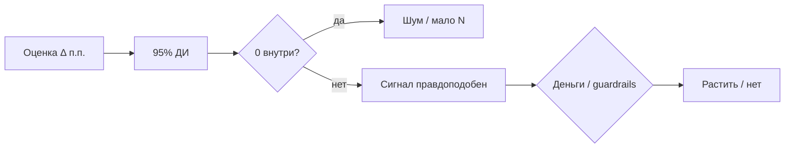

# М2.4. Неопределённость: когда разница «настоящая»

| Поле | Значение |
|---|---|
| **ID** | М2.4 |
| **Неделя / проход** | Неделя 6 · Проход 3 |
| **Опора** | статистика |
| **Аудитория** | аналитик + продакт |
| **Ориентир** | 90–110 мин · практика 2–3 ч |
| **Визуалы** | [чтение интервала](./visuals/m2-4-interval-read.svg) · [N и MDE](./visuals/m2-4-n-vs-mde.svg) |
| **Зависимость** | после М2.3; желательно М2.1–М2.2; стык с М2.5 (P4) |
| **Вехи** | **P4** — вход в честный A/B: оценка + ДИ + «хватит ли N» |
| **Усиление** | адаптировано из [stats-ab-course](https://github.com/gavnukkk97/stats-ab-course) (М1.3–1.4, М3.1) — см. [`../../internal/stats-ab-weave.md`](../../internal/stats-ab-weave.md) |

---

## Цели

После урока вы:

- **Общий минимум:** не принимаете решение по голой разнице в п.п.; читаете оценку **вместе с интервалом** и отделяете «шум» от «сигнал».
- **Аналитик:** строите 95% ДИ для доли / разницы долей (нормальное приближение или bootstrap); связываете ширину ДИ с N и MDE; считаете порядок N для двух групп **с множителем 2**.
- **Продакт:** требуете интервал в слайде; понимаете, что «почти значимо» — не вердикт; фиксируете MDE до старта эксперимента; не путаете разброс данных с дрожанием оценки.

---

## Контекст Ритма

На P4 команда считает `habit_to_subscribe_14d` по `control` vs `treatment` (`paywall_timing_2026q3`). Легко увидеть «+4 п.п.» на семпле из 80 users и захотеть раскатить paywall.

Этот урок — фильтр перед М2.5: **какая разница ещё совместима со случайностью**, сколько пользователей нужно, чтобы поймать учебный MDE (+3 п.п.), и почему малый семпл стенда врёт знаком эффекта.

Стенд: [`../stand/README.md`](../stand/). Для спокойных интервалов — full (`~2500` users); семпл 80 — учебный контрпример «широкий ДИ».

---

## Теория коротко

### 1. Оценка — точка; неопределённость — отрезок

Конверсия / разница конверсий — **оценка** по выборке. Другая выборка того же размера дала бы другое число. Доверительный интервал (ДИ) отвечает: *в каком диапазоне ещё правдоподобны «истинные» значения при том, как мы считаем*.

Правило курса (не теорема на доске):

| Смотрим | Вывод для решения |
|---|---|
| ДИ для разницы **включает 0** | недостаточно уверенности; не раскатываем |
| ДИ **целиком выше 0** (или ниже) | разница правдоподобна в этом направлении |
| ДИ узкий, но эффект крошечный | статистика ок, **бизнес** может сказать «не стоит» |
| ДИ широкий | мало данных или шумная метрика — не «эффект есть, но слабо» |

Картина: [`visuals/m2-4-interval-read.svg`](./visuals/m2-4-interval-read.svg).

### 2. SE ≠ разброс данных; точность покупается квадратично

- **σ / s** — как разбросаны *наблюдения* (users).
- **SE** — как дрожит *оценка* (среднее / доля): \(SE = s/\sqrt{n}\) или для доли \(\sqrt{p(1-p)/n}\).

Путать их — классика: «std = 0,3 → интервал ±0,3» без деления на \(\sqrt{n}\). ДИ тогда в разы шире (или уже) нужного.

Точность ×2 ≈ данных ×4: удвоить точность (сузить SE вдвое) стоит **вчетверо** больше users. На Ритме: «ещё чуть-чуть N, и ДИ станет узким» почти никогда не «чуть-чуть».

ЦПТ говорит про распределение **среднего**, а не про то, что «данные стали нормальными при n>30». На скошенных метриках (деньги, глубина) нормальный ДИ при малом n врёт покрытием — для доли на Ритме при разумном \(np\) обычно ок; для «китовых» метрик — bootstrap / трансформация (сильным: чтение stats-ab М3.4).

### 3. Доля и разница долей — рабочие формулы

Для доли \(p = x/n\) (успехи / users) грубое **нормальное приближение** 95% ДИ:

\[
p \pm 1{,}96 \sqrt{\frac{p(1-p)}{n}}
\]

Условие гигиены: \(n\hat p \ge 10\) и \(n(1-\hat p)\ge 10\). При редких событиях нижняя граница «−2%» — бессмыслица; тогда Wilson / точные методы (в чтении), не «красивый» нормальный ДИ.

Для разницы \(p_t - p_c\) (treatment − control):

\[
\Delta \pm 1{,}96 \sqrt{\frac{p_t(1-p_t)}{n_t} + \frac{p_c(1-p_c)}{n_c}}
\]

Юнит анализа на Ритме — **user** (как в `users.ab_variant`). Нельзя класть в формулу 10 000 событий чек-ина как «10 000 независимых» — зависимы внутри пользователя; SE занизится, ДИ станет ложно узким. Подробнее — юнит рандомизации в М2.5.

### 4. Bootstrap на пальцах (и гигиена)

Много раз тянем из своих данных выборку **с возвращением объёма n** (не 5n и не n/5), каждый раз считаем \(\Delta\); 2,5% и 97,5% квантили — приближённый 95% ДИ без нормальности.

| Правило | Зачем |
|---|---|
| Бут-выборка размера **n** | иначе ложная точность / раздутый ДИ |
| Тянуть **user целиком** | не отдельные события paywall |
| \(B \ge 1000\) разведка, \(\ge 5000\) финал | граница перцентиля сама шумит |
| Seed зафиксировать | воспроизводимость сдачи |
| Bias не лечит | смещённая выборка → уверенный неверный интервал |

Удобно в Python на стенде; идея важнее кода. Для простой доли t/z-формула часто достаточна — bootstrap незаменим для медианы, перцентилей, ratio.

### 5. Сколько данных нужно: N, MDE, мощность (две группы)

- **MDE** — минимальный эффект, который *обязаны* уметь поймать (учебно: **+3 п.п.** primary на paywall). Это решение бизнеса, не «какой эффект вылезет из трафика».
- **Ошибка II** (пропуск эффекта) дорога: убили полезный timing.
- Формула **на группу** при равном сплите (α≈5%, мощность≈80%, \(z_{1-\alpha/2}+z_{1-\beta}\approx 2{,}8\)):

\[
n \approx \frac{2\,(z_{1-\alpha/2}+z_{1-\beta})^2\,\sigma^2}{\Delta^2}
\quad\text{для доли }\sigma^2 = p(1-p)
\]

**Двойка — плата за две выборки** (\(SE^2 = \sigma^2/n + \sigma^2/n\)). Забыть ×2 → половина N → мощность ≈ **50%** вместо 80%: почти монетка. На переговорах с продактом: «хватит ли 2 недель» считают по *правильной* формуле, потом — календарь целыми неделями (сезонность будни/выходные).

Сплит **50/50** мощнее при том же трафике; 10/90 «от осторожности» сильно раздувает нужный N (порядок ×2–3).

Картина: [`visuals/m2-4-n-vs-mde.svg`](./visuals/m2-4-n-vs-mde.svg). Калькуляторы (Evan Miller и др.) — в «дальше читать»; на уроке: MDE и N **до** старта, не «глянем через три дня».

Порядок на Ритме (учебно, \(p\approx 0{,}07\), \(\Delta=0{,}03\)): \(\sigma^2\approx 0{,}065\), \(n \approx 15{,}7\cdot 0{,}065 / 0{,}03^2 \approx 1100\) на крыло — full-стенд (~1200/крыло) как раз в зоне учебного MDE; семпл 80 — нет.

### 6. Что ДИ и «значимость» не делают

| Миф | Реальность |
|---|---|
| «p&lt;0,05 = правда» | порог условный; peeking ломает его (М2.5) |
| «p = 3% = вероятность случайности 3%» | это \(P(\text{данные}\mid H_0)\), не \(P(H_0\mid\text{данные})\) |
| «p большой = эффекта нет» | часто «мало мощности»; смотрите ДИ и MDE |
| «ДИ = вероятность, что эффект в отрезке» | учебная оговорка: процедура на повторных выборках |
| «Узкий ДИ = надо раскатывать» | смотрите деньги и guardrails |
| «На семпле 80 уже видно» | обычно ДИ огромный — это и есть ответ |

---

## Разобранный пример: две «победы» на Ритме

**Метрика:** habit→subscribe за 14д (как в М5.1 / М2.5).

| Срез | \(n_c\) | \(n_t\) | \(p_c\) | \(p_t\) | \(\Delta\) | 95% ДИ (учебно) | Вердикт |
|---|---|---|---|---|---|---|---|
| Семпл ~80 | 35 | 33 | 6% | 12% | +6 п.п. | примерно −8…+20 | **шум** — 0 внутри |
| Full ~2500 | ~1200 | ~1200 | 7% | 12% | +5 п.п. | примерно +2…+8 | **сигнал** — дальше деньги и guardrails |

Цифры порядка для метода (точные — с вашего прогона). Смысл: **один и тот же знак** на малом N не даёт решения; на полном — даёт материал для P4.

Продакт на защите: «+5 п.п., ДИ +2…+8, N≈1200/крыло; early paywall ↓; depth в норме → растим» — сильнее, чем «конверсия выросла на 70% относительно».

Проверка «хватит ли N»: при MDE +3 п.п. и \(p\approx7\%\) нужен порядок ~1k/крыло — full подходит; семпл — учебный провал мощности, не «продукт не работает».

---

## Практика

Данные: стенд Ритма. Сравните **семпл** (`sql/03_seed` / малый CSV) и **full** (`load_generated.sh 2500 42`), если оба доступны; иначе посчитайте ДИ на full и отдельно «что было бы при N=40/крыло» (масштабирование ширины \(\propto 1/\sqrt{n}\)).

### Ядро (оба)

1. Возьмите одну метрику доли на Ритме (учебный дефолт: habit→subscribe_14д **или** D7 depth≥3 — одно определение из М5.1).
2. Посчитайте оценку \(p\) и **95% ДИ** для одной группы (например, все non-internal с habit).
3. Разбейте по `ab_variant` (control / treatment): \(\Delta\) в п.п. + 95% ДИ для разницы; укажите \(n_c, n_t\).
4. Запишите вердикт одной фразой: «0 внутри / вне» + что это значит для раскатки (**без** подглядывания ключа преподавателя).
5. Зафиксируйте учебный **MDE = +3 п.п.** и оцените порядок N по формуле с **×2**; хватает ли вашего N qualitatively по ширине ДИ.

### Расширение «руки»

- Реализуйте ДИ двумя способами: нормальное приближение **и** bootstrap (≥1000 разведка / ≥5000 финал, seed, ресэмпл users) в SQL+руками / Python; сравните границы.
- Покажите, как при \(n\) в 4 раза меньше ширина ДИ roughly удваивается (формула или симуляция).
- Sanity: исключили `is_internal`; знаменатель — users, не события paywall; проверка \(n\hat p \ge 10\).
- Сравните «ошибочный» N без ×2 и правильный — какая мощность ожидается qualitatively.

### Расширение «решение»

- Слайд для команды: оценка, ДИ, N, MDE, расчёт «хватит ли трафика», решение «ждём / раскатываем / убиваем гипотезу».
- Политика: запрет фразы «ещё денёк, почти значимо» — заменить на «окно и N зафиксированы в карточке М2.5».
- Если ДИ включает 0, но early paywall сильно упал — что говорите продукту (не путать guardrail с primary).

---

## Критерии приёмки

- [ ] Есть оценка + 95% ДИ + N; не голой «+X%».
- [ ] Для разницы A/B явно сказано, внутри ли 0.
- [ ] Связь с MDE / «хватит ли данных»; в расчёте N виден множитель 2 (или явная оговорка калькулятора).
- [ ] Ядро + одно расширение.
- [ ] AI мог выдать «красивый p-value» — в сдаче ваш расчёт и определение метрики.

---

## Линия AI

| Можно | Нельзя без вас |
|---|---|
| Напомнить формулу / набросать bootstrap | Выбрать метрику и MDE |
| Объяснить интервал словами для слайда | Объявить победителя эксперимента |
| Проверить арифметику ×2 | Подменить «0 внутри» на «тренд положительный» |

**Проверка:** удалите из сдачи любые p/ДИ, которые AI выдал без ваших \(x, n\). Пересчитайте одну границу вручную. Если AI «забыл ×2» в sample size — поймайте как ошибку приёмки.

---

## Дальше читать

- Структура P4: [`../course-structure.md`](../course-structure.md) §3.2; визуалы статистики §5.
- Инвентарь: [`../sources-inventory.md`](../sources-inventory.md) — «Статистика и котики»; Stepik bootstrap; Карпов «Основы статистики»; калькуляторы Evan Miller; карго-культ A/B.
- Открытые якоря: [`../materials-library.md`](../materials-library.md) §3.4.
- Авторский stats-ab (private ref / углубление): [gavnukkk97/stats-ab-course](https://github.com/gavnukkk97/stats-ab-course) М1.3–1.4, М3.1 — карта вшивания [`../../internal/stats-ab-weave.md`](../../internal/stats-ab-weave.md).
- Следующий урок: [`m2-5-ab-design-read.md`](./m2-5-ab-design-read.md) — карточка эксперимента, SRM, CUPED, честное чтение.
- Определения метрик: [`m5-1-metrics-layer.md`](./m5-1-metrics-layer.md); конверсии: [`m2-3-conversion-cohorts.md`](./m2-3-conversion-cohorts.md).
