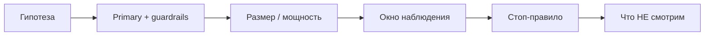

# М2.5. A/B-тесты: дизайн и чтение

| Поле | Значение |
|---|---|
| **ID** | М2.5 |
| **Неделя / проход** | Недели 6–8 · Проход 3 |
| **Опора** | статистика |
| **Аудитория** | аналитик + продакт |
| **Ориентир** | 100–120 мин · практика 4–5 ч |
| **Визуалы** | [анатомия эксперимента](./visuals/m2-5-experiment-anatomy.svg) · [чтение без подглядывания](./visuals/m2-5-read-honestly.svg) |
| **Зависимость** | после М1.8 (гипотеза); желательно М2.4 (интервалы); словарь М5.1; стенд с `ab_variant` |
| **Вехи** | **P4** — дизайн на `paywall_timing_*` + честный расчёт + решение |

---

## Цели

После урока вы:

- **Общий минимум:** заполняете карточку эксперимента Ритма (гипотеза → primary/guardrail → выборка → окно → критерий стопа → что *не* смотрим) и честно читаете исход.
- **Аналитик:** считаете эффект по `users.ab_variant` на полном датасете; ловите peeking и подгонку сегментов; сверяете логику с ключом преподавателя (не подгоняете ответ).
- **Продакт:** принимаете решение «растим / разворачиваем / убиваем» с деньгами; не требуете «ещё сутки, там почти p&lt;0.05».

---

## Контекст Ритма

На стенде уже заложен завершённый эксперимент **`paywall_timing_2026q3`**:

| Вариант | Поведение (синтетика) |
|---|---|
| **control** | paywall часто рано (`day_7` / `feature_lock`) |
| **treatment** | paywall в основном после `streak_3_reached` |

Колонки: `users.ab_variant`, `users.ab_experiment`. Внутренние (`is_internal`) — вне анализа.  
**Ключ исхода** лежит у преподавателя (`docs/stand/instructor/`) — студентам не раздаём. На малом семпле шум большой; для P4 используйте полный прогон генератора (`--full` / ~2500 users).

Связь с P3: гипотеза H2 из М1.8 как раз про timing paywall.

---

## Теория коротко

### 1. Анатомия эксперимента

Обязательные поля (визуал курса §5):

Карточка: [`visuals/m2-5-experiment-anatomy.svg`](./visuals/m2-5-experiment-anatomy.svg).

| Поле | Учебный дефолт на Ритме |
|---|---|
| Гипотеза | «Paywall после streak_3 повышает habit→subscribe за 14д и снижает early paywall» |
| Primary | **habit_to_subscribe_14d** (users с habit_created → subscribe за 14д) |
| Guardrails | **d7_depth_ge3**; **early_paywall_share** |
| Assignment | 50/50 на install, без internal |
| Окно | фиксированное от install/habit — не «пока не понравится» |
| Не смотрим | 20 срезов «а вдруг на web»; цвет кнопки как primary |

### 2. Ошибки на языке бизнеса

| Ошибка | Статистика | Бизнес |
|---|---|---|
| I (ложная тревога) | «эффект есть», а шум | раскатили вредный paywall |
| II (пропуск) | «эффекта нет», а он есть | убили полезный рычаг |

Мощность и размер выборки — про цену ошибки II. Формулы и калькуляторы — в чтении (Evan Miller / GoPractice); на уроке важно: **до старта** зафиксировать N и MDE, а не «глянем через три дня».

### 3. Подглядывание, множественные сравнения, сегменты

| Антипаттерн | Почему врёт | Что делать |
|---|---|---|
| Peeking каждый день | p-value «гуляет», стоп на удаче | одно окно / alpha-spending / фиксированный горизонт |
| 15 метрик без поправки | одна «зелёная» случайно | одна primary; остальные — описательно |
| Сегмент после факта | p-hacking | сегменты в карточке *до* чтения или новый тест |
| Малый семпл стенда | знак эффекта плавает | полный датасет для зачёта P4 |

Честное чтение: [`visuals/m2-5-read-honestly.svg`](./visuals/m2-5-read-honestly.svg).

### 4. Как считать на стенде (логика)

1. Когорта: `ab_experiment = 'paywall_timing_2026q3'`, `ab_variant` in (control, treatment), `is_internal = false`.
2. Primary: среди users с `habit_created` — доля с `subscribe_started` / первой подпиской в окне 14д (определение из М5.1).
3. Guardrail depth: D7 habit depth ≥3 по словарю.
4. Guardrail early paywall: доля paywall с ранним trigger (как в словаре — users или views, **одна** версия).
5. Разница treatment − control в **п.п.**; интервал — по М2.4 (если ещё нет текста — хотя бы честный N и оговорка шума).
6. Решение + деньги: эффект × размер будущей волны × ARPPU/маржа из М1.3.

Преподаватель сверяет знак/порядок с `true_effects`, не требует посимвольного совпадения на малой выборке.

### 5. Решение: растим / разворачиваем / убиваем

| Исход | Типичное решение |
|---|---|
| Primary ↑, guardrails в норме | **растим** treatment |
| Primary ↑, depth просел | **не растить**; ищем компромисс / новый тест |
| Primary шум, early paywall ↓ | **не путать** приятный guardrail с победой |
| Primary ↓ | **разворачиваем** / **убиваем** гипотезу timing |

---

## Разобранный пример: карточка до чтения данных

**Эксперимент:** `paywall_timing_2026q3`  
**Гипотеза:** показ paywall после `streak_3_reached` ↑ habit→subscribe_14d и ↓ early_paywall_share, не вредя depth≥3.  
**Primary:** habit_to_subscribe_14d.  
**Guardrails:** d7_depth_ge3 (не хуже control на X п.п.); early_paywall_share (ожидаем снижение).  
**MDE (учебно):** +3 п.п. primary.  
**Стоп:** по календарю окончания набора + фиксированное окно 14д после habit; без ежедневного p.  
**Не смотрим как primary:** CV от install; «красивость» экрана; 10 habit_type срезов.  
**Деньги:** если +5 п.п. на базе 7% habit→sub и 5 400 habit / волну ≈ +270 Pro × смешанный платёж — порядок из листа М1.3.

После расчёта на full-синтетике студент пишет вердикт; преподаватель сверяет с ключом (`winner`, `absolute_lift_pp`).

---

## Практика

Стенд: [`../stand/README.md`](../stand/). Полные данные: `bash scripts/load_generated.sh 2500 42`. Ключ — только у преподавателя.

### Ядро (оба) — артефакт P4 (дизайн + чтение)

1. Заполните **карточку эксперимента** по анатомии §1 (все поля).
2. Зафиксируйте определения primary/guardrails **ссылкой на словарь М5.1** (или вложите карточки).
3. Опишите план расчёта (шаги, фильтры, дедуп) до того, как смотреть разбивку по вариантам.
4. Посчитайте на данных стенда (full): primary и guardrails по control/treatment; разница в п.п.; N в каждом крыле.
5. Вынесите решение: растим / разворачиваем / убиваем + **одно предложение про деньги** (порядок).
6. Список «чего не смотрели» — не пустой.

### Расширение «руки»

- SQL или Python: воспроизводимый расчёт трёх метрик с исключением internal и дедупом subscribe.
- Sanity: доля assignment ≈ 50/50; нет утечки варианта в props события как «источника истины» вместо `users.ab_variant`.
- Покажите, как ранний peeking на подвыборке 10% users мог бы дать другой знак (симуляция/два среза по времени).

### Расширение «решение»

- Бриф защиты 5–10 мин (заготовка капстоуна М6.1): гипотеза → дизайн → результат → деньги → риски.
- Политика стопа для команды: что запрещено писать в чат («ещё денёк, почти значимо»).
- Если primary в шуме, но early paywall сильно упал — какое решение и почему не «частичная победа».

---

## Критерии приёмки

- [ ] Карточка эксперимента полная; primary одна; guardrails названы.
- [ ] Расчёт на данных с фильтрами; N и п.п. указаны.
- [ ] Решение + деньги; список «не смотрим».
- [ ] Ядро + одно расширение.
- [ ] Нет подгонки под ключ: сдача сдаётся *до* сверки; AI не «угадывает winner» из промпта без данных.

---

## Линия AI

| Можно | Нельзя без вас |
|---|---|
| Черновик SQL и формулировок гипотезы | Выбор primary и стоп-правила |
| Объяснить p-value / интервал словами | Решение раскатки |
| Найти дыры в карточке | Сегменты «пока не найдём зелёное» |

**Проверка:** запретите AI отвечать на «кто победил в paywall_timing» без вашего SQL-результата. Любой уверенный winner из «знаний модели» — провал (и утечка ключа).

---

## Дальше читать

- Вехи P4 и капстоун: [`../course-structure.md`](../course-structure.md) §3.2, §4.1; визуал «анатомия эксперимента» §5.
- Инвентарь: [`../sources-inventory.md`](../sources-inventory.md) — GoPractice design / peeking / non-normal; Evan Miller (калькуляторы).
- Диагноз → гипотеза: [`m1-8-product-diagnosis.md`](./m1-8-product-diagnosis.md).
- Определения метрик: [`m5-1-metrics-layer.md`](./m5-1-metrics-layer.md).
- Стенд A/B: [`../stand/README.md`](../stand/README.md) (ключ — `instructor/`, не в студенческую сдачу).

Рядом по статистике: [`m2-4-confidence-intervals.md`](./m2-4-confidence-intervals.md) (ДИ / MDE / N). Когда A/B нельзя — М2.6.
