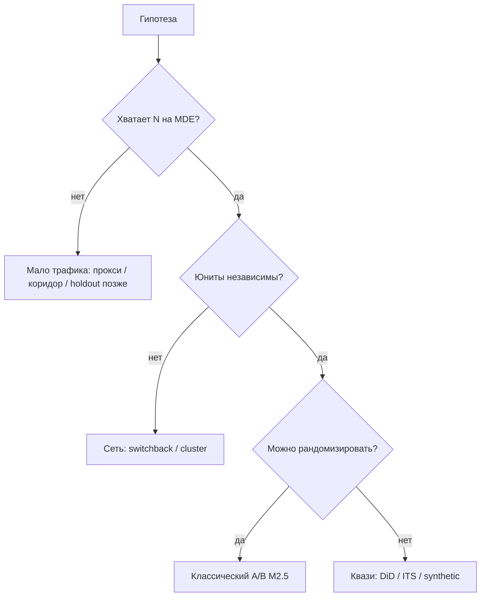
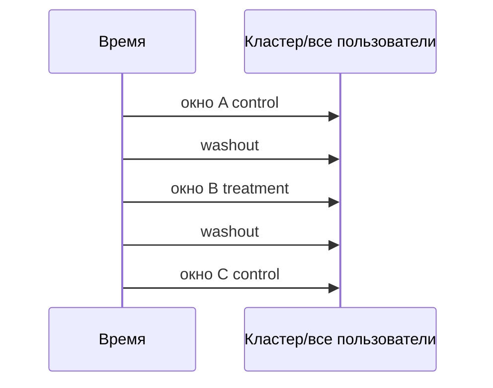

# М2.6. Когда A/B невозможен

| Поле | Значение |
|---|---|
| **ID** | М2.6 |
| **Неделя / проход** | Неделя 7 · Проход 3 |
| **Опора** | статистика · дизайн проверки без классического A/B |
| **Аудитория** | аналитик + продакт |
| **Ориентир** | 70–90 мин · практика 3 ч |
| **Визуалы** | Mermaid: дерево выбора метода · switchback схема |
| **Зависимость** | после **М2.4**, **М2.5**; стык с **М4.4**, **М1.10** |
| **Вехи** | **P4** — честный план, если N/интерференция ломают user-level A/B |

---

## Цели

После урока вы:

- **Общий минимум:** для гипотезы Ритма выбираете **метод проверки**, когда классический user-level A/B нельзя / бессмысленно; фиксируете допущения и риск ошибки.
- **Аналитик:** отличаете мало трафика, сетевые эффекты и «нельзя рандомизировать»; набросаете дизайн switchback / DiD / качественной замены на уровне схемы.
- **Продакт:** не требуете p-value там, где его не будет; принимаете решение с явной неопределённостью.

---

## Контекст Ритма

На учебном стенде P4 как раз **можно** честно посчитать `paywall_timing_*` — это привилегия синтетики. В жизни у Ритма (или вашего продукта) часто: мало платящих, длинный цикл, вмешательство пользователей друг в друга, одна витрина на всех.

**М2.6** учит не подделывать A/B «на глаз за 3 дня», а выбрать другую проверку и сказать бизнесу правду.

---

## Теория коротко

### 1. Сначала честно: почему A/B «нельзя»

| Причина | Симптом | Что будет, если всё равно гонять user A/B |
|---|---|---|
| **Мало трафика / редкое событие** | MDE недостижим за разумный срок (М2.4) | ложные победы, peeking |
| **Интерференция / сеть** | один пользователь влияет на другого (маркетплейс, общий инвентарь, общий алгоритм) | смещённый эффект |
| **Один мир на всех** | цена, ranking, infra-флаг нельзя разрезать по user | контрольная «заражена» |
| **B2B / долгий цикл** | сделка 3–9 мес, N клиентов десятки | недопустимая длительность |
| **Этика / необратимость** | вред, юридика, нельзя откатить | нельзя рандомизировать |

### 2. Мало трафика: не «уменьшим значимость»

Запрещённые костыли: смотреть p каждый день; резать MDE постфактум; тестировать 12 метрик без поправки.

Рабочие пути:

| Путь | Суть | Ритм |
|---|---|---|
| Прокси-метрика | ближе к поведению, чаще срабатывает | time-to-check-in вместо годовой подписки |
| Качество → количество | коридор М4.4, затем узкий A/B | текст CTA |
| Гео/время holdout | раскат на 10% позже | только если нет сильной сезонности без контроля |
| Накопить N | честно ждать | сказать срок в защите |
| Не тестировать | ship + мониторинг guardrail | дешёвые обратимые правки |

### 3. Switchback (обзор)

Когда нельзя делить пользователей: чередуем treatment/control по **времени × региону (кластеру)**.

| Правило | Зачем |
|---|---|
| Юнит анализа = кластер-окно, не событие | иначе зависимые наблюдения |
| Washout / burn-in | срезать перенос эффекта |
| Дольше / больше кластеров | иначе нет мощности |
| Не для сверхдлинных эффектов | switchback плох, если эффект копится неделями |

Для **paywall UI** Ритма обычно хватает user A/B. Switchback понадобится скорее для общего ранжирования напоминаний или серверного лимита, общего на всех.

### 4. Квазиэксперименты — обзорно, без «я учёный»

| Метод | Идея | Когда на Ритме |
|---|---|---|
| **DiD** | сравнить Δ до/после у «получивших» vs похожих | раскат фичи на Android раньше iOS |
| **Interrupted time series** | слом ряда в момент релиза | один глобальный релиз |
| **Regression discontinuity** | порог (score, дата) | реже в B2C-привычках |
| **Synthetic control** | синтетический «двойник» региона | если есть много регионов |

Все требуют **допущений** (параллельные тренды и т.д.). В сдаче курса: назвать метод + допущение + что сделаете, если допущение ломается — не «посчитали в CausalImpact и всё ок».

### 5. Качественная замена не стыдна

Если N = 40 платящих в месяц: 5 коридоров (М4.4) + чёткие guardrail после ship сильнее, чем «A/B на 200 пользователях с p=0,04».

Связка с М1.10: глагол решения может быть **ждём данных / кораблим с мониторингом / убиваем**, а не только «растим по тесту».

---

## Разобранный пример: мало Pro-конверсий

**Гипотеза:** новый онбординг ↑ depth_d7.  
**Расчёт М2.4:** до MDE +3 п.п. нужно ~X недель при текущем трафике — неприемлемо к релизу.  

**План М2.6:**

1. Прокси: time-to-first-check-in + habit→check_in_1d (чаще).  
2. 5 коридоров на онбординге (М4.4).  
3. Ship на 20% user-holdout, если прокси стабильно лучше и depth не падает 14 дней.  
4. Полный A/B — когда накопим N; до тех пор не объявлять «доказано».

---

## Практика

Возьмите **одну** гипотезу из P3/P4 (не обязательно paywall), для которой user A/B слаб.

### Ядро (оба)

1. Заполните карточку: гипотеза · почему A/B нельзя/дорог · выбранный метод · primary/прокси · guardrail · срок · допущения.  
2. Нарисуйте схему проверки (switchback **или** DiD **или** качественный+holdout).  
3. Напишите абзац для защиты: *какое решение примем при каком исходе* (М1.10).  
4. Явно: что будет **ложным** выводом, если нарушить допущение.

### Расширение «руки»

- Оценка: на полном стенде Ритма для paywall A/B как раз возможен — покажите расчётом N (из М2.4), контраст с «бедным» сценарием.  
- Псевдокод агрегации switchback: метрика на (region, window).  
- Список метрик, которые нельзя делать primary при низком N.

### Расширение «решение»

- Memo: отказать стейкхолдеру в «быстром A/B на неделю».  
- Когда кораблим без теста (обратимость, малый blast radius).  
- Связь стоимости гипотезы М1.4 с отказом от недомощного теста.

---

## Критерии приёмки

- [ ] Причина «нельзя A/B» названа конкретно (не «сложно»).
- [ ] Выбран метод + допущения + guardrail.
- [ ] Нет peeking / «понизим α» как решения.
- [ ] Абзац решения с неопределённостью.
- [ ] Ядро + одно расширение.

---

## Линия AI

| Можно | Нельзя без вас |
|---|---|
| Обзор методов и чеклист допущений | Выбрать метод под политическое давление |
| Черновик карточки эксперимента | Объявить причинность из корреляции DiD без допущений |
| Симуляция мощности | Спрятать малый N красивым графиком |

**Проверка:** вычеркните все p-value из плана. Осталась ли логика решения? Если нет — вы маскировали немощность тестом.

---

## Дальше читать

- Курс: [`m2-4-confidence-intervals.md`](./m2-4-confidence-intervals.md) · [`m2-5-ab-design-read.md`](./m2-5-ab-design-read.md) · [`m4-4-corridor-tests.md`](./m4-4-corridor-tests.md).  
- Открыто: [Statsig — switchback overview](https://www.statsig.com/blog/switchback-experiments) · [DoorDash — switchback under network effects](https://careersatdoordash.com/blog/experiment-rigor-for-switchback-experiment-analysis/) · [Kameleoon — what is switchback](https://www.kameleoon.com/blog/switchback-testing) · [GoPractice — дизайн A/B](https://gopractice.ru/data/design-ab-test/) (граница применимости).  
- Private ref для сильных: stats-ab М6 — см. [`../../internal/stats-ab-weave.md`](../../internal/stats-ab-weave.md) (не студенческий dump).
