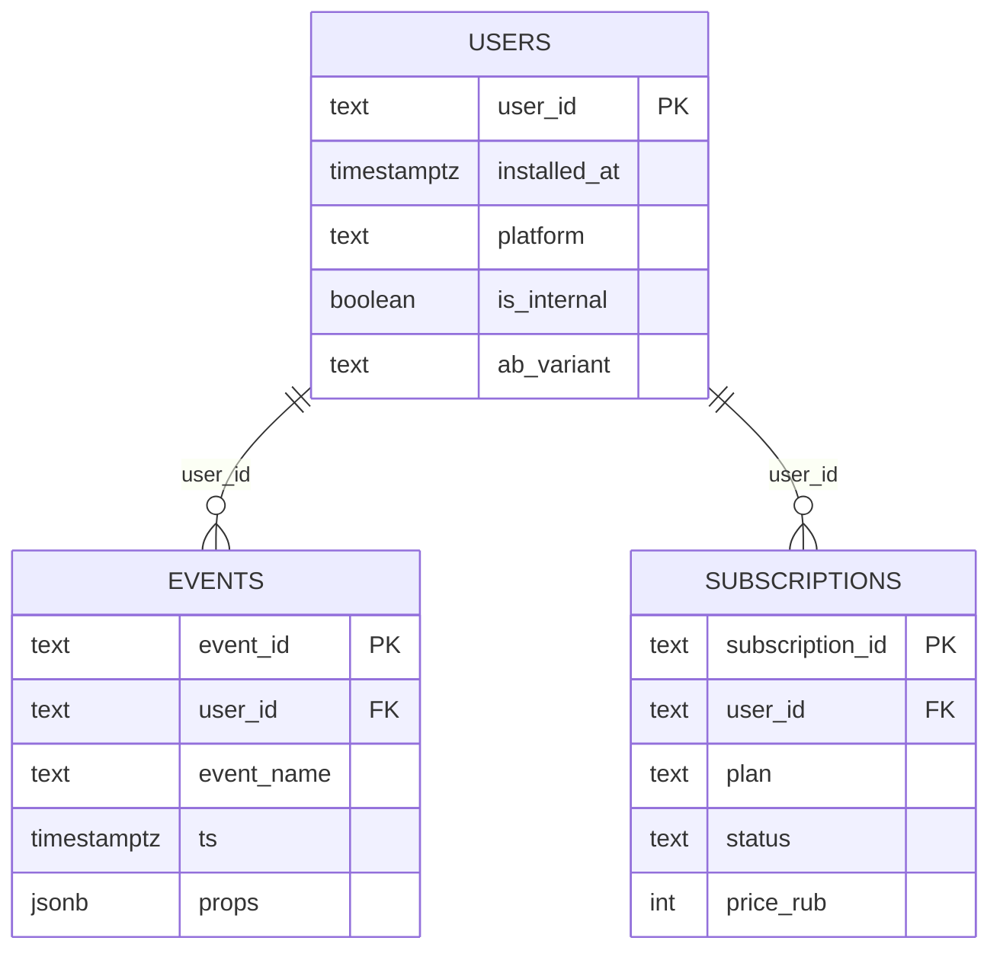

# М3.1. Откуда берутся данные: зерно таблиц Ритма

| Поле | Значение |
|---|---|
| **ID** | М3.1 |
| **Неделя / проход** | Неделя 1 · Проход 1 |
| **Опора** | инструменты (SQL/данные) |
| **Аудитория** | аналитик + продакт |
| **Ориентир** | 70–90 мин · практика 2–3 ч |
| **Визуалы** | [зерно таблиц](./visuals/m3-1-grain-tables.svg) · [слои данных](./visuals/m3-1-data-layers.svg) |
| **Зависимость** | после М0.1; рядом с М4.3 (события); до/параллельно старту М3.2 |
| **Вехи** | **P1** — без зерна нет честной цифры SQL |

---

## Цели

После урока вы:

- **Общий минимум:** для каждой таблицы Ритма называете **зерно** (что значит одна строка) и не путаете users с events.
- **Аналитик:** читаете схему стенда; предсказываете, как JOIN раздует строки; отличаете сырое / view / агрегат.
- **Продакт:** ставите задачу на расчёт с явным зерном и знаменателем; ловите «DAU по событиям» как дыру в постановке.

---

## Контекст Ритма

Цифра «depth 27%» появляется не из воздуха: пользователь отметил день → клиент пишет событие → строка в Postgres → (позже) view → карточка Metabase.

Пока команда спорит о SQL, она часто спорит о **зерне**: считают ли `check_in` как пользователей, дни или тапы. М4.3 фиксирует *какие* события; этот урок — *как они лежат в таблицах* до того, как писать SELECT в М3.2.

Стенд: [`../stand/README.md`](../stand/), схема [`../stand/sql/01_schema.sql`](../stand/sql/01_schema.sql).

---

## Теория коротко

### 1. Событие в продукте → строка в таблице

| В продукте | В данных |
|---|---|
| Юзер установил приложение | строка в `users` |
| Юзер отметил привычку | строка в `events` с `event_name = 'check_in'` |
| Юзер оплатил Pro | строка в `subscriptions` (+ обычно `subscribe_started` в events) |

Аналитика продукта ≠ «отчёт GA». На курсе источник правды — **наш контракт разметки** (М4.3) и Postgres. Amplitude/Метрика — ориентиры индустрии, не стек сдачи.

### 2. Зерно = ответ на «что такое одна строка?»

| Таблица | Зерно | Ключ | Типичная ловушка |
|---|---|---|---|
| **users** | 1 user | `user_id` | дублировать user «для удобства» |
| **events** | 1 факт события | `event_id`; FK `user_id` | `count(*)` как число людей |
| **subscriptions** | 1 факт Pro / статуса | `subscription_id`; FK `user_id` | JOIN без дедупа: month→year = 2 строки |

Картина: [`visuals/m3-1-grain-tables.svg`](./visuals/m3-1-grain-tables.svg).

### 3. Users vs sessions vs события

| Вопрос | Правильный знаменатель на Ритме |
|---|---|
| Сколько людей создали привычку? | `count(DISTINCT user_id)` из events / users с фактом |
| Сколько раз открывали paywall? | строки `paywall_view` (осторожно: дубли) |
| Активность «дней» для depth | уникальные календарные дни с `check_in`, не тапы |

Сессия на курсе **не** отдельная таблица; если кто-то говорит «session conversion» — сначала определите, что такое session. Иначе это четыре числа из М2.3 под другим именем.

### 4. Слои: сырое → чистое → витрина → агрегат

| Слой | На стенде | Зерно |
|---|---|---|
| Сырое | `events`, `users`, `subscriptions` | факт |
| Чистое / QA | `v_qa_*`, дедуп в запросе | часто всё ещё событие или user×день |
| Витрина | `v_first_habit`, `v_depth_d7` | ближе к метрике |
| Агрегат / KPI | карточка Metabase | одна цифра за период |

Картина: [`visuals/m3-1-data-layers.svg`](./visuals/m3-1-data-layers.svg).

Правило: **ошибка на сыром не лечится** красивым дашбордом (М5.2). Сначала зерно и контракт событий.

### 5. Props и «грязь» генератора

В `events.props` (jsonb) лежат `habit_id`, `local_date`, `trigger`, `schema_version`, … Генератор намеренно портит часть строк (пустые props, дубли, `local_day` vs `local_date`) — чтобы М3.2/М3.6 ловили ложь. На М3.1 достаточно знать: **свойства не свободный текст для BI**, а часть контракта зерна (например, depth требует день, не только ts).

---

## Разобранный пример: три count(*) — три смысла

Вопрос продакта: «Сколько у нас подписчиков?»

| Запрос (логика) | Что на самом деле считает | Риск |
|---|---|---|
| `count(*) from subscriptions` | строки фактов (month+year = 2) | завышает людей |
| `count(distinct user_id) from subscriptions where status='active'` | уникальные users с активным Pro | ближе к «сейчас платят» |
| `count(*) from events where event_name='subscribe_started'` | старты оплаты (в т.ч. повторы) | путает intent с статусом |

До SQL в М3.2 продакт обязан сказать: *люди сейчас на Pro* или *события старта*. Аналитик обязан повторить зерно в ответе.

Второй пример — depth: `count(check_in)` vs `count(DISTINCT day)` — классический провал зерна; определение в М1.1/М4.3.

---

## Практика

Схема и (если стенд поднят) живые таблицы. CSV-семпл в `docs/stand/seed/` — запасной путь.

### Ядро (оба)

1. Заполните карточку на **три таблицы**: зерно · PK · FK · 2–3 важных поля · одна ловушка count/JOIN.
2. Для метрики **D7 habit depth ≥3** напишите цепочку слоёв: какое сырое событие → какое промежуточное зерно (user × день) → какая итоговая доля (users).
3. Разберите одну ложную постановку: «посчитай конверсию в Pro по числу paywall_view» — что не так с зерном и как переформулировать (users vs views).
4. Укажите, где в схеме живёт A/B (`users.ab_variant`) и почему вариант **не** берём из props события как источник истины.

### Расширение «руки»

- На стенде: `count(*)`, `count(distinct user_id)` для `events` и `subscriptions`; объясните разницу числами.
- Найдите (SQL или глазами CSV) пример user с >1 строки в `subscriptions` или дублем `check_in`.
- Нарисуйте/опишите, что сделает `users JOIN subscriptions` с зерном результата до GROUP BY.

### Расширение «решение»

- Бриф задачи аналитику на одну метрику P1 (depth или habit→subscribe): зерно, знаменатель, окно, исключение internal — без слова «просто выгрузи».
- Список «чего нельзя обещать бизнесу» из сырого GA-мышления (сессии как люди, button_click как воронка).
- Связка с М4.3: одно событие из tracking plan → в какой таблице окажется и с каким зерном.

---

## Критерии приёмки

- [ ] Карточка зерна на 3 таблицы без путаницы users/events.
- [ ] Цепочка depth (или другой метрики) по слоям сформулирована.
- [ ] Одна ложная постановка разобрана и переформулирована.
- [ ] Ядро + одно расширение.
- [ ] AI-схема с выдуманной таблицей `sessions` без договорённости — отклонена.

---

## Линия AI

| Можно | Нельзя без вас |
|---|---|
| Набросать ERD / комментарии к схеме | Объявить зерно «как удобнее для JOIN» |
| Черновик формулировки брифа | Подменить users событиями в знаменателе |
| Объяснить jsonb props | Выдумать поля, которых нет в `01_schema.sql` |

**Проверка:** сверьте каждый объект в ответе AI со [`../stand/sql/01_schema.sql`](../stand/sql/01_schema.sql). Лишнее поле = провал.

---

## Дальше читать

- Календарь / P1: [`../course-structure.md`](../course-structure.md) §3.2, §4.1.
- Инвентарь: [`../sources-inventory.md`](../sources-inventory.md), [`../sql-python-sources.md`](../sql-python-sources.md) — критика «цифр из воздуха»; ориентиры Amplitude/Mixpanel как класс систем, не как ДЗ.
- Контракт событий: [`m4-3-tracking-plan.md`](./m4-3-tracking-plan.md).
- Следующий шаг руками: [`m3-2-sql-zero-to-windows.md`](./m3-2-sql-zero-to-windows.md); проверка AI: [`m3-6-verify-ai-sql.md`](./m3-6-verify-ai-sql.md).
- Словарь метрик (слой определений): [`m5-1-metrics-layer.md`](./m5-1-metrics-layer.md).
