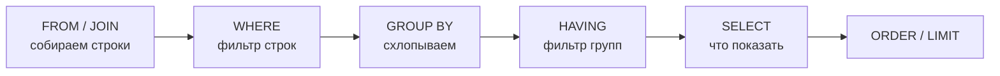

# М3.2. SQL с нуля до оконных функций

| Поле | Значение |
|---|---|
| **ID** | М3.2 |
| **Неделя / проход** | Недели 1–3 · Проходы 1–2 (растянут: SELECT → JOIN → окна) |
| **Опора** | Python и SQL |
| **Аудитория** | аналитик + продакт |
| **Ориентир** | 3–4 блока по 60–90 мин · практика 6–10 ч суммарно |
| **Визуалы** | [модель запроса и зерно](./visuals/m3-2-query-grain.svg) · [окна на Ритме](./visuals/m3-2-windows-ritm.svg) |
| **Зависимость** | после М3.1 (желательно) и схемы событий из [`m4-3-tracking-plan.md`](./m4-3-tracking-plan.md); стык с [`m2-3-conversion-cohorts.md`](./m2-3-conversion-cohorts.md) |

---

## Цели

После урока вы:

- **Общий минимум:** читаете чужой Postgres-запрос на схеме Ритма и говорите, *какое зерно* на выходе и *какой вопрос бизнеса* он закрывает.
- **Аналитик:** пишете SELECT → JOIN → агрегации → окна до «первое событие / когорта / шаг воронки»; ловите запрос без синтаксической ошибки с неверным смыслом.
- **Продакт:** ставите задачу на SQL так, что в ней есть определение метрики, окно и знаменатель; не принимаете «конверсия 19%» без зерна.

---

## Контекст Ритма

Диалект курса — **PostgreSQL**. Учебная схема — та же, что в М4.3 (стенд CSV/Docker может появиться позже; имена не ломаем):

| Таблица | Зерно | Ключевые поля |
|---|---|---|
| **`users`** | 1 строка = 1 пользователь | `user_id`, `installed_at`, `platform`, `is_internal` |
| **`events`** | 1 строка = 1 факт события | `event_id`, `user_id`, `event_name`, `ts`, `props` (jsonb) |
| **`subscriptions`** | 1 строка = факт подписки / статуса | `user_id`, `started_at`, `plan`, `status` |

События из tracking plan: `app_open`, `onboarding_completed`, `habit_created`, `check_in`, `streak_3_reached`, `paywall_view`, `subscribe_started`, …

Тон модуля: **модель важнее синтаксиса**. В 2026 SELECT напишет AI; ценность аналитика — знать, что просить и почему ответ врёт. Три «ломаных» запроса в конце — обязательная практика.

Внешний вход (параллельно, не rar с Яндекс.Диска): [Karpov SQL Simulator](https://karpov.courses/simulator-sql) → продуктовые шаблоны [Kariernik «15 запросов»](https://kariernik.ru/blog/sql-zaprosy-dlya-produktovyh-analitikov) → окна [HireHi](https://hirehi.ru/blog/okonnye-funktsii-sql-dlia-analitika-kak-schitat-skolziashchie-srednie-rangi-i-nakopitelnye-itogi-bez-podzaprosov) + метрики на SQL [Habr](https://habr.com/ru/articles/1010980/).

---

## Теория коротко

### 1. Запрос = конвейер, не «магия SELECT»

Порядок *логики* (не синтаксиса текста):



Окна (`OVER`) считаются **после** WHERE, но **до/рядом** с финальным SELECT — на уже отфильтрованном наборе, *не схлопывая* строки так, как `GROUP BY`.

Смотрите: [`visuals/m3-2-query-grain.svg`](./visuals/m3-2-query-grain.svg) — зерно на каждом шаге.

Правило курса: перед написанием кода ответьте на три вопроса:

1. Какое **зерно** на входе (user / event / day)?
2. Какое **зерно** нужно на выходе?
3. Какое **определение** метрики (числитель, знаменатель, окно, дедуп)?

### 2. SELECT / WHERE / агрегации на Ритме

```sql
-- DAU по check_in (учебный эскиз; is_internal выкидываем)
SELECT date_trunc('day', e.ts)::date AS d,
       count(DISTINCT e.user_id) AS dau_check_in
FROM events e
JOIN users u ON u.user_id = e.user_id
WHERE e.event_name = 'check_in'
  AND u.is_internal = false
GROUP BY 1
ORDER BY 1;
```

Ловушки NULL и фильтров:

| Ловушка | Симптом | Правило |
|---|---|---|
| `WHERE props->>'plan' = 'year'` | отрезает NULL и «нет плана» | отделяйте «нет значения» от «не year» |
| `count(*)` вместо `count(DISTINCT user_id)` | раздутая «конверсия» | продуктовые метрики почти всегда по users |
| `INNER JOIN subscriptions` «для удобства» | теряете freemium | LEFT, если знаменатель = все с привычкой |

### 3. JOIN меняет зерно

```sql
-- ОПАСНО: events ⋈ subscriptions без дедупа → дубли строк событий
SELECT e.user_id, e.event_name, s.plan
FROM events e
JOIN subscriptions s ON s.user_id = e.user_id;
```

Если у user две строки в `subscriptions` (month потом year), каждое событие **удвоится**. Дальше `count(*)` врёт, а `count(DISTINCT user_id)` может случайно «спасти» — и скрыть баг.

Правило: после JOIN проверьте `count(*)` до и после; сравните с `count(DISTINCT user_id)`.

### 4. Оконные функции — когда строки нельзя схлопнуть

Нужны окна, когда хотите **пометить** строку относительно других строк того же user / когорты, не теряя детализацию:

| Задача на Ритме | Окно | Зачем |
|---|---|---|
| Первое `habit_created` | `row_number() OVER (PARTITION BY user_id ORDER BY ts)` | знаменатель depth / activation |
| День жизни относительно install | `date_trunc(...) - installed_at` + фильтр | когортный D1/D7 |
| Предыдущий check_in | `lag(ts) OVER (PARTITION BY user_id, props->>'habit_id' ORDER BY ts)` | разрывы серии |
| Накопительные дни с чек-ином | `count(*) OVER (PARTITION BY user_id ORDER BY day)` | путь к depth≥3 |

Картина: [`visuals/m3-2-windows-ritm.svg`](./visuals/m3-2-windows-ritm.svg).

```sql
-- Первое создание привычки на пользователя
WITH ranked AS (
  SELECT user_id, ts,
         row_number() OVER (PARTITION BY user_id ORDER BY ts) AS rn
  FROM events
  WHERE event_name = 'habit_created'
)
SELECT user_id, ts AS first_habit_at
FROM ranked
WHERE rn = 1;
```

```sql
-- Шаг воронки: был ли paywall_view в окне 14д после первого habit
-- (эскиз; полный разбор — в практике и М2.3)
```

Окно ≠ `GROUP BY`: после `GROUP BY` строк меньше; после окна строк столько же, плюс колонка-метка.

### 5. Рецепт: когортная матрица ретеншна на Postgres

Тот же пайплайн, что в М2.3 §7 — на схеме Ритма. Идея окон (first-touch / offset) универсальна; ниже — **Postgres**, не DuckDB.

```sql
-- Habit retention: когорта = неделя первого habit_created;
-- день N = был ≥1 check_in на calendar day = habit_day + N
WITH first_habit AS (
  SELECT user_id,
         min(ts) AS habit_at,
         date_trunc('week', min(ts))::date AS cohort_week
  FROM events
  WHERE event_name = 'habit_created'
  GROUP BY 1
),
check_days AS (
  SELECT e.user_id,
         (e.ts AT TIME ZONE 'Europe/Moscow')::date AS d
  FROM events e
  JOIN users u ON u.user_id = e.user_id AND u.is_internal = false
  WHERE e.event_name = 'check_in'
  GROUP BY 1, 2
),
aged AS (
  SELECT f.cohort_week,
         f.user_id,
         (c.d - (f.habit_at AT TIME ZONE 'Europe/Moscow')::date) AS day_n
  FROM first_habit f
  JOIN check_days c ON c.user_id = f.user_id
  WHERE c.d >= (f.habit_at AT TIME ZONE 'Europe/Moscow')::date
),
cohort_sizes AS (
  SELECT cohort_week, count(*) AS cohort_users
  FROM first_habit f
  JOIN users u USING (user_id)
  WHERE u.is_internal = false
  GROUP BY 1
)
SELECT a.cohort_week,
       a.day_n,
       count(DISTINCT a.user_id) AS retained,
       round(100.0 * count(DISTINCT a.user_id) / cs.cohort_users, 1) AS retained_pct
FROM aged a
JOIN cohort_sizes cs USING (cohort_week)
WHERE a.day_n IN (0, 1, 3, 7, 14)
GROUP BY 1, 2, cs.cohort_users
ORDER BY 1, 2;
```

Что проверять перед сдачей:

- знаменатель = размер когорты **на якоре**, не «активные в день N»;
- day_n считается от **habit**, не от «первого любого события», если так в словаре М5.1;
- недозревшие когорты: нет day_14 — не сравнивайте с зрелыми (М2.3).

Другие окна на том же паттерне: `min(...) OVER (PARTITION BY user_id)` для first-touch без схлопывания строк; `lag` для разрывов streak; накопительный `count(DISTINCT day)` к depth≥3 — см. эскиз ниже.

### 6. Почему «запрос без ошибки» врёт

Типовые классы (их же ловите в трёх сломанных запросах ниже и в М3.6):

1. **Неверное зерно** — считаете события как users.
2. **Неверный JOIN** — INNER отрезал / дубль раздул.
3. **Неверное окно / дедуп** — depth по тапам, не по календарным дням; renew как new Pro.
4. **Неверный знаменатель** — «конверсия от paywall» vs «от install».
5. **Утечка внутренних** — `is_internal` забыли.

---

## Разобранный пример: D7 habit depth ≥3 на SQL

**Определение (из М1.1 / М4.3):** среди users с первым `habit_created` в когорте — доля тех, у кого ≥3 **уникальных календарных дней** с `check_in` в окне 7 суток от даты первого habit.

Эскиз (логика; синтаксис props/таймзоны уточните на стенде):

```sql
WITH first_habit AS (
  SELECT user_id, min(ts) AS habit_at
  FROM events
  WHERE event_name = 'habit_created'
  GROUP BY 1
),
check_days AS (
  SELECT e.user_id,
         (e.ts AT TIME ZONE 'Europe/Moscow')::date AS local_day
  FROM events e
  JOIN first_habit f ON f.user_id = e.user_id
  WHERE e.event_name = 'check_in'
    AND e.ts >= f.habit_at
    AND e.ts <  f.habit_at + interval '7 days'
),
depth AS (
  SELECT user_id, count(DISTINCT local_day) AS days_with_check
  FROM check_days
  GROUP BY 1
)
SELECT
  count(*) FILTER (WHERE coalesce(d.days_with_check, 0) >= 3)::float
  / nullif(count(*), 0) AS depth_ge3
FROM first_habit f
LEFT JOIN depth d USING (user_id)
JOIN users u USING (user_id)
WHERE u.is_internal = false
  AND f.habit_at >= date '2026-08-01'
  AND f.habit_at <  date '2026-09-01';
```

Что здесь важно для модели: знаменатель = users с habit; числитель = users с ≥3 **днями**; LEFT JOIN, чтобы нули не пропали; фильтр внутренних.

---

## Три «ломаных» запроса (обязательно поймать)

Все три **выполняются без ошибки Postgres**. Задача — найти смысловую ложь. Учебные цифры можно подставить позже; ловите по модели.

### Ломаный A — «конверсия в Pro 62%»

```sql
-- Заявлено: доля users с habit_created, у кого был subscribe_started
SELECT
  count(*) FILTER (WHERE e.event_name = 'subscribe_started')::float
  / count(*) FILTER (WHERE e.event_name = 'habit_created') AS cr
FROM events e;
```

**Почему врёт:** зерно = **строки событий**, не users. Один user с 10 `habit_created` (правки) и один subscribe искажает отношение. Нужны `count(DISTINCT user_id)` в числителе и знаменателе (и обычно окно после первого habit).

### Ломаный B — «все с paywall почти подписаны»

```sql
SELECT count(DISTINCT e.user_id)::float
     / (SELECT count(DISTINCT user_id) FROM events WHERE event_name = 'paywall_view') AS cr
FROM events e
JOIN subscriptions s ON s.user_id = e.user_id
WHERE e.event_name = 'paywall_view'
  AND s.status = 'active';
```

**Почему врёт:** `JOIN subscriptions` делает знаменатель *де-факто* «видел paywall **и** есть подписка» в числителе пути, плюс смешивает money-status с событием. Классика: INNER вместо раздельных множеств; нет окна «subscribe после view»; renew/active тянет старых Pro.

### Ломаный C — «depth ≥3 = 81%» через окно

```sql
WITH ordered AS (
  SELECT user_id, ts,
         row_number() OVER (PARTITION BY user_id ORDER BY ts) AS rn
  FROM events
  WHERE event_name = 'check_in'
)
SELECT count(DISTINCT user_id)::float
     / (SELECT count(DISTINCT user_id) FROM events WHERE event_name = 'habit_created') AS depth_ge3
FROM ordered
WHERE rn >= 3;
```

**Почему врёт:** `rn >= 3` — это «≥3 **тапа** check_in», не ≥3 **календарных дня**; нет окна 7 дней от habit; знаменатель — все когда-либо с habit, не когорта. Окно применено «красиво», определение depth из М4.3 убито.

---

## Практика

Пока нет живого Postgres — пишите SQL/псевдокод по схеме и объясняйте зерно. Когда стенд появится — те же имена.

### Ядро (оба)

1. Нарисуйте три таблицы Ритма и стрелки JOIN; подпишите зерно каждой.
2. Напишите (или восстановите) корректный запрос **DAU по `check_in`** и **конверсию habit → subscribe за 14д** (users, дедуп).
3. Разберите **ломаные A, B, C**: для каждого — (а) какое зерно сейчас, (б) какой вопрос бизнеса имелся в виду, (в) исправленный эскиз.
4. Одним абзацем: чем `GROUP BY user_id` отличается от `row_number() OVER (PARTITION BY user_id …)` на примере первого `habit_created`.

### Расширение «руки»

- Напишите запрос **когортного habit retention D1/D7** (актив = день с `check_in`; когорта = неделя `installed_at` или `first_habit` — выберите одно и зафиксируйте).
- Добавьте проверку качества: дубли `check_in` на `(user_id, props->>'habit_id', local_day)`.
- Прогоните те же метрики как CTE-цепочку; отметьте, где окно необходимо, а где хватает `GROUP BY`.
- Сопоставьте свой стиль с 2–3 шаблонами из Kariernik (DAU, retention, воронка) — не копируйте схему доставки, перенесите *идею* на Ритм.

### Расширение «решение»

- Сформулируйте ТЗ аналитику на один дашбордный KPI (depth≥3 или paywall CR) так, чтобы по ТЗ нельзя было сдать ломаный A/B/C.
- Для каждого ломаного запроса опишите **цену ошибки** в деньгах/спринте Ритма (что команда сделает не так).
- Запретите в ТЗ три конструкции (например «запрещён count(*) для CR», «запрещён INNER к subscriptions для знаменателя freemium»).

---

## Критерии приёмки

- [ ] Есть схема зерна `users` / `events` / `subscriptions` своими словами.
- [ ] Два рабочих эскиза запросов (DAU + конверсия или depth) с явным определением.
- [ ] Ломаные A, B, C разобраны: диагноз + исправление.
- [ ] Показано отличие GROUP BY vs окно на одном примере Ритма.
- [ ] Ядро + одно расширение.
- [ ] Видно, что AI мог написать «красивый SQL» — вы проверили зерно и знаменатель.

---

## Линия AI

| Можно | Нельзя без вас |
|---|---|
| Черновик синтаксиса SELECT/JOIN/окон | Выбрать определение метрики и зерно |
| Переписать запрос под Postgres | Принять число без проверки count до/после JOIN |
| Объяснить план «что делает запрос» | Решить, ломаный ли смысл |

**Проверка:** для любого AI-SQL выпишите зерно входа/выхода и `count(*)` vs `count(DISTINCT user_id)`. Если не можете — запрос не готов к сдаче (полный набор — М3.6).

---

## Дальше читать

База окон и когорт — в §4–5 выше. Библиотека курса (примеры окон; диалект в статьях может быть DuckDB — переносите идею на Postgres Ритма):

- Карта модуля: [`../course-structure.md`](../course-structure.md) § М3.2.
- **Библиотека:** [`../uploads/medium-hashblock-duckdb-window-cohorts.md`](../uploads/medium-hashblock-duckdb-window-cohorts.md) · [`../uploads/medium-mohitdaxini-monthly-cohort-retention-sql.md`](../uploads/medium-mohitdaxini-monthly-cohort-retention-sql.md) · [`../uploads/medium-duckweave-duckdb-retention-cohorts.md`](../uploads/medium-duckweave-duckdb-retention-cohorts.md) · [`../uploads/bonus-kariernik-sql-product-analyst.md`](../uploads/bonus-kariernik-sql-product-analyst.md).
- Python рядом (stub): [`m3-4-pandas-polars.md`](./m3-4-pandas-polars.md).
- Схема событий: [`m4-3-tracking-plan.md`](./m4-3-tracking-plan.md).
- Определения: [`m2-3-conversion-cohorts.md`](./m2-3-conversion-cohorts.md).
- Проверка AI: [`m3-6-verify-ai-sql.md`](./m3-6-verify-ai-sql.md).
- Карта: [`../materials-library.md`](../materials-library.md).

Не используем выгрузки rar с Яндекс.Диска (#6/#8).
