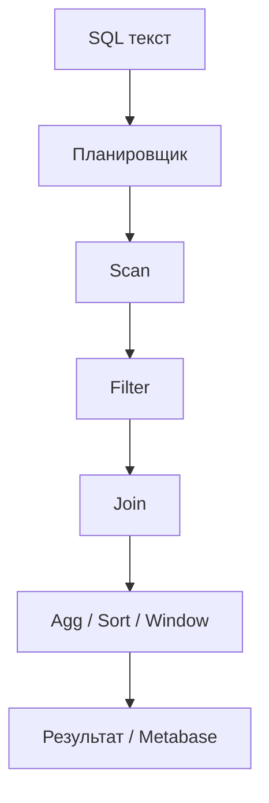

# М3.3. Как это исполняется под капотом

| Поле | Значение |
|---|---|
| **ID** | М3.3 |
| **Неделя / проход** | Неделя 3 · Проход 2 |
| **Опора** | Python и SQL |
| **Аудитория** | аналитик + продакт |
| **Ориентир** | 70–90 мин · практика 2 ч |
| **Зависимость** | после старта М3.2 (JOIN/агрегации); до витрин М5.* и тяжёлых окон |
| **Вехи** | мост к **Metabase** — медленный дашборд часто = плохой план / зерно, не «BI глючит» |

---

## Цели

После урока вы:

- **Общий минимум:** объясняете разницу Seq Scan vs Index Scan на пальцах и почему «тот же ответ» может стоить в 100 раз дороже.
- **Аналитик:** читаете упрощённый `EXPLAIN`; переписываете запрос или добавляете фильтр по времени; не тащите весь `events` в Metabase без нужды.
- **Продакт:** принимаете оценку «эта карточка на полном логе будет тормозить» и согласуете витрину/окно.

---

## Контекст Ритма

Таблица `events` на full-генерации — миллионы строк. Карточка Metabase «depth по неделям» с `WHERE ts > now() - interval '7 days'` и без него — два разных продукта. Стек курса: **Postgres** как источник, **Metabase** как слой показа — оба страдают от плохого плана.

---

## Теория коротко

### 1. Запрос — это план, не «магия SELECT»

Упрощённый конвейер:

1. Какие строки читать (scan / index)?
2. Фильтр (`WHERE`).
3. Соединение (`JOIN`).
4. Агрегация / сортировка / окно.

`EXPLAIN` (без `ANALYZE` на старте достаточно) показывает **задуманный** план. `EXPLAIN ANALYZE` — ещё и время; на учебном стенде можно, на проде — осторожно.

### 2. Seq Scan vs Index Scan

| План | Смысл | Когда на Ритме |
|---|---|---|
| **Seq Scan** | читаем таблицу подряд | маленький семпл; или фильтр всё равно почти все строки |
| **Index Scan / Bitmap** | идём по индексу | селективный фильтр: `user_id`, диапазон `ts`, `event_name` |

Индекс — не бесплатный: ускоряет чтение, замедляет запись, занимает место. На курсе не админим прод-DWH; учимся **формулировать** запрос так, чтобы план был разумным.

### 3. JOIN и взрыв строк

Плохой JOIN (М3.2) сначала раздувает строки, потом агрегация «чинит» ответ ценой CPU. Под капотом: больше чтений и хеш/сорт. Лекарство — зерно и дедуп **до** тяжёлой агрегации.

### 4. Витрины и Metabase

Повторяющиеся тяжёлые запросы → view / материализованная витрина (`02_views.sql` на стенде — учебный пример). Правило: дашборд решения (М5.2/М5.4) опирается на **узкое** определение и по возможности на уже агрегированный слой, не на сырой `events` «на каждый чих».

---

## Разобранный пример: две формулировки depth

**A.** Считаем depth по всем `events` без фильтра по времени, потом в Metabase фильтр «последние 7 дней» на уже огромном результате (антипаттерн: логика фильтра не в SQL).

**B.** В SQL: `WHERE ts >= … AND event_name = 'check_in'`, агрегация по `user_id`, затем join к когорте.

На full B обычно на порядки дешевле. Симптом A в Metabase: карточка крутится десятки секунд, студенты думают «Docker слабый».

---

## Практика

### Ядро (оба)

1. Возьмите один рабочий запрос из М3.2 (или карточку depth).
2. Выполните `EXPLAIN` (и по возможности `EXPLAIN ANALYZE`) на стенде.
3. Запишите: какой scan, есть ли фильтр по `ts` / `event_name`, оценка строк.
4. Предложите **одну** перепись (добавить фильтр, сузить события, считать через view) и сравните план/время словами.

### Расширение «руки»

Сравните два плана:

- `SELECT count(*) FROM events WHERE event_name = 'check_in'`
- `SELECT count(*) FROM events WHERE ts >= now() - interval '7 days' AND event_name = 'check_in'`

Объясните, почему второй предпочтительнее для дашборда «текущая неделя», даже если числа разные по смыслу.

### Расширение «решение»

Бриф аналитику: «Карточка P3 не должна сканировать весь лог». Критерии приёмки: окно времени в SQL, использование view из стенда или согласованная витрина, время ответа < X сек на семпле/full (договоритесь в группе).

---

## Критерии приёмки

- [ ] Есть вывод `EXPLAIN` (текст/скрин) и человеческое объяснение.
- [ ] Предложена перепись с ожидаемым эффектом.
- [ ] Связь с Metabase/витриной названа явно.
- [ ] Ядро + одно расширение.
- [ ] Нет претензии настроить прод-индексы «как DBA» — достаточно понимания модели.

---

## Линия AI

AI пишет SQL без мысли о плане. В промпт добавляйте: «фильтр по ts и event_name до JOIN; не SELECT * из events». Проверка: `EXPLAIN` глазами + count строк до/после.

---

## Дальше

- SQL: [`m3-2-sql-zero-to-windows.md`](./m3-2-sql-zero-to-windows.md)
- Python: [`m3-4-pandas-polars.md`](./m3-4-pandas-polars.md)
- Metabase: [`m5-4-metabase-dashboard.md`](./m5-4-metabase-dashboard.md)
- Стенд views: [`../stand/sql/02_views.sql`](../stand/sql/02_views.sql)
- Карта: [`../course-structure.md`](../course-structure.md) · [`../materials-library.md`](../materials-library.md) · канон: [`../sql-python-sources.md`](../sql-python-sources.md)
