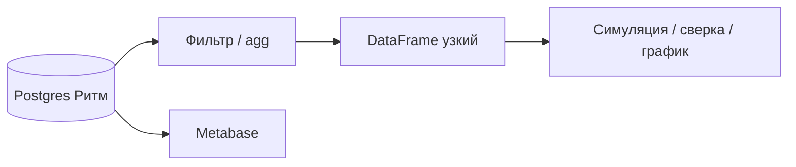

# М3.4. Python с нуля: pandas и polars

| Поле | Значение |
|---|---|
| **ID** | М3.4 |
| **Неделя / проход** | Неделя 4 · Проход 2 |
| **Опора** | Python и SQL |
| **Аудитория** | аналитик + продакт |
| **Ориентир** | 90–110 мин · практика 3–4 ч |
| **Зависимость** | после М3.1–М3.2; рядом М3.5–М3.6, М5.1; стык М2.4 (bootstrap) |
| **Стек курса** | Postgres стенда + локальный Python; BI = **Metabase** (ноутбук ≠ прод-дашборд) |

---

## Цели

После урока вы:

- **Общий минимум:** для задачи Ритма называете — SQL, Python или оба — и какое **зерно** на выходе.
- **Аналитик:** повторяете depth / простую когорту в pandas *или* polars и сверяете с SQL; не тащите весь лог в RAM «потому что можно».
- **Продакт:** не принимаете график из ноутбука без тех же определений, что в словаре М5.1.

---

## Контекст Ритма

М3.2 достаёт цифру SQL. М3.4 учит: *когда* переносить расчёт в DataFrame (симуляции, bootstrap М2.4, сложная логика, ad-hoc график) и почему «выгрузил всё в pandas» — не стратегия аналитики продукта.

Источник истины практики — **стенд Postgres**; Metabase читает тот же Postgres. Python — со-пилот расчёта, не замена BI.

---

## Теория коротко

### 1. Разделение труда

| Где | Что делать на Ритме |
|---|---|
| **Postgres** | фильтр, JOIN, агрегации, окна по большим `events`; единый источник для Metabase |
| **Python (pandas/polars)** | bootstrap/ДИ, сложная логика, проверка AI, разовые исследования |
| **Не сюда** | «единственный» прод-дашборд в ноутбуке |

Правило: DataFrame = та же гранулярность, что таблица. Если после `merge` строк стало больше users — вы размножили зерно (как плохой JOIN в М3.2).

### 2. Pandas и polars — одна модель, разный движок

| | pandas | polars |
|---|---|---|
| Модель | DataFrame, строки/колонки | то же + явный lazy |
| Когда | привычный стек, мелкие срезы | быстрее на крупных локальных таблицах; lazy plan |
| Ловушка | молчаливый align по индексу; `fillna` | другой API — читайте типы |

На курсе достаточно **одного** из двух для сдачи; сравнение приветствуется в «руках».

### 3. «Локальный SQL» на файлах (идея)

На больших CSV/Parquet цикл «всё в RAM» дороже, чем *запросить* файл (в индустрии часто DuckDB). Принцип переносим:

- отфильтруй и агрегируй **запросом** (SQL на стенде или локальный SQL-движок);
- в DataFrame — уже узкий срез.

Диалект стенда остаётся PostgreSQL; DuckDB в uploads — идея, не обязательный стек сдачи.

### 4. Воспроизводимость ноутбука

В шапке: версия определения метрики (М5.1), окно дат, seed (если сэмпл), источник (`compose` / seed CSV). Без этого сдача не принимается.

---

## Разобранный пример: depth SQL ↔ Python

1. SQL: users с `habit_created`, count `check_in` за 7 дней, доля ≥3.
2. Выгрузка узкого среза: `user_id`, `ts`, `event_name` только нужных событий (не весь лог).
3. pandas/polars: `groupby(user_id).agg`, порог ≥3, доля.
4. Сверка: число знаменателя и доля — расхождение > округления → ищите зерно/таймзону/`isna`.

Намеренная ошибка: merge `users` с `events` без дедупа paywall → `len(df) >> nunique(user_id)`.

---

## Практика

### Ядро (оба)

1. Выберите одну метрику из словаря (depth≥3 или habit retention D7).
2. Посчитайте SQL на стенде (эскиз из М3.2 ок).
3. Повторите в **pandas или polars** на том же срезе; сравните число и зерно.
4. Запишите: что оставили в SQL и что вынесли в Python и почему.
5. В шапке ноутбука / отчёта — определение = карточка М5.1.

### Расширение «руки»

- Намеренно сломайте merge (дубли user) и покажите ловлю через `nunique` vs `len`.
- Мини-benchmark: filter в SQL vs filter после полной выгрузки семпла.
- Опционально: тот же расчёт в polars lazy vs pandas — порядок времени на семпле.

### Расширение «решение»

Заказ аналитику: «нужен bootstrap ДИ для A/B (М2.4)» — почему это Python, а primary metric для дашборда всё ещё из Postgres/Metabase. Критерий приёмки: те же определение и окно.

---

## Критерии приёмки

- [ ] Есть сверка SQL ↔ Python по одной метрике.
- [ ] Зерно названо; расхождение объяснено или устранено.
- [ ] Нет «дашборда только в ноутбуке» как замены М5.2/М5.4.
- [ ] Шапка с определением метрики.
- [ ] Ядро + одно расширение.

---

## Линия AI

AI пишет pandas быстро и часто молча меняет timezone / `fillna` / join type. Приёмка — как в М3.6: строки до/после, суммы, края, сверка с SQL.

---

## Дальше читать (библиотека курса)

- [`../uploads/medium-nickpatel-pandas-to-duckdb.md`](../uploads/medium-nickpatel-pandas-to-duckdb.md) — идея локального SQL vs pandas (диалект не наш; принцип переносим).
- Канон трека: [`../sql-python-sources.md`](../sql-python-sources.md).
- SQL: [`m3-2-sql-zero-to-windows.md`](./m3-2-sql-zero-to-windows.md) · под капотом: [`m3-3-query-under-the-hood.md`](./m3-3-query-under-the-hood.md) · проверка: [`m3-6-verify-ai-sql.md`](./m3-6-verify-ai-sql.md)
- ДИ/bootstrap: [`m2-4-confidence-intervals.md`](./m2-4-confidence-intervals.md)
- Карта: [`../course-structure.md`](../course-structure.md) · [`../materials-library.md`](../materials-library.md)
