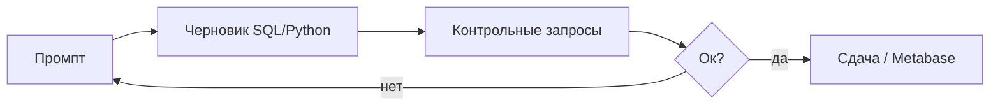

# М3.5. AI как со-пилот для SQL и Python

| Поле | Значение |
|---|---|
| **ID** | М3.5 |
| **Неделя / проход** | Неделя 4 · Проход 2 |
| **Опора** | Python и SQL (+ линия AI) |
| **Аудитория** | аналитик + продакт |
| **Ориентир** | 50–70 мин · практика 1,5–2 ч |
| **Зависимость** | после М3.1–М3.2; перед/рядом М3.6; договор М0.2 |
| **Вехи** | мост к проверке AI — без промпта М3.6 бьёт по пустому месту |

---

## Цели

После урока вы:

- **Общий минимум:** собираете промпт по шаблону курса (схема → зерно → определение → окно → формат) и отличаете плохой запрос к модели от хорошего.
- **Аналитик:** итерируете «объясни / найди ошибку / sanity-check»; не вставляете код AI в сдачу без приёмки.
- **Продакт:** ставите задачу так, что AI и человек получают одно определение метрики.

---

## Контекст Ритма

Вопрос «какая доля users с depth≥3 за 7 дней после habit_created?» выглядит простым. Плохой промпт: «напиши SQL для depth». Хороший — отдаёт схему стенда, зерно `events`, определение из М5.1, окно D7, запрет выдуманных полей.

Стек: ответ AI выполняется в **Postgres** Ритма; Metabase не заменяется чатом.

---

## Теория коротко

### 1. Анатомия промпта курса

| Блок | Содержание | Пример Ритма |
|---|---|---|
| Контекст решения | какое решение | «достаточно ли ценности до paywall» |
| Схема | таблицы, ключи | `users`, `events`, `subscriptions` |
| Зерно | что одна строка | events = одно событие |
| Определение метрики | формула словами | depth≥3 = ≥3 `check_in` за 7 дней после первого `habit_created` |
| Окно / фильтры | даты, исключения | без `is_internal` |
| Формат выхода | SQL + краткая логика + 2 контрольных запроса | count users до/после |

### 2. Плохой vs хороший

| Плохой | Хороший |
|---|---|
| «Посчитай ретеншн» | «D7 active = ≥1 check_in в день 7 относительно install; users; Postgres» |
| Без схемы | вставлен кусок `01_schema` / список полей |
| «Сделай красиво» | «верни SQL и запрос проверки: nunique user_id» |

### 3. Заготовки итерации

1. **Объясни** чужой/свой запрос по шагам зерна.
2. **Найди ошибку:** «ответ 140% конверсии — где взрыв JOIN?»
3. **Sanity-check:** предложи 3 контрольных SELECT.

Кульминация проверки — М3.6; здесь учимся **кормить** модель так, чтобы ложь было легче поймать.

### 4. Граница роли AI (М0.2)

AI ускоряет синтаксис и черновик. Выбор метрики, ответственность за решение, приёмка цифры — человек.

---

## Разобранный пример

**Плохой промпт:** «SQL conversion to Pro for Ritm».

Типичный ответ AI: `COUNT(*) FILTER (WHERE event = 'purchase') / COUNT(*)` с полями, которых нет в схеме, и сессионным знаменателем.

**Хороший промпт (сжато):**

- Решение: конверсия habit→subscribe за 14 дней.
- Схема: `events(event_id, user_id, event_name, ts)`, …
- Успех: `subscribe_started`; знаменатель: users с `habit_created`; окно 14 дней; distinct user.
- Диалект: PostgreSQL; не выдумывай колонки.
- Добавь: count знаменателя, count числителя отдельно.

---

## Практика

### Ядро (оба)

1. Возьмите одну метрику из словаря (черновик М5.1 или depth из М1.1).
2. Напишите **плохой** промпт (3–5 строк) и **хороший** по шаблону §1.
3. Получите ответ AI (или сымитируйте типичный плохой ответ) на плохой промпт — выпишите 2 правдоподобные ошибки.
4. Хорошим промптом получите SQL и **не** сдавайте его: только приложите к сдаче оба промпта и список ошибок.

### Расширение «руки»

Прогоните хороший SQL на стенде; напишите 2 контрольных запроса (n до/после JOIN, min/max дат). Если числа странные — итерация промпта, не «починить руками молча».

### Расширение «решение»

Постановка аналитику = готовый хороший промпт. Критерий: стажёр с AI и без должен понять определение одинаково.

---

## Критерии приёмки

- [ ] Пара плохой/хороший промпт на одной метрике Ритма.
- [ ] В хорошем есть схема, зерно, определение, окно, формат.
- [ ] Перечислены ≥2 типовые ошибки плохого пути.
- [ ] Ядро + одно расширение.
- [ ] В сдаче нет «цифры из чата без прогона» как финала (финал — М3.6 + стенд).

---

## Линия AI

Это урок *про* со-пилота. Метаправило: промпт — артефакт наравне с SQL. Без него приёмка М3.6 превращается в угадайку.

---

## Дальше

- Проверка: [`m3-6-verify-ai-sql.md`](./m3-6-verify-ai-sql.md)
- Договор AI: [`m0-2-ai-in-contour.md`](./m0-2-ai-in-contour.md)
- Словарь: [`m5-1-metrics-layer.md`](./m5-1-metrics-layer.md)
- Python: [`m3-4-pandas-polars.md`](./m3-4-pandas-polars.md)
- Карта: [`../course-structure.md`](../course-structure.md) · [`../materials-library.md`](../materials-library.md) (§ AI-verify)
