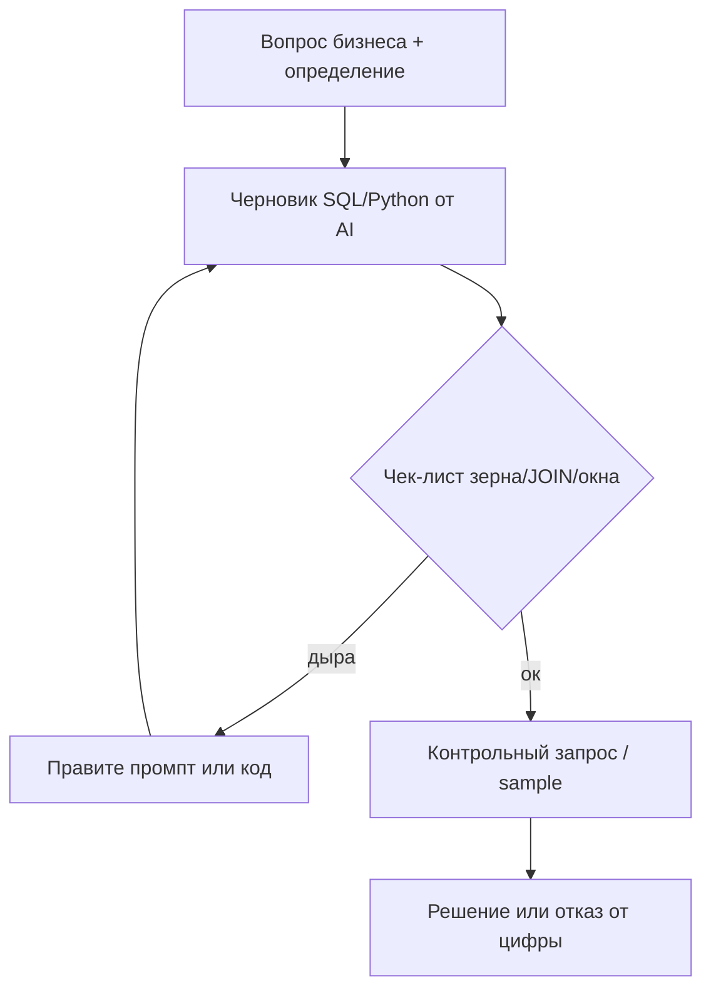

# М3.6. Проверка того, что выдал AI (SQL / Python)

| Поле | Значение |
|---|---|
| **ID** | М3.6 |
| **Неделя / проход** | Неделя 4 · Проход 2 |
| **Опора** | Python и SQL |
| **Аудитория** | аналитик + продакт |
| **Ориентир** | 75–100 мин · практика 3–4 ч |
| **Визуалы** | [цикл приёмки](./visuals/m3-6-verify-loop.svg) · [таксономия лжи AI](./visuals/m3-6-lie-taxonomy.svg) |
| **Зависимость** | после [`m3-2-sql-zero-to-windows.md`](./m3-2-sql-zero-to-windows.md); желательно М3.5 (промпт). Схема — из [`m4-3-tracking-plan.md`](./m4-3-tracking-plan.md) |

---

## Цели

После урока вы:

- **Общий минимум:** имеете чек-лист приёмки AI-ответа (строки, JOIN, NULL, даты, края) и применяете его к одному числу Ритма.
- **Аналитик:** ловите правдоподобно неверный SQL/псевдо-Python на той же схеме `users`/`events`/`subscriptions`; чините и фиксируете контрольный запрос.
- **Продакт:** не принимаете «AI посчитал» без артефакта проверки; умеете сказать, *какой* класс лжи перед вами.

---

## Контекст Ритма

М3.2 учит модели и трём ломаным запросам «от автора». М3.6 — тот же мир, но голос другой: **ответ выглядит как надёжный отчёт со-пилота**. Задача — поймать ложь *до* того, как число попадёт в синкап или Metabase.

Формулировка курса: *AI — соавтор кода и черновика; вывод и ответственность — ваши.* Цифры должны сходиться с детерминированным кодом/SQL, а не с «уверенным» текстом модели ([Habr: «ИИ-аналитика, которая не галлюцинирует»](https://habr.com/ru/articles/1066650/) — дальше читать).

Схема без изменений:

- `users(user_id, installed_at, platform, is_internal)`
- `events(event_id, user_id, event_name, ts, props jsonb)`
- `subscriptions(user_id, started_at, plan, status)`

---

## Теория коротко

### 1. Минимум приёмки (всегда)

Перед тем как поверить числу:

| Шаг | Вопрос | Быстрая проверка |
|---|---|---|
| 1. Зерно | что считает одна строка результата? | нарисуйте users vs events |
| 2. До/после JOIN | не раздуло / не отрезало? | `count(*)`, `count(DISTINCT user_id)` |
| 3. Знаменатель | кто «все»? | сверьте с определением из М2.3 |
| 4. Окно и даты | от какой ts? таймзона? | min/max ts, хвост когорты |
| 5. NULL и края | внутренние, пустой props, 0 в знаменателе | `is_internal`, `props->>'x' IS NULL` |
| 6. Стык с витриной | то же число иначе? | второй запрос / ручной sample 5 user_id |

Цикл: [`visuals/m3-6-verify-loop.svg`](./visuals/m3-6-verify-loop.svg).



### 2. Таксономия «лжи» AI на Ритме

Карта: [`visuals/m3-6-lie-taxonomy.svg`](./visuals/m3-6-lie-taxonomy.svg).

| Класс | Как выглядит | Пример на Ритме |
|---|---|---|
| **Выдуманное поле** | `users.country`, `events.session_id` | в схеме курса нет — сразу reject |
| **Подмена метрики** | «retention» = просто MAU/DAU | stickiness ≠ D7 habit retention |
| **Зерно** | count событий как users | ломаный A из М3.2 |
| **INNER JOIN** | «так проще» | freemium выпал из знаменателя |
| **Окно/дедуп** | depth по тапам; renew = new | ломаный C; Pro из `status=active` без `started_at` |
| **Причинность** | SQL верен, текст врёт | «упало из-за paywall» без разреза trigger |
| **Диалект** | MySQL/CH функции в Postgres | `datediff`, `uniqExact` |

Text-to-SQL ломается системно на схеме, JOIN и агрегациях — см. [Habr «Почему text-to-SQL до сих пор ломается»](https://habr.com/ru/articles/944010/) как фон; методика приёмки — авторская, ниже.

### 3. Правило детерминизма

- LLM может предложить код.
- **Число** для решения берётся только из выполненного SQL/Python (или ручного счёта sample).
- Комментарий модели про «причину» — гипотеза, не факт (стык с М0.2).

---

## Разобранный пример: «поймай ложь» №0

**Промпт студента (плохой):** «Посчитай конверсию в подписку Ритма».

**Ответ AI (правдоподобный):**

> Конверсия = 19%. Запрос:
> ```sql
> SELECT count(*) FILTER (WHERE event_name = 'subscribe_started')::float
>      / count(*) FILTER (WHERE event_name = 'paywall_view')
> FROM events;
> ```
> Вывод: paywall работает хорошо, можно повышать цену Pro.

**Разбор по чек-листу:**

1. Зерно — события, не users → метрика D из М2.3, обычно врёт.
2. Нет окна, нет `is_internal`, нет связи «subscribe после view».
3. Текст про цену — **причинность**; в данных её нет.

**Приёмка:** отклонить; переписать определение (users, окно 7д от первого paywall); запретить вывод про цену без эксперимента.

---

## Набор «поймай ложь» (сдача)

Ниже — шесть карточек. Для ядра разберите **любые 4**; для «руки» — все 6 + один свой. Ответ AI уже «дан»; стенд не обязателен — ловите по схеме и модели.

### Ложь 1 — выдуманное поле

**Вопрос:** DAU Ритма по платформе.  
**AI:**

```sql
SELECT u.device_type, count(DISTINCT e.user_id)
FROM events e
JOIN users u ON u.user_id = e.user_id
WHERE e.event_name = 'app_open'
GROUP BY 1;
```

**Задание:** что не так? эталонное поле? исправление.

<details>
<summary>Эталон мысли (смотрите после своей попытки)</summary>

В `users` есть `platform`, не `device_type`. Это галлюцинация схемы. Плюс уточнить: DAU по `app_open` vs по `check_in` (продуктовый актив).
</details>

### Ложь 2 — INNER и знаменатель

**Вопрос:** доля users с `habit_created`, у кого активная подписка.  
**AI:** считает через `FROM users u JOIN subscriptions s … JOIN events e … WHERE event_name = 'habit_created'` и делит «успехи» на `count(DISTINCT u.user_id)` **из этого же JOIN**.

**Задание:** почему доля ≈ 100%? как развести множества.

<details>
<summary>Эталон мысли</summary>

Знаменатель уже только подписчики (INNER). Нужен знаменатель из events/users с habit и LEFT JOIN к subscriptions / отдельный count.
</details>

### Ложь 3 — подмена retention

**Вопрос:** недельный retention когорты install.  
**AI:** `weekly_active / dau` и называет это «retention 28%».  
**Задание:** какая метрика на самом деле? как должен выглядеть когортный запрос на Ритме (словами или SQL-эскиз).

### Ложь 4 — depth без дней

**Вопрос:** D7 habit depth ≥3.  
**AI:** отдаёт ломаный C из М3.2 (`row_number() … rn >= 3` по `check_in`) и пишет: «81%, онбординг отличный».  
**Задание:** класс лжи; исправление; можно ли из этого делать решение по онбордингу?

### Ложь 5 — Python/pandas зерно (даже без ноутбука)

**Вопрос:** уникальные дни check-in на user.  
**AI (псевдокод):**

```python
df = events.query("event_name == 'check_in'")
df.groupby("user_id").size()  # → «дни»
```

**Задание:** что посчиталось? как должно быть с `local_date` / `ts.dt.date`?

### Ложь 6 — верный SQL, лживый вывод

**Факт:** запрос users с `paywall_view` где `props->>'trigger' = 'feature_lock'` вырос с 20% до 45% доли всех view.  
**AI-текст:** «Конверсия в Pro упала, потому что paywall стали показывать раньше streak_3; нужно вернуть старый триггер».  
**Задание:** какие ещё гипотезы совместимы с фактом? чего не хватает для решения?

---

## Практика

### Ядро (оба)

1. Выпишите чек-лист приёмки из §1 своими словами (6 пунктов).
2. Разберите **4** карточки из набора «поймай ложь»: класс → доказательство по схеме → исправление или отказ.
3. Для одной метрики Ритма (depth≥3 или habit→subscribe) напишите **контрольный** мини-запрос (sample 5 `user_id` / сверка count), которым будете проверять любой будущий AI-SQL.
4. Одним абзацем: чем ложь класса «причинность» отличается от лжи класса «зерно».

### Расширение «руки»

- Разберите все 6 карточек; добавьте **7-ю** — свой правдоподобный неверный ответ AI на схеме Ритма (SQL или Python).
- Составьте «code-review промпт»: вставьте схему + определение + требование вернуть зерно и контрольные count.
- Перенесите один исправленный запрос в короткий pandas/polars-псевдокод и покажите ту же проверку зерна (стык к М3.4).

### Расширение «решение»

- Политика команды на одну страницу: когда AI-число можно нести на синкап; что обязательно в приложении к цифре; красные флаги (выдуманные поля, INNER к деньгам, вывод без разреза).
- Для лжи 6 напишите, какое решение **нельзя** принимать и какой эксперимент/разрез заказать.
- Свяжите с М5.2: какие 3 проверки должны висеть под KPI-карточками до сборки Metabase (М5.4).

---

## Критерии приёмки

- [ ] Чек-лист приёмки полный и применимый.
- [ ] ≥4 карточки разобраны с классом лжи и исправлением/отказом.
- [ ] Есть контрольный запрос/процедура sample для одной метрики Ритма.
- [ ] Отделена ложь кода от лжи причинности.
- [ ] Ядро + одно расширение.
- [ ] В сдаче видно: вы не «поверили отчёту», а прогнали приёмку.

---

## Линия AI

| Можно | Нельзя без вас |
|---|---|
| Черновик SQL/Python и варианты фикса | Утвердить, что число верно |
| Самопроверка по вашему чек-листу | Заменить контрольный запрос «уверенностью» |
| Черновик политики команды | Подписать политику без примера на Ритме |

**Проверка:** вычеркните из ответа AI все абзацы причинности. Если цифр+кода не осталось — сдавать нечего.

---

## Дальше читать

- Дифференциатор в карте: [`../course-structure.md`](../course-structure.md) § М3.6.
- Опоры: [`../sql-python-sources.md`](../sql-python-sources.md) §4 и волна 2.D — HireHi ChatGPT для аналитика; zasqlpython AI-гайд; **Habr [«ИИ-аналитика, которая не галлюцинирует»](https://habr.com/ru/articles/1066650/)**; Habr [«text-to-SQL ломается»](https://habr.com/ru/articles/944010/).
- База SQL и ломаные A–C: [`m3-2-sql-zero-to-windows.md`](./m3-2-sql-zero-to-windows.md).
- Рамка AI в контуре: [`m0-2-ai-in-contour.md`](./m0-2-ai-in-contour.md).

Связь вперёд: исправленные определения уходят в словарь М5.1 и карточки [`m5-2-dashboard-decision.md`](./m5-2-dashboard-decision.md) / сборку [`m5-4-metabase-dashboard.md`](./m5-4-metabase-dashboard.md).
