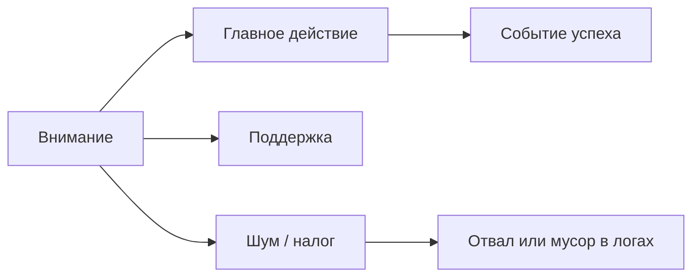

# М4.1. Экран как гипотеза: структура интерфейса

| Поле | Значение |
|---|---|
| **ID** | М4.1 |
| **Неделя / проход** | Неделя 1 · Проход 1 |
| **Опора** | UX и поверхность продукта |
| **Аудитория** | аналитик + продакт |
| **Ориентир** | 60–75 мин · практика 1,5–2 ч |
| **Зависимость** | после М0.1 / М1.1; до М4.3 (tracking); рядом с М3.1 |
| **Вехи** | вход в **P1** — без понятного экрана нет измеримых событий |

---

## Цели

После урока вы:

- **Общий минимум:** разбираете экран Ритма на «главное / поддержка / шум» и связываете зону внимания с будущей метрикой.
- **Аналитик:** видите, какое действие на экране должно стать событием; ловите дизайн, где измеримость уже сломана (модалка без адреса, «бесшовный» шаг).
- **Продакт:** формулируете гипотезу экрана («если упростим X, вырастет Y») до того, как заказывать разметку или A/B.

---

## Контекст Ритма

Первый экран после установки обещает «привычку на 21 день». Пользователь видит поле названия, выбор частоты, кнопку «Создать». Paywall позже — отдельный экран с ценой Pro.

На этом уроке мы **не** рисуем Figma и **не** пишем tracking plan целиком (это М4.3). Мы учимся читать экран как **гипотезу о внимании и действии** — иначе события в Postgres будут про кнопки, а не про решения пользователя.

---

## Теория коротко

### 1. Один экран — одна задача

| Правило | На Ритме |
|---|---|
| Одна главная задача | «Создать первую привычку», не «настроить всё приложение» |
| Иерархия внимания | заголовок → поле → CTA; вторичное (подсказки, «позже») ниже |
| Шум | баннеры, лишние настройки, юридический мелкий шрифт в зоне CTA |

Если на экране две равносильные кнопки («Создать» и «Импорт из календаря»), вы уже не знаете, какое событие считать успехом онбординга.

### 2. Экран = гипотеза

Формат курса:

> **Если** пользователь видит [структуру], **то** с большей вероятностью сделает [действие], **что** сдвинет [метрику].

Пример: если убрать выбор «21 день / навсегда» с первого экрана и оставить только название привычки → вырастет `habit_created` / install за D0; guardrail — depth D7 не должен упасть.

### 3. Паттерны, которые ломают данные (미리보기 М4.3)

| Паттерн | Почему плохо для аналитики |
|---|---|
| Модалка поверх всего без URL/экрана | нет стабильного «где»; событие без контекста |
| Два шага в одном тапе | нельзя отделить «понял» от «согласился» |
| Автологин / silent renew | нет явного `session_start` для воронки |
| Один `button_click` на все | не восстановить сценарий |

### 4. Выгода и налог (задел М1.6)

На экране всё, что помогает сделать работу пользователя — **выгода**; всё, что отнимает время/внимание без ценности — **налог**. Аналитик помечает налог словами уже на неделе 1; цифры трения — позже.

---

## Разобранный пример: онбординг Ритма

**Экран «Новая привычка» (учебный).**

| Зона | Что на экране | Вердикт |
|---|---|---|
| Главное | «Какую привычку держим?» + поле + CTA «Создать» | ок |
| Поддержка | пример «Зарядка 10 мин», переключатель напоминания | ок, если не конкурирует с CTA |
| Шум | карусель «истории успеха», ссылка на блог, 4 соцкнопки | налог; размывает задачу |

**Гипотеза:** убрать карусель и соцкнопки → `habit_created` / session_onboarding +X п.п. при том же install.

**Что логировать потом (намёк на М4.3):** `onboarding_started`, `habit_name_entered`, `habit_created` — не один `button_click`.

---

## Практика

### Ядро (оба)

1. Возьмите **один** экран Ритма: онбординг *или* paywall (опишите словами / схематично).
2. Разметьте три зоны: главное / поддержка / шум.
3. Сформулируйте гипотезу экрана в формате if → действие → метрика.
4. Назовите **одно** событие, без которого эту гипотезу нельзя проверить.

### Расширение «руки»

- Нарисуйте wireframe «до/после» (коробки достаточно).
- Для каждого интерактивного элемента напишите кандидатов в события (`event_name` черновик).
- Укажите один элемент, который **сломает** измеримость, если оставить как есть.

### Расширение «решение»

- Постановка дизайнеру/разработчику на полстраницы: что убрать, какой успех экрана, какую метрику смотрим через 7 дней, цена ошибки (что будет, если «упростили» и depth упал).

---

## Критерии приёмки

- [ ] Экран размечен на три зоны; шум назван явно.
- [ ] Есть гипотеза if → действие → метрика на языке Ритма.
- [ ] Названо минимум одно событие для проверки.
- [ ] Ядро + одно расширение.
- [ ] Нет требования «нарисовать портфолио в Figma» — схема/wireframe достаточно.

---

## Линия AI

| Шаг | AI можно | Вы отвечаете |
|---|---|---|
| Набросать список зон экрана | да | привязка к Ритму, не generic SaaS |
| Предложить «улучшения UX» | черновик | одна гипотеза и одна метрика |
| Придумать имена событий | да | гранулярность и смысл — ваши (М4.3) |

**Проверка:** если гипотеза не указывает метрику из будущего словаря (depth, habit_created, paywall→subscribe) — перепишите.

---

## Дальше

- Tracking plan: [`m4-3-tracking-plan.md`](./m4-3-tracking-plan.md)
- Зерно таблиц: [`m3-1-data-grain.md`](./m3-1-data-grain.md)
- Проблема продукта: [`m1-1-problem-market.md`](./m1-1-problem-market.md)
- Карта: [`../course-structure.md`](../course-structure.md) · библиотека: [`../materials-library.md`](../materials-library.md) (§ UX / Surf, NN/g — по ссылкам)
- Стенд: [`../stand/README.md`](../stand/README.md)

Следующий по неделе 1–2: старт [`m3-2-sql-zero-to-windows.md`](./m3-2-sql-zero-to-windows.md) и [`m4-3-tracking-plan.md`](./m4-3-tracking-plan.md).
