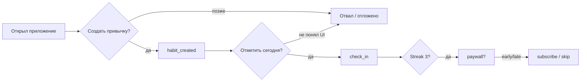
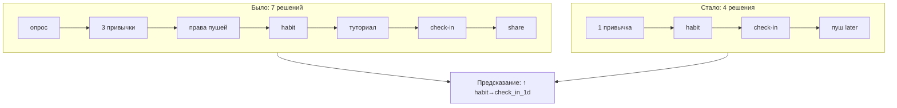

# М4.2. Поток, а не экран: сценарий и трение

| Поле | Значение |
|---|---|
| **ID** | М4.2 |
| **Неделя / проход** | Неделя 3 · Проход 2 |
| **Опора** | UX · user flow / трение |
| **Аудитория** | аналитик + продакт |
| **Ориентир** | 60–80 мин · практика 2–3 ч |
| **Визуалы** | Mermaid: поток решений · до/после сжатия шагов |
| **Зависимость** | после **М4.1**; стык с **М1.6**, **М1.7**, **М4.3** |
| **Вехи** | мост к P2/P3: шаг потока = кандидат в событие |

---

## Цели

После урока вы:

- **Общий минимум:** рисуете **user flow** ключевого сценария Ритма как цепочку **решений**, находите трение и **пересобираете** поток, убрав ≥2 шага; предсказываете сдвиг метрики.
- **Аналитик:** помечаете на потоке «логируется / дыра» (вход в М4.3); отличаете отвал от бага/ошибки состояния.
- **Продакт:** проектируете пустые/загрузочные/ошибочные состояния как часть продукта, не «потом добавим».

---

## Контекст Ритма

М4.1 разобрал **один экран** как гипотезу. **М4.2** поднимает масштаб: пользователь идёт через решения — создать привычку, отметить день, встретить paywall. Трение в потоке часто важнее красоты отдельного экрана.

Связь с М1.6: налог на экране ⊂ налог в потоке. С М1.7: flow — скелет CJM. С М4.3: каждый шаг потока либо событие, либо явная дыра.

---

## Теория коротко

### 1. Поток = последовательность решений, не карта экранов

На каждом узле:

| Поле | Вопрос |
|---|---|
| **Решение** | что выбирает человек (сделать / отложить / уйти) |
| **Трение** | время, усилия, страх, ожидание |
| **Исход** | следующий узел или отвал |
| **Сигнал** | событие или «не видим» |

### 2. Трение и «налог» в потоке

| Тип трения | Пример Ритма | Рычаг |
|---|---|---|
| Лишний шаг | email + соц. вход + опрос целей | выкинуть / отложить |
| Ожидание | спиннер без скелетона | состояние загрузки |
| Тупик | пустой список привычек без CTA | empty state |
| Ошибка | failed sync чек-ина без retry | error state + событие |
| Контекст mobile | paywall с мелким текстом на ходу | упростить / later |

Правило: **каждый обязательный шаг должен покупать ясность или доверие.** Иначе это налог.

### 3. Пустые / загрузочные / ошибочные состояния

| Состояние | Плохо | Лучше |
|---|---|---|
| Empty | белый экран | одна CTA «создать первую привычку» |
| Loading | вечный спиннер | скелетон + таймаут → ошибка |
| Error | «что-то пошло не так» | retry + код для поддержки / лог |

Без этих трёх состояний аналитика потом спорит: «баг или гипотеза?» (см. открытый кейс разделения фронт-ошибок и продуктового отвала).

### 4. Mobile vs desktop (кратко)

Ритм — в первую очередь mobile. На потоке отметьте:

- жесты и reachability CTA;  
- прерывания (пуш, звонок) → нужен возврат в тот же шаг;  
- paywall на маленьком экране = выше налог непонимания (М1.6).

### 5. Пересборка: убрать шаги и предсказать метрику

Предсказание всегда: метрика + направление + guardrail (например early_paywall_share не растёт).

---

## Разобранный пример: сжатие онбординга Ритма

**Было:** 6 экранов до `habit_created`.  
**Трение:** выбор 3 привычек + длинный опрос.  
**Стало:** 1 привычка → сразу check-in demo.  
**События:** сохранить `onboarding_step` или явно сократить план (М4.3).  
**Метрика:** ↑ share `habit_created`→`check_in`≤1д; guardrail — не ↑ churn на d1 из-за «непонятно зачем приложение».

---

## Практика

### Ядро (оба)

1. User flow ключевого сценария (install → Pro или → depth): 6–10 узлов решений.  
2. На каждом: трение + сигнал (событие/дыра).  
3. Пересоберите поток, убрав **≥2** шага; приложите «было / стало».  
4. Предскажите одну метрику + guardrail.  
5. Отметьте empty/loading/error хотя бы на одном узле (check-in или paywall).

### Расширение «руки»

- Таблица «узел flow → событие М4.3» (все узлы).  
- Где воронка не отличит баг от отказа — список для М4.4 / фронт-логов.  
- Псевдо: доля сессий с `paywall_view` без предшествующего `streak_3`.

### Расширение «решение»

- Что сознательно оставляем как трение (цена, согласие) и почему.  
- Mobile-only упрощение: один шаг, который режем только на телефоне.  
- Как сжатие потока попадает в гипотезу P3 (влияние × стоимость).

---

## Критерии приёмки

- [ ] Flow как решения, не список экранов Figma.
- [ ] ≥2 шага убраны; есть предсказание метрики.
- [ ] Пометки логируется/дыра.
- [ ] Учтён хотя бы один non-happy state.
- [ ] Ядро + одно расширение.

---

## Линия AI

| Можно | Нельзя без вас |
|---|---|
| Черновик узлов flow | Решить, какие шаги обязательны бизнесу |
| Идеи empty states | Подменить измерение «стало короче» |
| Сравнение mobile/desktop паттернов | Игнорировать tracking-дыры |

**Проверка:** удалите из схемы все экраны без решения пользователя. Если осталось <3 узлов — вы рисовали UI-тур.

---

## Дальше читать

- Курс: [`m4-1-screen-as-hypothesis.md`](./m4-1-screen-as-hypothesis.md) · [`m4-3-tracking-plan.md`](./m4-3-tracking-plan.md) · [`m1-6-benefit-tax.md`](./m1-6-benefit-tax.md) · [`m1-7-cjm-journey.md`](./m1-7-cjm-journey.md).  
- Открыто: [Habr — User flow](https://habr.com/ru/articles/1081360/) · [Habr — гипотеза или баг фронта](https://habr.com/ru/companies/proto/articles/1077812/) · NN/g / ux-sources.  
- Библиотека: [`../materials-library.md`](../materials-library.md) §3.7 · [`../ux-sources.md`](../ux-sources.md).
