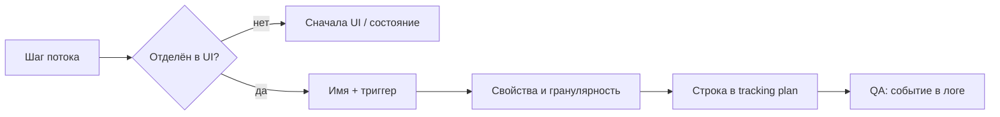

# М4.3. Проектирование под измеримость: tracking plan

| Поле | Значение |
|---|---|
| **ID** | М4.3 |
| **Неделя / проход** | Неделя 2 · Проход 1 |
| **Опора** | UX и поверхность продукта (измеримость) |
| **Аудитория** | аналитик + продакт |
| **Ориентир** | 75–90 мин · практика 2–3 ч |
| **Визуалы** | [контракт плана](./visuals/m4-3-tracking-contract.svg) · [дизайн ломает данные](./visuals/m4-3-broken-design.svg) |
| **Зависимость** | после М0.1, М1.1; полезно М4.1 / М3.1, но не блокер |

---

## Цели

После урока вы:

- **Общий минимум:** умеете превратить шаг потока Ритма в строку tracking plan и объяснить, *какой вопрос бизнеса* закрывает событие.
- **Аналитик:** проектируете свойства, триггер и способ проверки; ловите антипаттерн `button_click` и дыры до релиза.
- **Продакт:** заказываете разметку как контракт (не «поставьте аналитику»), видите, где UI делает измерение невозможным.

---

## Контекст Ритма

Метрика решения прохода 1 из М1.1 — **D7 habit depth ≥3**: доля новых с `habit_created`, у кого ≥3 дня с чек-ином за 7 дней.

Без событий эта метрика — лозунг. Tracking plan — контракт между продуктом, разработкой и аналитикой: *что именно пишем в Postgres*, когда, с какими полями, кто отвечает, как проверить до релиза.

Стек курса (провизорно): события → локальный **Postgres** → позже Metabase. CSV-стенд ещё может отсутствовать; в уроке фиксируем **схему и имена** — по ним потом появятся синтетические таблицы.

---

## Теория коротко

### 1. Правило: шаг потока = кандидат в событие

Не каждое нажатие — событие. Событие нужно, если без него нельзя ответить на вопрос решения.

| Шаг сценария Ритма | Вопрос | Событие (черновик) |
|---|---|---|
| Открыл приложение | есть ли возврат? | `app_open` |
| Закончил онбординг | где отвал до привычки? | `onboarding_completed` |
| Создал привычку | знаменатель depth | `habit_created` |
| Отметил день | числитель depth / streak | `check_in` |
| Дошёл до 3 дней серии | ранний успех | `streak_3_reached` |
| Увидел paywall | reach Pro | `paywall_view` |
| Начал оплату | конверсия в деньги | `subscribe_started` |

Связка с UX: если шаг *не отделён* в интерфейсе (например, paywall «вплыл» без экрана/состояния), его почти невозможно стабильно залогировать.

### 2. Tracking plan — таблица-контракт

Минимальные колонки курса (как в визуале §5 структуры):

| Колонка | Зачем |
|---|---|
| **Вопрос бизнеса** | без вопроса событие — шум |
| **Имя события** | стабильный идентификатор |
| **Триггер** | *когда* пишем (условие в продукте) |
| **Свойства** | что нужно для разрезов и дедупа |
| **Гранулярность** | строка = user × момент / user × habit × день |
| **Владелец** | кто чинит, если сломалось |
| **Как проверить** | QA до/после релиза |

Каркас таблицы: [`visuals/m4-3-tracking-contract.svg`](./visuals/m4-3-tracking-contract.svg).

### 3. Именование: глагол действия, не UI-декор

| Плохо | Почему | Лучше на Ритме |
|---|---|---|
| `button_click` | не восстановить смысл через год | `check_in` |
| `screen_4` | экраны переименуют | `paywall_view` |
| `success` | success чего? | `subscribe_started` |
| `user_did_something` | нет контракта | `habit_created` |

Правила курса (сжато):

1. Имя = **что случилось с объектом продукта**, не «какой виджет».
2. Одно событие — одно значение для метрики; не смешивать «создал» и «отредактировал».
3. Свойства — словарь: `habit_id`, `plan` (`month`/`year`), `trigger` (`streak_3` / `day_7` / `feature_lock`), `platform`.
4. Версия схемы: если меняете смысл `check_in` — новое имя или поле `schema_version`, не молчаливый rewrite.

### 4. Дизайн, который ломает данные

Типовые ловушки на Ритме:

| UI-решение | Как ломает | Чем чинить в контракте |
|---|---|---|
| Paywall модалкой без стабильного состояния | нет адреса/экрана → дубли и пропуски `paywall_view` | явный триггер + дедуп «1 view / user / день» в определении метрики |
| Автологин / silent restore сессии | `app_open` ≠ осознанный возврат | разделить `app_open` и `session_restored` *или* считать ретеншн по `check_in` |
| Свайп «отметил» без подтверждения | случайные `check_in` | событие только после commit; свойство `source=swipe\|tap` |
| Бесшовный апселл внутри чек-ина | нельзя отделить ценность от продажи | отдельные события `streak_3_reached` и `paywall_view` |
| Одна кнопка «Продолжить» на 4 шагах онбординга | только `button_click` | `onboarding_step_viewed` + `step_name` **или** финал `onboarding_completed` |

Разбор: [`visuals/m4-3-broken-design.svg`](./visuals/m4-3-broken-design.svg).

### 5. Учебная схема Postgres (пока без CSV)

Описание, с которым стыкуются М3.x / М5.x:

**`users`** — одна строка на пользователя: `user_id`, `installed_at`, `platform`, `is_internal`.

**`events`** — сырой поток: `event_id`, `user_id`, `event_name`, `ts`, `props` (jsonb: `habit_id`, `plan`, `trigger`, …).

**`subscriptions`** — факт оплаты: `user_id`, `started_at`, `plan`, `status`.

Правило гранулярности: метрики продукта почти всегда считают по **`user_id`**, не по строкам `events` как «сессиям». Depth ≥3 — это *уникальные календарные дни с `check_in`*, не три тапа подряд.

---

## Разобранный пример: от D7 depth к 12 событиям

**Решение недели:** если depth≥3 низкий — упрощаем цель онбординга до «3 дня»; paywall не раньше `streak_3_reached`.

Фрагмент контракта (эталон мысли, не полный план):

| Вопрос | Событие | Триггер | Ключевые props | Проверка |
|---|---|---|---|---|
| Знаменатель depth | `habit_created` | успешное сохранение первой привычки | `habit_id`, `habit_type` | у нового user ровно одно «первое» за онбординг-сессию |
| Числитель depth | `check_in` | пользователь подтвердил день | `habit_id`, `local_date` | нет двух строк с одним `(user, habit, local_date)` без причины |
| Ранний успех | `streak_3_reached` | серия достигла 3 | `habit_id` | пишется один раз на серию / сбрасывается при обрыве по правилу продукта |
| Не рано ли продаём | `paywall_view` | показ пейвола | `trigger` | доля view *до* streak_3 — отдельный разрез |
| Деньги | `subscribe_started` | платёж принят стором | `plan` | стык с `subscriptions` |

**Антипример:** команда повесила Amplitude на все кнопки. В логах 40 имён вида `btn_orange_big`. Depth посчитать нельзя — разрыв «UX → события» из М0.1.

---

## Практика

Пока стенда нет — работайте по описанной схеме и учебным цифрам. Когда появятся CSV/Postgres — подставьте факты, имена не ломая.

### Ядро (оба)

1. Нарисуйте основной сценарий Ритма (онбординг → привычка → чек-ин → streak → paywall → Pro) и пометьте шаги: **логируем / не логируем / под вопросом**.
2. Соберите tracking plan на **10–15 событий** с колонками: вопрос · событие · триггер · свойства · владелец · как проверить.
3. Явно выпишите определение **D7 habit depth ≥3** через ваши события (числитель, знаменатель, окно 7 дней от чего, дедуп дней).
4. Найдите в своём плане **одно** место, где текущий/гипотетический UI мог бы сломать событие — и предложите правку UI *или* правку контракта.

### Расширение «руки»

Добавьте к плану:

- черновик 2–3 SQL-проверок качества (словами или псевдокодом Postgres): доля users без `habit_created` после `onboarding_completed`; дубли `check_in` на `(user_id, habit_id, local_date)`; `paywall_view` без предшествующего `habit_created`;
- таблицу «событие → в какую метрику дерева М1.1 входит»;
- пометку `schema_version` / правило миграции, если `check_in` начнёт писаться на сервере, а не на клиенте.

### Расширение «решение»

Одностраничное ТЗ разработке:

- зачем разметка (какое решение недели);
- must-have 8 событий vs nice-to-have;
- что *запрещено* логировать (`button_click` без смысла, PII в props);
- критерии приёмки релиза разметки (3 проверки из «руки» или свои);
- цена ошибки: что команда сделает не так, если `paywall_view` врёт.

---

## Критерии приёмки

- [ ] 10–15 строк плана с полными колонками контракта.
- [ ] D7 depth ≥3 определён через события без дыр.
- [ ] Нет голых `button_click` / `screen_N` как основы метрик.
- [ ] Есть хотя бы один разбор «дизайн ↔ данные».
- [ ] Ядро + одно расширение.
- [ ] В сдаче видно: AI мог набросать имена — вы утвердили триггеры и проверки.

---

## Линия AI

| Можно | Нельзя без вас |
|---|---|
| Черновик списка событий и props | Решить, что *обязательно* для решения недели |
| Предложить taxonomy имён | Утвердить триггер «когда именно пишем» |
| Сгенерировать QA-чеклист | Прогнать/описать проверку на схеме Ритма |

**Проверка:** вычеркните из ответа AI все события без колонки «вопрос бизнеса». Если осталось <8 — промпт был «напиши аналитику для habit-app», а не контракт под depth≥3.

---

## Дальше читать

- Место в спирали и визуал «таблица-контракт»: [`../course-structure.md`](../course-structure.md) §4–5 (М4.3).
- UX-опоры модуля: [`../ux-sources.md`](../ux-sources.md) — Surf (tracking plan), Habr про события / AGIMA-имена / карта e-com.
- Общий инвентарь: [`../sources-inventory.md`](../sources-inventory.md) §5 (UX).
- Стык к данным и SQL: [`../sql-python-sources.md`](../sql-python-sources.md); следующий логичный текст после плана — М3.1 / М3.2.

Связанные уже написанные уроки: [`m1-1-problem-market.md`](./m1-1-problem-market.md) (метрика depth), [`m0-1-contour.md`](./m0-1-contour.md) (разрыв «события»).
