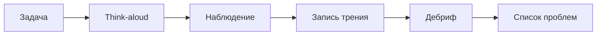

# М4.4. Качественное исследование: коридорные тесты и интервью

| Поле | Значение |
|---|---|
| **ID** | М4.4 |
| **Неделя / проход** | Неделя 5 · Проход 2 (+ второй круг в проходе 3) |
| **Опора** | UX / поверхность продукта |
| **Аудитория** | аналитик + продакт |
| **Ориентир** | 70–90 мин · практика 3–4 ч (3 коротких теста) |
| **Визуалы** | [протокол коридора](./visuals/m4-4-corridor-protocol.svg) · [наблюдение → гипотеза](./visuals/m4-4-obs-to-hypothesis.svg) |
| **Зависимость** | после М4.2/М4.3 желательно; стык с М1.8 (P3) и словарём М5.1 |
| **Вехи** | **P3** / демо прохода 2 — качественная опора к гипотезам |

---

## Цели

После урока вы:

- **Общий минимум:** проводите короткий коридорный тест по протоколу (задача → think-aloud → запись трения) и не выдаёте n=3 за доказательство.
- **Аналитик:** переводите наблюдение в **метрику из словаря** и проверяемую гипотезу; видите, чего цифры воронки не объяснят без контакта с человеком.
- **Продакт:** ведёте сессию без подсказок; отделяете предпочтения («красиво») от провала задачи; кормите М1.8 качественной опорой, не списком фич.

---

## Контекст Ритма

На P3 диагностика показывает, например, провал **habit → first check_in** или ранний paywall. Воронка говорит *где* отвал; коридор помогает увидеть *почему* на экране: человек ищет кнопку 20 секунд, не понимает «отметить день», путает paywall с онбордингом.

Учебный объект: поток Ритма (онбординг → привычка → чек-ин → …) на прототипе, стенде UI, или **аналоге** (другое habit-приложение) / своём опциональном продукте — если своего UI нет. Личный рекламный бюджет не нужен. Респонденты: коллеги, друзья, однокурсники — «коридор», не рекрут агентства.

Связь: М1.8 даёт H1–H3; этот урок — качественная опора и мост к проверке (повторный коридор / A/B М2.5).

---

## Теория коротко

### 1. Зачем качественное рядом с цифрами

| Метод | Вопрос | Не заменяет |
|---|---|---|
| Воронка / когорта | где и у кого отвал | механизм на экране |
| Коридор | где спотыкается живой человек | статистическую значимость |
| Проблемное интервью | какая работа / боль вне UI | «все так сказали = правда рынка» |
| A/B | что лучше по метрике | понимание *почему* без наблюдения |

Правило курса: качественное **формулирует** гипотезу; количество **проверяет** её на Ритме.

### 2. Коридорный тест за час — протокол

Картина: [`visuals/m4-4-corridor-protocol.svg`](./visuals/m4-4-corridor-protocol.svg).

1. **Задача** (одна): «Создайте привычку „зарядка 10 минут“ и отметьте сегодняшний день» — не тур по всем экранам.
2. **Think-aloud:** респондент говорит, что думает; вы молчите.
3. **Наблюдение:** паузы, мисклики, возвраты, где бросил.
4. **Запись:** факт («20 сек искал чек-ин»), не оценка («неудобный UX»).
5. **Дебриф:** открытые вопросы («что мешало?»), без «а вот эта кнопка же очевидная».

**Запреты ведущего:** спасать кликом; объяснять продукт заранее; спрашивать «понравилось ли»; обобщать с одного человека.

### 3. Сколько людей

Ориентир NN/g: уже **5** респондентов ловят большую долю usability-проблем одного потока; на курсе минимум **3** коротких теста на проходе 2. Это насыщение проблем, не доверительный интервал конверсии (М2.4).

### 4. Проблемное интервью (коротко)

Рядом с коридором — разговор **вне** кликов: когда бросали привычки, что пробовали, что было вместо Ритма. Без подсказки решения («а купили бы Pro за 299?»). Шаблоны — GoPractice JTBD / «Спроси маму» в чтении. На сдаче достаточно 1 короткого проблемного разговора *или* углублённого дебрифа после коридора — не обязательно полный CustDev-курс.

### 5. Наблюдение → метрика → гипотеза

Картина: [`visuals/m4-4-obs-to-hypothesis.svg`](./visuals/m4-4-obs-to-hypothesis.svg).

Шаблон курса:

1. **Наблюдение:** факт без оценки.  
2. **Трение:** шаг потока (из М4.2 / tracking plan).  
3. **Метрика:** имя из словаря М5.1 (например, habit→first check_in ≤1д).  
4. **Гипотеза:** если [изменение], то [метрика] сдвинется, потому что [механизм].  
5. **Проверка:** повторный коридор (проход 3) и/или эксперимент М2.5 — не «трое сказали ок».

Связь с P3: качественная строка в карточке гипотезы М1.8, не замена воронки.

---

## Разобранный пример: три теста → одна H

**Задача:** создать привычку и сделать первый check_in.

| # | Наблюдение | Трение | Метрика |
|---|---|---|---|
| 1 | Долго ищет, куда нажать после создания habit | неясный CTA на home | habit→first check_in ≤1д |
| 2 | Отметил «в уме», не нашёл контрол в приложении | нет явного check_in | то же + depth |
| 3 | Путает paywall с продолжением онбординга | ранний paywall | early_paywall_share; onboarding→habit |

**Сжатая гипотеза (пример):** если после `habit_created` показать явный primary «отметить сегодня» без paywall, то доля habit→first check_in ≤1д вырастет, потому что пропадает поиск действия.  
**Не гипотеза:** «сделать красивее онбординг» без метрики.

---

## Практика

Проход 2: контакт и список проблем. Проход 3 (опционально в капстоуне): повторный коридор после изменения.

### Ядро (оба)

1. Подготовьте **скрипт**: одна задача на Ритме (или аналоге) + 3–5 вопросов дебрифа без подсказки решения.
2. Проведите **≥3** коридорных теста (15–20 мин каждый); на каждый — заметка: наблюдение / трение / цитата (по желанию).
3. Сведите **список проблем** (не меньше 3 уникальных); к каждой — кандидат в метрику из М5.1 (или черновик определения, если словаря ещё нет).
4. Оформите **≥1 гипотезу** по шаблону наблюдения→метрика→if/then; укажите, как проверите количественно.
5. Явно напишите ограничение: «n=3 не доказывает рост конверсии».

### Расширение «руки»

- Сопоставьте каждую проблему с событием tracking plan (М4.3): какое событие уже есть / какого не хватает, чтобы потом измерить трение.
- Набросайте SQL-логику метрики для одной гипотезы (зерно из М3.1) — даже если прогон позже.
- Чеклист качества заметок: факт vs интерпретация (разметьте 5 строк своих заметок).

### Расширение «решение»

- Бриф для демо прохода 2: 3 проблемы → 1 ставка в бэклог → отказ от одной «хотелки» без метрики.
- План второго круга (проход 3): что измените в UI и какую задачу дадите снова.
- Связка с М1.8: в какую из H1–H3 ляжет коридор; что останется только количественным.

---

## Критерии приёмки

- [ ] Скрипт задачи + ≥3 проведённых теста с заметками.
- [ ] Список проблем с метриками; ≥1 гипотеза if/then.
- [ ] Оговорка про малый n; нет «доказали рост».
- [ ] Ядро + одно расширение.
- [ ] AI мог нагенерировать «10 UX insights» — в сдаче только то, что было в ваших сессиях.

---

## Линия AI

| Можно | Нельзя без вас |
|---|---|
| Черновик скрипта и вопросов дебрифа | Подменить наблюдения выдуманными цитатами |
| Помочь сжать if/then | Выбрать метрику без словаря / воронки |
| Структурировать таблицу проблем | Объявить победу дизайна по трём «ок» |

**Проверка:** вычеркните любую проблему, которой нет в сырых заметках сессий. Пустой список после вычёркивания = провал.

---

## Дальше читать

- P3 и демо прохода 2: [`../course-structure.md`](../course-structure.md) §3.2, §4.1.
- UX-инвентарь: [`../ux-sources.md`](../ux-sources.md) — Habr Альфа (коридорка); Notion Heroes; NN/g usability testing / how many users; GoPractice JTBD-интервью; лекция 6 VK Team.
- Общий инвентарь: [`../sources-inventory.md`](../sources-inventory.md).
- Диагностика: [`m1-8-product-diagnosis.md`](./m1-8-product-diagnosis.md); измеримость: [`m4-3-tracking-plan.md`](./m4-3-tracking-plan.md); словарь: [`m5-1-metrics-layer.md`](./m5-1-metrics-layer.md).
- Количественная проверка гипотезы: [`m2-5-ab-design-read.md`](./m2-5-ab-design-read.md); интервалы: [`m2-4-confidence-intervals.md`](./m2-4-confidence-intervals.md).
