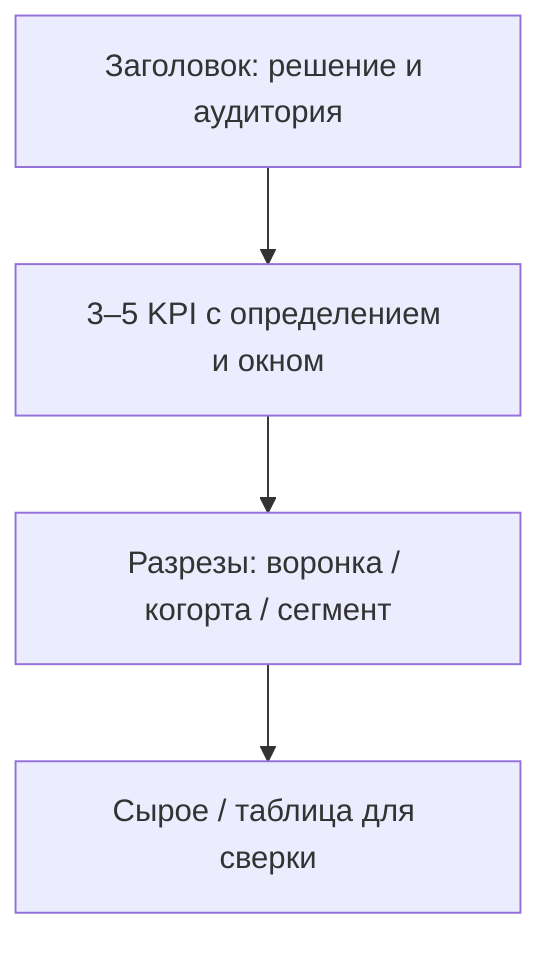

# М5.2. Дашборд как инструмент решения

| Поле | Значение |
|---|---|
| **ID** | М5.2 |
| **Неделя / проход** | Неделя 4 · Проход 2 |
| **Опора** | BI и аналитическая система |
| **Аудитория** | аналитик + продакт |
| **Ориентир** | 75–90 мин · практика 2–3 ч |
| **Визуалы** | [анатомия дашборда](./visuals/m5-2-dashboard-anatomy.svg) · [три типа не смешивать](./visuals/m5-2-three-types.svg) |
| **Зависимость** | после М1.1, М2.3; желательно черновик словаря (М5.1) и tracking plan (М4.3). Сборка в Metabase — М5.4 |

---

## Цели

После урока вы:

- **Общий минимум:** проектируете дашборд Ритма *на бумаге* под одно решение: сверху 3–5 чисел, ниже разрезы, внизу сырое — и называете тип (мониторинг / диагностика / исследование).
- **Аналитик:** отрезаете свалку метрик; привязываете каждый виджет к определению из М2.3/М5.1.
- **Продакт:** формулируете заказ «какой дашборд нужен» так, чтобы его нельзя было выполнить десятью несвязанными графиками.

---

## Контекст Ритма

Стек курса (**провизорный дефолт**): **Metabase + локальный Postgres** с синтетикой Ритма. На этом уроке **ещё не кликаем Metabase** — сначала контракт экрана. Иначе BI превращается в свалку вопросов «а давайте ещё MAU».

Входные определения, которые дашборд обязан нести (из М1.1 / М2.3):

- D7 habit depth ≥3;
- воронка habit → paywall → subscribe (users, окна);
- когортный habit retention;
- деньги: новые `subscribe_started` / выручка Pro (когда появится витрина).

---

## Теория коротко

### 1. Сначала решение, потом график

Шаблон заказа:

1. **Кто** смотрит (роль) и **как часто**.
2. **Какое решение** меняется после просмотра (if/then).
3. **Каких 3–5 чисел достаточно**, чтобы решить.
4. **Какие разрезы** нужны, если число «красное».
5. Чего на дашборде **не будет** (явный отказ).

Плохо: «дашборд продукта Ритм».  
Нормально: «еженедельно продакт+аналитик решают: правим онбординг на следующей неделе или нет — по depth≥3 и отвалу до первого check_in».

### 2. Три типа — не смешивать

| Тип | Вопрос | Плотность | Пример на Ритме |
|---|---|---|---|
| **Мониторинг** | всё ли в коридоре? | мало чисел, тренд, алерт | depth≥3, новые Pro, crash-free (если есть) |
| **Диагностика** | где сломалось? | воронка, сегменты, сравнение периодов | шаги до depth; paywall trigger; платформа |
| **Исследование** | что ещё верно? | ad-hoc, много разрезов | «а вдруг виноват habit_type?» — лучше ноутбук/вопрос в Metabase, не вечный экран |

Смешение = человек не знает, *зачем* открыл дашборд. Схема: [`visuals/m5-2-three-types.svg`](./visuals/m5-2-three-types.svg).

### 3. Анатомия экрана

Сверху вниз:

Правила:

- KPI без подписи определения — запрещены.
- Один экран — один тип (мониторинг *или* диагностика).
- Разрез отвечает на «почему KPI плохой», а не украшает.
- Сырой слой — для недоверия: сверка с SQL, не для ежедневного чтения всеми.

Макет: [`visuals/m5-2-dashboard-anatomy.svg`](./visuals/m5-2-dashboard-anatomy.svg).

### 4. Антипаттерны свалки

| Антипаттерн | Симптом | Что сделать |
|---|---|---|
| Метрический супермаркет | 30 виджетов «на всякий» | вынести в исследование / второй дашборд |
| Три конверсии без подписи | спор 4% vs 19% | одно определение из М2.3 на карточке |
| 12 линий ретеншна | никто не читает | когортная heatmap (М5.3) |
| Смешение денег и UX-микро | ARPPU рядом с цветом кнопки | разные экраны / роли |
| Нет даты обновления данных | решения по вчерашней дыре | timestamp + freshness |

### 5. Мост к Metabase (М5.4)

На бумаге вы уже задаёте то, что в Metabase станет:

- вопрос → карточка (агрегат из Postgres);
- фильтр периода / platform;
- dashboard с порядком сверху вниз;
- описание метрики в тексте карточки (пока нет отдельного semantic layer).

Пока CSV нет — рисуете виджеты и пишете, *из какой таблицы/события* число; учебные значения можно подставить из М2.3.

---

## Разобранный пример: два дашборда Ритма

### А. Свалка (плохой)

MAU, DAU, installs, store rating, 8 воронок, 12 линий ретеншна, heatmap кликов paywall, ARPU, CAC, NPS, «топ привычек».  
Решение не сформулировано. На синке час обсуждают rating.

### Б. Диагностика недели (рабочий)

**Кто:** продакт + аналитик, пятничный синкап 20 мин.  
**Решение:** если depth≥3 < 25% вторую неделю подряд → берём в спринт упрощение онбординга; иначе не трогаем онбординг, смотрим paywall.

**Верх (4 числа):**

1. Depth≥3 (окно 7д, от `habit_created`) — факт / прошлой волны.
2. Конверсия habit→≥1 check_in (7д).
3. Доля `paywall_view` с `trigger` до `streak_3`.
4. Новые `subscribe_started` (users, без renew).

**Середина:** воронка install→…→subscribe; когортная матрица D1/D3/D7 по последним 4 волнам; разрез platform.

**Низ:** таблица «топ дыр»: users с onboarding_completed без habit_created за 24ч (счётчик).

**Явно нет:** MAU, рейтинг стора, цвет кнопки.

---

## Практика

Опирайтесь на определения и учебные числа из [`m2-3-conversion-cohorts.md`](./m2-3-conversion-cohorts.md). Стенд Metabase соберёте в М5.4.

### Ядро (оба)

1. Выберите **одно** недельное решение Ритма (онбординг / paywall / канал привлечения — одно).
2. Заполните шаблон заказа из §1 (кто, решение, 3–5 чисел, разрезы, отказ).
3. Нарисуйте wireframe дашборда (бумага, FigJam, Markdown-таблица) по анатомии §3.
4. Пометьте тип: мониторинг или диагностика (не оба).
5. Под каждым KPI — однострочное определение (числитель / знаменатель / окно).

### Расширение «руки»

- Для каждого KPI укажите источник: таблица/событие Postgres и зерно (user).
- Напишите 3 контрольных запроса-проверки (словами), которыми сверите карточку Metabase позже.
- Предложите, какие 2 фильтра обязательны (например `platform`, когорта недели install), какие запрещены на этом экране.

### Расширение «решение»

- Перепишите заказ так, будто отдаёте аналитику без созвона.
- Добавьте: пороги if/then (конкретные %), эскалация «что делаем, если данные stale > 36ч», цена ошибки ложного сигнала.
- Набросайте *второй* дашборд другого типа (если ядро было диагностика — мониторинг для CEO на 3 числа) и покажите, что не копируете свалку.

---

## Критерии приёмки

- [ ] Есть решение if/then, не «обзор метрик».
- [ ] 3–5 KPI с определениями; тип экрана назван.
- [ ] Wireframe соблюдает иерархию KPI → разрезы → сырое.
- [ ] Список отказа (чего нет) не пустой.
- [ ] Ядро + одно расширение.
- [ ] AI мог нарисовать «красивый dashboard» — вы выбросили виджеты без связи с решением.

---

## Линия AI

| Можно | Нельзя без вас |
|---|---|
| Варианты layout и список кандидатов в KPI | Выбрать решение и пороги |
| Черновик описаний карточек Metabase | Утвердить определение % |
| Критика свалки | Решить, что режется навсегда |

**Проверка:** удалите из макета AI всё, что не меняет ваше if/then. Если осталось >7 виджетов — это ещё свалка.

---

## Дальше читать

- Анатомия дашборда в карте курса: [`../course-structure.md`](../course-structure.md) §5 визуал 6; модуль М5.2.
- Инвентарь BI: [`../sources-inventory.md`](../sources-inventory.md) §5 — GoPractice creating-dashboards / pichok; IBS «дашборд для менеджера»; Metabase Learn best practices (для М5.4).
- Офлайн (дашборд под решение): [`../uploads/bonus-gopractice-product-health-dashboard.md`](../uploads/bonus-gopractice-product-health-dashboard.md) · [`../uploads/bonus-habr-product-dashboard.md`](../uploads/bonus-habr-product-dashboard.md).
- Определения конверсий/когорт, которые тащите на карточки: [`m2-3-conversion-cohorts.md`](./m2-3-conversion-cohorts.md).
- События-источники: [`m4-3-tracking-plan.md`](./m4-3-tracking-plan.md).

Следующий по BI-списке: М5.3 (выбор графика) → М5.4 (сборка в Metabase на Postgres).
