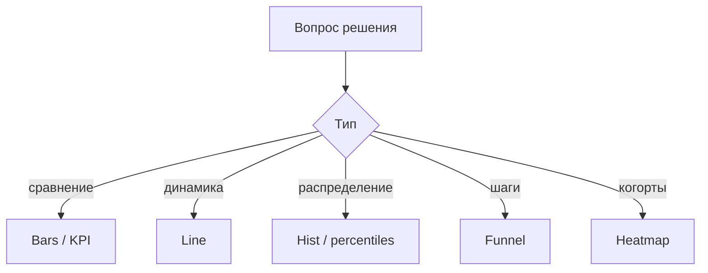

# М5.3. Выбор визуализации: какой график для какого вопроса

| Поле | Значение |
|---|---|
| **ID** | М5.3 |
| **Неделя / проход** | Неделя 5 · Проход 2 |
| **Опора** | BI и аналитическая система |
| **Аудитория** | аналитик + продакт |
| **Ориентир** | 50–70 мин · практика 1,5–2 ч |
| **Зависимость** | после М5.2 (бумага); до/рядом М5.4 (Metabase); стык М2.3 |
| **Вехи** | мост к демо-2 — график без вопроса = свалка |

---

## Цели

После урока вы:

- **Общий минимум:** под вопрос выбираете тип визуала (сравнение, динамика, распределение, воронка, когортная heatmap) и не смешиваете три решения на одном экране.
- **Аналитик:** пересобираете «свалку» в три экрана; показываете неопределённость там, где она есть (задел М2.4).
- **Продакт:** режете график, который красивый, но не двигает решение.

---

## Контекст Ритма

На демо прохода 2 команда несёт дашборд: линия MAU, 12 линий ретеншна по неделям, pie «платформы», воронка и таблица сырых событий — всё на одном холсте. Вопрос «где чинить depth?» тонет.

Стек показа — **Metabase** на Postgres; этот урок про *выбор*, не про клики UI (М5.4).

---

## Теория коротко

### 1. Сначала вопрос, потом geom

| Вопрос | Тип | На Ритме |
|---|---|---|
| Что больше / меньше? | bars / таблица KPI | depth≥3 Android vs iOS |
| Как меняется во времени? | линия (мало рядов) | недельный D7 |
| Как распределено? | histogram / перцентили | depth на user |
| Где отвал в шагах? | воронка | habit → depth≥3 → paywall → subscribe |
| Как стареет когорта? | **heatmap** / матрица | retention D1/D7/D30 по неделе install |

### 2. Что почти всегда плохо

- Pie на >4 долях; 3D; двойная ось «для красоты».
- 12 тонких линий ретеншна вместо heatmap (М2.3).
- Карта мира для продукта без гео-решения.
- Сырая таблица `events` как «главный» вид мониторинга.

### 3. Как соврать графиком (чтобы не врать)

- Обрезанная ось Y преувеличивает рост.
- Разные окна на соседних карточках.
- Смешение users и sessions в одной воронке.
- Старт оси не с нуля без подписи.

### 4. Неопределённость на дашборде

Если карточка — оценка по семплу или ранний хвост когорты: подпись «n=…», «когорта не дозрела», позже — интервал. Лучше серая зона, чем ложная точность.

### 5. Три экрана = три решения (стык М5.2)

Мониторинг / диагностика / исследование — разные визуалы. Не пихайте heatmap исследования в monitoring health.

Визуал курса §5 «воронка + когорта рядом» — учебный эталон: разные вопросы, разные картинки, одна страница сравнения типов.

---

## Разобранный пример: свалка → три экрана

**Было:** один дашборд «всё о Ритме».

**Стало:**

1. **Мониторинг:** 4 числа — install W, habit_created, depth≥3, subscribe; sparkline D7.
2. **Диагностика:** воронка сценария + bars отвала по platform.
3. **Исследование:** heatmap ретеншна чек-инов по неделе install.

Каждый экран отвечает на свой if/then (М5.2).

---

## Практика

### Ядро (оба)

1. Нарисуйте (бумага/фигма-коробки) **свалку** из 6+ виджетов «как обычно приносят».
2. Пересоберите в **три** экрана под три решения Ритма; для каждого — один главный визуал из таблицы §1.
3. Для когортного вопроса явно выберите heatmap, не 12 линий; коротко почему.
4. Укажите один способ соврать графиком, который вы сознательно запрещаете на демо.

### Расширение «руки»

В Metabase (после М5.4 или параллельно) соберите один правильный визуал на view стенда (например воронка или таблица когорт). Скрин + подпись определения метрики.

### Расширение «решение»

Чеклист приёмки дашборда для команды: вопрос → тип → запреты. Примените к чужому (одногруппника) эскизу.

---

## Критерии приёмки

- [ ] Свалка и три экрана с типами визуалов.
- [ ] Есть воронка *или* heatmap с обоснованием.
- [ ] Назван анти-паттерн вранья.
- [ ] Ядро + одно расширение.
- [ ] BI-стек = Metabase+Postgres, не «перерисуй в Tableau».

---

## Линия AI

AI предложит «dashboard with pie charts». Вы задаёте вопрос и тип. Проверка: один экран — один вопрос решения.

---

## Дальше

- Бумага: [`m5-2-dashboard-decision.md`](./m5-2-dashboard-decision.md)
- Сборка: [`m5-4-metabase-dashboard.md`](./m5-4-metabase-dashboard.md)
- Когорты: [`m2-3-conversion-cohorts.md`](./m2-3-conversion-cohorts.md)
- Карта: [`../course-structure.md`](../course-structure.md) §5 · [`../materials-library.md`](../materials-library.md)
