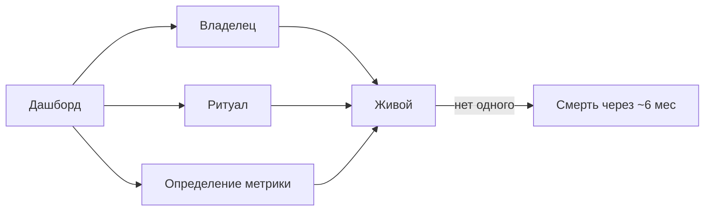
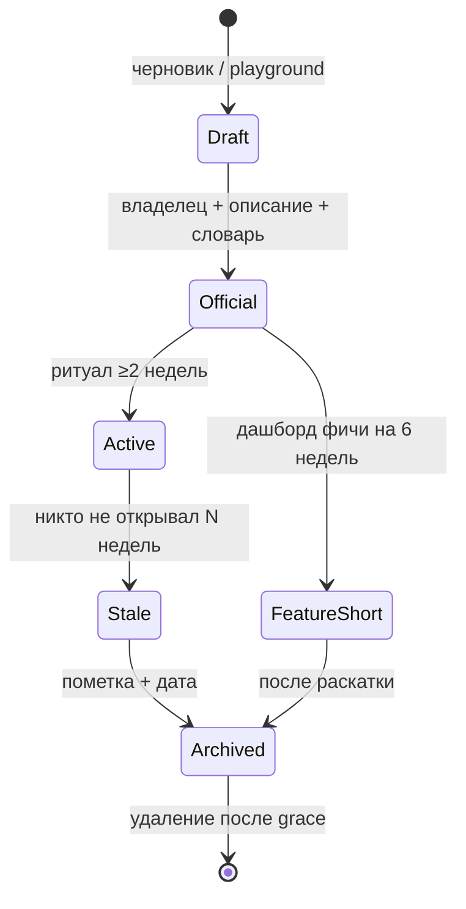

# М5.5. Жизнь аналитики в команде

| Поле | Значение |
|---|---|
| **ID** | М5.5 |
| **Неделя / проход** | Опция · конец прохода 2 или 3 |
| **Опора** | BI / процесс · ритуалы и смерть дашбордов |
| **Аудитория** | аналитик + продакт |
| **Ориентир** | 40–60 мин · практика 1–2 ч (или семинар 30 мин) |
| **Визуалы** | Mermaid: ритуал недели · жизненный цикл дашборда |
| **Зависимость** | после **М5.2** / **М5.4**; стык с М5.1 словарём |
| **Вехи** | опция — как не потерять слой метрик после демо-2 |

---

## Цели

После урока вы:

- **Общий минимум:** проектируете **недельный ритуал** чтения аналитики Ритма (кто / что / решение) и правило **архивации** дашборда.
- **Аналитик:** назначаете владельца, описание, частоту обновления; отделяете playground от «официальной» коллекции Metabase.
- **Продакт:** встраиваете дашборд в уже существующую встречу, а не создаёте «ещё один sync ради метрик».

---

## Контекст Ритма

К демо-2 у вас есть словарь (М5.1) и дашборд Metabase (М5.4). Через полгода без ритуала он станет кладбищем карточек. **М5.5** — лёгкий модуль про жизнь системы, не про новые графики.

Стек тот же: локальный Postgres + Metabase. В проде принципы те же: коллекции, verified questions, timelines.

---

## Теория коротко

### 1. Аналитика умирает не от SQL, а от отсутствия хозяина

Три причины, почему команду «не открывает Metabase» (типичный разбор adoption):

| Причина | Симптом | Лечение |
|---|---|---|
| Не знают, куда смотреть | 40 дашбордов | один hub + pin |
| Не доверяют числу | «у маркетинга другое» | словарь М5.1 рядом с карточкой |
| Не встроено в работу | метрики «потом» | ритуал на существующей встрече |

### 2. Недельный обзор Ритма (шаблон)

| Слот | Что смотрим | Решение на выходе |
|---|---|---|
| 5 мин | 3–5 чисел сверху (health) | «норма / тревога» |
| 10 мин | воронка / depth / early PW | одна гипотеза или «не трогаем» |
| 5 мин | эксперименты / релизы (timeline) | не путать сезонность с эффектом |
| 5 мин | долги данных | кто чинит событие/витрину |

Правило: **каждый просмотр заканчивается глаголом** (как М1.10), иначе это туризм по графикам.

### 3. Жизненный цикл дашборда

| Тип | Срок жизни | Пример Ритма |
|---|---|---|
| Product hub | годы | activation → retention → Pro |
| Feature / exp | 4–8 недель | карточки `paywall_timing_*` |
| Playground | дни–недели | личные коллекции Metabase |

### 4. Организация в Metabase (учебный минимум)

- Коллекция **Ритм / Official** — только vetted; права на редактирование узкие.  
- **Playground** — можно всё; раз в спринт чистка.  
- У каждой official-карточки: описание «что / для кого / частота / кто чинит».  
- Timeline/события: релиз онбординга, старт A/B — чтобы не гадать «почему в апреле выросло».  
- Verified / pinned — по возможности стека (в Learn Metabase — collections & same page).

### 5. Смерть через полгода — чеклист профилактики

1. Владелец назван по имени.  
2. Ритуал привязан к встрече, которая уже есть.  
3. Число карточек на hub ≤ разумного (ориентир IBS/health: 5–7 KPI сверху).  
4. Раз в месяц: usage / «кто смотрел»; stale → archive.  
5. Словарь метрик обновляется вместе с кодом событий (Лавка-логика доверия к разметке).

---

## Разобранный пример: hub Ритма после демо-2

**Official hub:** installs, habit→check_in_1d, depth_d7, early_paywall_share, Pro_subs_7d.  
**Ритуал:** понедельник 15 мин внутри уже существующего product sync.  
**Владелец:** аналитик потока; продакт — «заказчик» решений.  
**Feature board:** A/B paywall — archive через 2 недели после решения P4.  
**Смерть, которой избежали:** не тащили 12 диагностических разрезов на первую страницу (они живут в drill-down М5.2).

---

## Практика

### Ядро (оба)

1. Одностраничный **ритуал недели** для команды Ритма (таблица слотов).  
2. Паспорт **одного** дашборда: владелец, аудитория, частота, 5 карточек, критерий архивации.  
3. Правило playground vs official (5–7 предложений).  
4. Список из 3 сигналов «дашборд умирает».

### Расширение «руки»

- В Metabase (локально): описание к существующему дашборду М5.4 + pin в коллекции (скрин/заметки).  
- Черновик timeline: 3 события курса (демо-1, демо-2, старт A/B).  
- Запрос/заметка: какие карточки не открывали бы «в проде» через месяц.

### Расширение «решение»

- Встроить hub в реальную встречу вашей работы/учёбы (аналог).  
- Отказ: какие 5 карточек **не** кладём на hub.  
- Эскалация: что делаем, если число разошлось с маркетингом (ссылка на словарь).

---

## Критерии приёмки

- [ ] Есть ритуал с глаголом решения на выходе.
- [ ] У дашборда владелец и правило архивации.
- [ ] Official ≠ свалка playground.
- [ ] Не добавлены новые vanity-метрики «на всякий».
- [ ] Ядро + одно расширение (на семинаре — достаточно ядра).

---

## Линия AI

| Можно | Нельзя без вас |
|---|---|
| Черновик описаний карточек | Назначить владельца «команда» без имени |
| Чеклист гигиены коллекций | Раздуть hub «полным покрытием AARRR» |
| Напоминания в ритуал | Подменить доверие к данным красивым layout |

**Проверка:** если владельца уволили бы завтра — кто чинит сломанную карточку? Если ответа нет, дашборд уже мёртв.

---

## Дальше читать

- Курс: [`m5-2-dashboard-decision.md`](./m5-2-dashboard-decision.md) · [`m5-4-metabase-dashboard.md`](./m5-4-metabase-dashboard.md) · [`m5-1-metrics-layer.md`](./m5-1-metrics-layer.md).  
- Открыто: [Metabase Learn — keeping analytics organized](https://www.metabase.com/learn/metabase-basics/administration/administration-and-operation/same-page) · [Metabase — product team dashboard](https://www.metabase.com/dashboards/product-teams) · [How to get team to use Metabase](https://www.fractionaldataengineer.com/blog/how-to-get-your-team-to-use-metabase) · [GoPractice — health dashboard](https://gopractice.ru/insights/product-health-dashboard/) · [Habr Яндекс Лавка — доверие к событиям](https://habr.com/ru/companies/yandex/articles/940728/).
