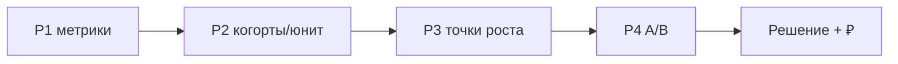

# М6.1. Капстоун: от проблемы до живой защиты

| Поле | Значение |
|---|---|
| **ID** | М6.1 *(включает практику бывшего М6.2 — см. § ниже)* |
| **Неделя / проход** | Неделя 8 · Проход 3 · **живая защита** |
| **Опора** | весь контур курса |
| **Аудитория** | аналитик + продакт (пары приветствуются) |
| **Ориентир** | сборка 1–2 дня · защита **10 минут** + вопросы |
| **Визуалы** | [дуга 10 минут](./visuals/m6-1-defense-arc.svg) · [рубрика баллов](./visuals/m6-1-scoring-rubric.svg) |
| **Зависимость** | артефакты P1–P4: М1.3, М5.1, М3.*/М5.*, М1.7/М1.8/М4.4, М2.4/М2.5, **М1.10** |
| **Вехи** | **P4 защита** — сквозной контур на Ритме |

---

## Цели

После модуля вы:

- **Общий минимум:** проводите **10-минутную живую защиту** на Ритме по дуге *проблема → метрики → SQL/BI → A/B → решение* и закрываете рубрику без критичного нуля.
- **Аналитик:** показываете воспроизводимый расчёт (зерно, фильтры, primary) и объясняете, почему исход **не шум**.
- **Продакт:** даёте глагол решения, порядок денег и следующий шаг; отвечаете на вопросы жюри без ухода в wishlist.

---

## Контекст Ритма

Капстоун **не** новый продукт и **не** новый датасет. Это сборка того же B2C-приложения привычек **Ритм** и тех же синтетических таблиц стенда: воронка, юнит, диагностика, эксперимент `paywall_timing_2026q3`.

Жюри слышит одну историю: *где теряли ценность/деньги → что измерили → что проверили экспериментом → что делаем*.

### М6.2 свёрнут в этот модуль

В карте курса (§6) фигурирует **М6.2. Разбор работ**. Отдельный полный текст **не пишем**: пир-ревью, взаимная критика и слот портфолио входят в практику ниже (блок «разбор»). Если позже понадобится отдельный семинар — достаточно вынести этот блок; дожим вех P1–P4 не блокируется.

---

## Теория коротко

### 1. Дуга защиты 10 минут

| Время | Блок | Что обязаны сказать |
|---|---|---|
| 0:00–1:30 | **Проблема** | работа пользователя; узкое звено из данных |
| 1:30–3:00 | **Метрики** | древо/словарь; сравнение с базой |
| 3:00–5:00 | **SQL / BI** | зерно; один запрос или дашборд-решение |
| 5:00–7:30 | **A/B** | карточка; исход; почему не шум |
| 7:30–10:00 | **Решение** | глагол · ₽ · риск · next |

Тайминг: [`visuals/m6-1-defense-arc.svg`](./visuals/m6-1-defense-arc.svg).

### 2. Рубрика (макс 20)

| Критерий | Баллы | 4 балла выглядит как | 0 баллов |
|---|---|---|---|
| Проблема | 0–4 | узкое из воронки/юнита, не wishlist | «хотим больше фич» |
| Метрики | 0–4 | имена из М5.1 + сравнение | голые % без знаменателя |
| SQL / BI | 0–4 | воспроизводимо, верное зерно | скрин без фильтра internal |
| A/B честно | 0–4 | дизайн + исход + анти-peeking | «AI сказал, кто выиграл» |
| Решение | 0–4 | глагол + ₽ порядка + риск | нет следствия |

Картина: [`visuals/m6-1-scoring-rubric.svg`](./visuals/m6-1-scoring-rubric.svg).

| Итог | Вердикт |
|---|---|
| **≥14** и нет критичного нуля | зачёт защиты |
| 11–13 | доработка 48ч + короткий ретейк |
| ≤10 или крит. ноль | пересдача полной дуги |

**Критичный ноль:** нет primary из словаря; нет глагола решения; подгонка под instructor key / winner из модели без своего расчёта.

### 3. Что нести в комнату (пакет)

Обязательный минимум (ссылки на свои артефакты курса):

1. Одностраничный диагноз / юнит (P1–P2).  
2. Три гипотезы P3 + отказ (+ качественная строка, если была).  
3. Карточка A/B + таблица control/treatment.  
4. Абзац М1.10 (ответ → основание → следствие).  
5. 5–8 слайдов **или** один live-дашборд + 1 страница спикера — не 30 слайдов.

### 4. Типовые вопросы жюри

- Как определена primary? Окно? Знаменатель?  
- Почему N достаточный / какой MDE?  
- Что с guardrail depth?  
- Сколько ₽ и откуда ARPPU?  
- Что сделаете, если через две волны depth просядет?  
- Где AI помогал и что вы перепроверили?

### 5. AI на капстоуне

AI можно на черновике слайдов, SQL, формулировках. **Нельзя:** просить «кто победил в paywall_timing» без ваших чисел; подставлять ключ преподавателя; закрывать дыру в определении метрики «убедительным текстом».

---

## Разобранный пример: скелет спикера (не эталон цифр)

1. **Проблема:** работа — удержать 1–3 ритуала; узкое — habit→depth≥3 ~27% при живом paywall→pay.  
2. **Метрики:** depth и habit→subscribe из словаря; early_paywall_share как рычаг.  
3. **SQL/BI:** когорты без internal; дашборд показывает узкое, не 12 графиков.  
4. **A/B:** H2 timing; primary habit_to_subscribe_14d; guard depth + early share; full N; исход *ваш*.  
5. **Решение:** глагол + порядок ₽ с листа М1.3 + мониторинг depth.

Преподаватель сверяет знак/порядок A/B с `docs/stand/instructor/` **после** выступления.

---

## Практика

### Ядро (оба) — защита

1. Соберите пакет §3.  
2. Выпишите тайминг по минутам (кто говорит что, если пара).  
3. Репетиция 10 минут **на время** (запись или пир).  
4. Живая защита перед жюри / группой.  
5. Список «чего не смотрели» и «что не делаем» — вслух в блоке решения.

### Расширение «руки»

- Приложите SQL/ноутбук primary + guardrails (воспроизводимо на стенде).  
- Sanity: assignment ≈50/50; exclusion internal; одно определение early paywall.  
- Один слайд «почему это не шум» (N, окно, ДИ или честная оговорка М2.4).

### Расширение «решение»

- Q&A-лист: 5 вопросов и ваши ответы (≤3 предложения каждый).  
- Цена ошибки I vs II в одном абзаце.  
- Опция: ½ страницы «как перенести контур на свой продукт» (не вместо Ритма).

### Разбор работ (бывший М6.2)

После защит (тот же день или семинар):

1. Пары **аналитик ↔ продакт** (можно внутри команды): 10 мин взаимной критики по рубрике.  
2. Одна сильная сторона + один пробел **по критерию**, не «красивые слайды».  
3. Обновление портфолио: ссылка на пакет P1–P4 + 1-pager решения (без ключа instructor).

Отдельный файл урока М6.2 не требуется, пока этот блок проводится.

---

## Критерии приёмки

- [ ] Живая защита ≤10 мин по дуге; все пять блоков слышны.
- [ ] Primary и guardrails из словаря; расчёт воспроизводим.
- [ ] Глагол решения + порядок ₽ + риск.
- [ ] Рубрика ≥14 без критичного нуля (или назначен ретейк).
- [ ] Ядро + одно расширение; пир-ревью по блоку М6.2 отмечено.

---

## Линия AI

| Можно | Нельзя без вас |
|---|---|
| Черновик структуры слайдов | Выбор primary и глагола |
| Рефакторинг SQL после вашей постановки | Winner эксперимента «из знаний» |
| Тренировочные вопросы жюри | Подмена ответа на вопрос жюри выдуманными цифрами |

**Проверка перед выходом на сцену:** в брифе нет ни одной цифры, которой нет в вашем SQL/листе. Любая «уточнённая» цифра от AI = стоп.

---

## Дальше читать

- Календарь и вехи: [`../course-structure.md`](../course-structure.md) §3.2–3.3, §4.1, блок 6.  
- Стенд и ключ (только преподаватель): [`../stand/README.md`](../stand/README.md).  
- Сборка решения: [`m1-10-insight-to-decision.md`](./m1-10-insight-to-decision.md).  
- A/B: [`m2-5-ab-design-read.md`](./m2-5-ab-design-read.md).  
- Диагноз: [`m1-8-product-diagnosis.md`](./m1-8-product-diagnosis.md), путь: [`m1-7-cjm-journey.md`](./m1-7-cjm-journey.md).

Визуалы: [`visuals/m6-1-defense-arc.svg`](./visuals/m6-1-defense-arc.svg), [`visuals/m6-1-scoring-rubric.svg`](./visuals/m6-1-scoring-rubric.svg).
